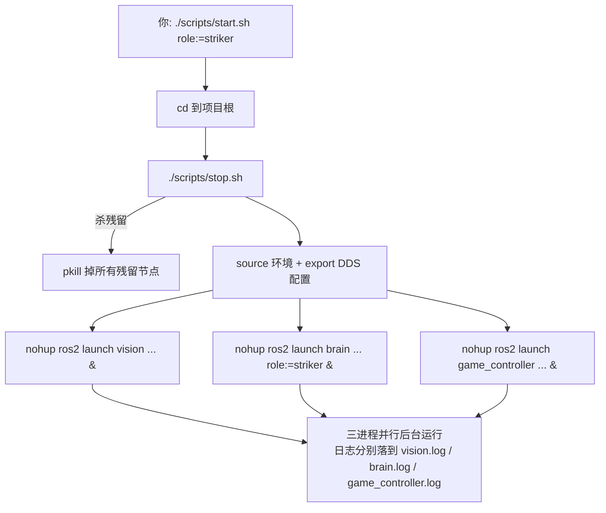

# 1.1 · 入口脚本 start.sh / stop.sh 逐行精读

本篇把真机启动脚本 `scripts/start.sh` 和清场脚本 `scripts/stop.sh` **一行不漏**地讲透。

---

## 一、`scripts/start.sh` 完整逐行

```bash
#!/bin/bash
```
**第 1 行**：Shebang，声明用 `/bin/bash` 解释执行。

```bash
cd `dirname $0`
cd ..
```
**第 3–4 行**：把当前工作目录切到**项目根目录**。
- `` `dirname $0` ``：`$0` 是脚本自身路径（如 `./scripts/start.sh`），`dirname` 取其目录部分 `./scripts`。反引号是命令替换，等价于 `cd ./scripts`。
- `cd ..`：再退一级到项目根 `robocup_demo/`。
> 💡 为什么要这么绕？因为后面所有相对路径（`./scripts/stop.sh`、`./install/setup.bash`）都是相对项目根写的。这两行保证**无论你从哪个目录调用脚本**，工作目录都被锁定到根目录，路径才不会错。这是 shell 脚本的标准开场白。

```bash
echo "[STOP EXISTING NODES (IF ANY), TO AVOID CONFLICT]"
./scripts/stop.sh
```
**第 6–7 行**：先调 `stop.sh` 把可能还在后台运行的旧进程杀掉。
> 💡 为什么启动前要先停？ROS2 节点同名会冲突、UDP 端口（如裁判机的 3838）会被占用、上一把没退干净的视觉进程还占着 GPU。先清场再开，避免"明明改了代码却还是旧行为"这类玄学问题。

```bash
source /opt/ros/humble/setup.bash
```
**第 9 行**：加载 ROS2 Humble 的环境（把 `ros2` 命令、核心库路径注入当前 shell）。`/opt/ros/humble` 是 ROS2 Humble 的标准安装路径。

```bash
source ./install/setup.bash
```
**第 10 行**：加载**本项目编译产物**的环境。`install/` 是 `colcon build` 的输出目录（见 [1.5 编译](./1.5-编译与依赖.md)）。这一步让 `ros2 launch vision ...` 能找到我们自己编译的 `vision` 包。
> ⚠️ 推论：**跑脚本前必须先编译**，否则 `install/` 不存在，这一行会失败。

```bash
export FASTRTPS_DEFAULT_PROFILES_FILE=/opt/booster/BoosterRos2/fastdds_profile_udp_only.xml
```
**第 11 行**：设置环境变量，指定 **Fast DDS**（ROS2 默认的底层通信中间件）使用一个"只走 UDP"的配置文件。
> 💡 ROS2 的话题通信底层是 DDS。DDS 默认可能尝试共享内存、TCP 等多种传输。这里强制只用 UDP，是为了行为可预测、和裁判机/队友的 UDP 通信环境一致，避免共享内存在多机/容器场景下的诡异问题。

```bash
echo "[START ROBOCUP NODES]"
echo "[START VISION]"
nohup ros2 launch vision launch.py > vision.log 2>&1 &
```
**第 13–15 行**：启动**视觉**节点。这行信息量很大，拆开看：
- `ros2 launch vision launch.py`：执行 `vision` 包的 launch 文件（详见 [1.3](./1.3-launch文件逐行.md)）。
- `> vision.log`：标准输出(stdout)重定向到 `vision.log` 文件。
- `2>&1`：标准错误(stderr，文件描述符 2)也重定向到 stdout 现在指向的地方，即也写进 `vision.log`。**顺序很重要**：必须先 `> vision.log` 再 `2>&1`。
- `nohup`：忽略挂断信号(SIGHUP)，这样即使关掉终端，进程也继续跑。
- 末尾 `&`：放到**后台**执行，shell 不等它结束就继续往下走。
> 💡 三个节点都用 `nohup ... &`，所以它们是**三个并行的后台进程**，谁也不阻塞谁。日志各自分流到 `vision.log/brain.log/game_controller.log`，排查问题时分别 `tail -f` 即可。

```bash
echo "[START BRAIN]"
nohup ros2 launch brain launch.py "$@"  > brain.log 2>&1 &
```
**第 16–17 行**：启动**大脑**节点，几乎和视觉一样，但多了 `"$@"`。
- `"$@"`：把**你调用 `start.sh` 时跟在后面的所有参数**原封不动透传给 brain 的 launch。加引号是为了正确处理带空格的参数。
> 💡 这就是 `./scripts/start.sh role:=striker player_id:=2` 能临时指定角色的原理——这些参数经 `"$@"` 流进 brain 的 `launch.py`，被那里的 `DeclareLaunchArgument` 接住（见 [1.3](./1.3-launch文件逐行.md)）。三个节点里只有 brain 接受这种透传，因为只有它的行为需要按角色/球员号定制。

```bash
echo "[START GAME_CONTROLLER]"
nohup ros2 launch game_controller launch.py > game_controller.log 2>&1 &
echo "[DONE]"
```
**第 18–20 行**：启动**裁判机通信**节点，并打印完成。裁判机节点不需要任何外部参数（端口等都硬编码在它的 launch 里），所以没有 `"$@"`。

### start.sh 小结
全脚本就干三件事：**①锁定工作目录 → ②清场+加载环境 → ③后台拉起三个节点**。理解 `nohup ... > log 2>&1 &` 和 `"$@"` 这两个 shell 惯用法，就理解了整个启动入口。

---

## 二、`scripts/stop.sh` 完整逐行

```bash
#!/bin/bash
echo ["STOP VISION"]
pkill -9 vision_node
```
**杀视觉**：`pkill -9 vision_node` 按进程名匹配并发送 `SIGKILL`(信号 9，强制杀，不可被忽略)。`vision_node` 是视觉可执行文件名。

```bash
echo ["stop detection_converter"]
pkill -9 -f detection_converter_node.py
```
**杀仿真检测转换节点**：`-f` 表示匹配**完整命令行**而不仅是进程名。因为这是个 Python 脚本，真正的进程名是 `python3`，必须用 `-f` 去匹配命令行里的 `detection_converter_node.py` 才能精确定位。

```bash
echo ["STOP BRAIN"]
pkill -9 brain_node
```
**杀大脑**：同理，`brain_node` 是大脑可执行文件名。

```bash
echo ["STOP GAMECONTROLLER"]
ps aux | grep "game_controller" | grep -v "game_controller_app" | grep -v "grep" | awk '{print $2}' | xargs -r kill -9
```
**杀裁判机**：这一行没用 `pkill`，而是一条管道，因为要**精确排除**某些同名进程：
- `ps aux`：列出所有进程。
- `grep "game_controller"`：筛出名字含 `game_controller` 的行。
- `grep -v "game_controller_app"`：`-v` 是反向匹配，**排除**叫 `game_controller_app` 的（那是别的程序，不能误杀）。
- `grep -v "grep"`：排除 `grep` 命令自身（否则会匹配到刚才那条 grep 进程）。
- `awk '{print $2}'`：取每行第 2 列，即 PID。
- `xargs -r kill -9`：把这些 PID 喂给 `kill -9`。`-r` 表示**如果没有任何 PID 就不执行 kill**（避免空参数报错）。
> 💡 为什么裁判机要用这么复杂的写法而不是 `pkill`？因为环境里可能存在一个不该被杀的 `game_controller_app`（比如官方裁判机软件本体），简单的 `pkill game_controller` 会把它一起干掉。这条管道是"按名字杀，但留下白名单"的精细做法。

### stop.sh 小结
四个节点对应四种"找进程"的方式：普通可执行用 `pkill 名字`、Python 脚本用 `pkill -f 命令行`、需要排除白名单的用 `ps|grep|awk|xargs` 管道。

---

## 三、一张时序图收尾


