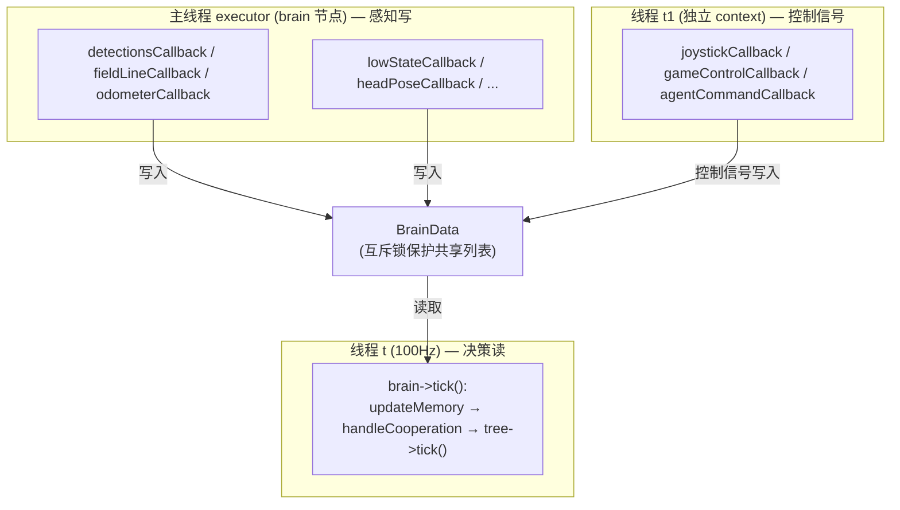

# 1.4 · main.cpp 与多线程模型逐行

大脑进程的入口是 `src/brain/src/main.cpp`（仅 60 行）。它短小但浓缩了整个大脑的**并发架构**。本篇逐行讲透，并解释每个线程为什么存在。

---

## 一、完整代码逐段

```cpp
#include <iostream>
#include <rclcpp/rclcpp.hpp>
#include <memory>
#include <thread>
#include "brain.h"

#define HZ 100
using namespace std;
```
`HZ 100`：决策循环的频率，**100Hz = 每 10ms 跑一次决策**。这个数字贯穿全项目——所有"每帧""每 tick"指的就是这 10ms。

```cpp
int main(int argc, char **argv) {
    rclcpp::init(argc, argv);                       // ① 初始化 ROS2
    std::shared_ptr<Brain> brain = std::make_shared<Brain>();  // ② 造大脑对象
    brain->init();                                  // ③ 读配置、建行为树、建子模块、订阅话题
```
- `rclcpp::init`：初始化 ROS2 运行时，解析 `argc/argv` 里的 ROS 参数。
- `make_shared<Brain>()`：`Brain` 继承 `rclcpp::Node`，构造时就声明了一大堆参数（见 [模块05](../05-大脑数据与坐标系/index.md)）。用 `shared_ptr` 是因为行为树节点要持有 brain 指针。
- `brain->init()`：真正的初始化——加载配置、创建 `config/data/log/tree/client/locator/communication/visualizer` 各子对象、建立所有话题订阅与发布。这一步跑完，大脑就"装配完成"了。

### 线程 t：100Hz 决策心跳

```cpp
    thread t([&brain]() {
        while (rclcpp::ok()) {
            auto start_time = brain->get_clock()->now();
            brain->tick();                          // ★ 跑一次决策
            auto end_time = brain->get_clock()->now();
            auto duration = (end_time - start_time).nanoseconds() / 1000000.0; // 毫秒
            brain->log->log_scalar("performance", "brain_tick_duration_ms", duration);
            this_thread::sleep_for(chrono::milliseconds(static_cast<int>(1000 / HZ)));
        }
    });
```
- `while (rclcpp::ok())`：只要 ROS2 没被关闭就一直循环。
- 计时夹住 `brain->tick()`，把每次决策耗时记成标量 `brain_tick_duration_ms`——可以在可视化里看决策有没有超时（理想 < 10ms）。
- `sleep_for(10ms)`：循环尾部睡 `1000/HZ = 10` 毫秒，把频率稳定在 ~100Hz。
> ⚠️ 注意这是"固定睡眠"而非"固定周期"：如果 `tick()` 本身耗时 3ms，那实际周期是 3+10=13ms，略低于 100Hz。对本项目精度足够。

### 线程 t1：遥控/裁判机/agent 高优先级回调

```cpp
    thread t1([&brain, &argc, &argv]() {
        auto context = rclcpp::Context::make_shared();   // 独立的 ROS context
        context->init(argc, argv);
        rclcpp::NodeOptions opt; opt.context(context);
        auto node = rclcpp::Node::make_shared("brain_node_ext", opt);  // 第二个节点
        auto sub1 = node->create_subscription<...RemoteControllerState>(
            "/remote_controller_state", 10, bind(&Brain::joystickCallback, brain, _1));
        auto sub2 = node->create_subscription<...GameControlData>(
            "/booster_soccer/game_controller", 10, bind(&Brain::gameControlCallback, brain, _1));
        auto sub3 = node->create_subscription<std_msgs::msg::String>(
            "/booster_agent/soccer_game_control", 1, bind(&Brain::agentCommandCallback, brain, _1));
        rclcpp::executors::SingleThreadedExecutor executor;
        executor.add_node(node);
        executor.spin();
    });
```
这个线程**单独建了一个 ROS context 和一个辅助节点 `brain_node_ext`**，专门订阅三类消息：
- `/remote_controller_state`：手柄（人类操作员急停/切模式）。
- `/booster_soccer/game_controller`：裁判机状态。
- `/booster_agent/soccer_game_control`：agent 模式的上层指令。

> 💡 **为什么要单独开 context + 线程？** 这三类是**高优先级控制信号**：裁判一吹哨要立刻响应、操作员按急停不能延迟。如果它们和视觉检测回调挤在同一个 executor 里，可能被某个耗时的视觉回调堵住几十毫秒。独立 context + 独立单线程 executor 保证它们有自己的处理通道，不被业务回调阻塞。回调函数体 `joystickCallback`/`gameControlCallback` 仍然是 `Brain` 的成员（用 `bind(&Brain::xxx, brain, _1)` 绑定），所以它们写的还是同一个 brain 对象。

### 主线程：所有业务感知回调

```cpp
    rclcpp::executors::SingleThreadedExecutor executor;
    executor.add_node(brain);     // 主 brain 节点
    executor.spin();              // 阻塞，处理 brain 节点的所有订阅回调

    t.join(); t1.join();
    rclcpp::shutdown();
    return 0;
}
```
主线程的 executor 跑 `brain` 主节点，处理它在 `init()` 里建立的所有业务订阅：视觉检测、场地线、里程计、底层状态、头部位姿、相机内参、摔倒恢复…这些回调不停往 `BrainData` 写"机器人当前感知到的世界"。

---

## 二、三线程全景与数据流向



这是经典的**"感知线程写、决策线程读"** 模型。因为多线程并发访问 `BrainData` 里的球、机器人列表等，所以那些容器都用 `std::mutex` 包了 getter/setter（详见 [模块05](../05-大脑数据与坐标系/index.md)）。球预测器的共享状态也用 `predictorMutex_` 保护（详见 [模块06](../06-定位与球预测/index.md)）。

---

## 三、`tick()` 一帧做什么（`brain.cpp:415`）

决策线程每 10ms 调一次 `tick()`，它是所有决策的总调度：

```cpp
void Brain::tick() {
    logDebugInfo(); logLags(); logStatusToConsole();   // 1. 打日志/统计延迟
    publishVisualizationMarkers();                      // 2. 发可视化标记
    publishOdomToMapTF(); publishRobotPose();           // 3. 发 TF 和位姿
    publishBallPosition(); publishTeammatesPoses();
    pubKickMsg();                                        // 4. 发踢球意图
    updateMemory();           // ★5. 更新对球/机器人/障碍/开球的"记忆"+推进球预测
    handleSpecialStates();    // ★6. 处理开球/任意球计时、进球庆祝标志
    handleCooperation();      // ★7. 队内协作：算 cost、定 lead、换角色
    tree->tick();             // ★★★8. 跑一次行为树——真正的决策
    if (config->headController.enable) head_controller_.update(this);  // 9. 主动头控
    if (training_logger_.enabled()) logTrainingFrame();                // 10. 记训练数据
}
```

执行顺序有讲究：**先更新感知记忆和协作状态（5–7），再让行为树基于最新状态做决策（8）**。各步骤的详细展开：
- 第 5 步 `updateMemory` → [模块06](../06-定位与球预测/index.md)（球记忆与预测）。
- 第 7 步 `handleCooperation` → [模块04](../04-裁判机与通信/index.md)（队内协作）。
- 第 8 步 `tree->tick` → [模块07](../07-行为树与决策/index.md)（行为树决策，核心）。
- 第 9/10 步头控与训练记录 → [模块08](../08-机器人控制与底层/index.md)。

---

## 四、视觉/裁判机进程的 main（对比）

- **视觉 `src/vision/src/main.cpp`**（29 行）：创建 `VisionNode`，用 **4 线程多线程执行器**跑，开启进程内通信（零拷贝传大图像）。它把 `argv[1..3]` 当三个 yaml 配置路径传给 `VisionNode`。详见 [模块03](../03-视觉模块/index.md)。
- **裁判机 `src/game_controller/src/main.cpp`**（17 行）：创建 `GameControllerNode`、调 `init()`(起 UDP 监听线程)、`spin()`。详见 [模块04](../04-裁判机与通信/index.md)。

三个进程的 main 都很薄——真正的逻辑在各自的 Node 类里。

---

## 小结

- `HZ=100`：决策每 10ms 一拍。
- **三线程**：① 100Hz 决策心跳(读)，② 业务感知回调(写)，③ 独立 context 的遥控/裁判机回调(高优先级控制)。
- 三者通过加锁的 `BrainData` 共享世界状态。
- `tick()` 的顺序是"先更新记忆/协作，再跑行为树决策"。
