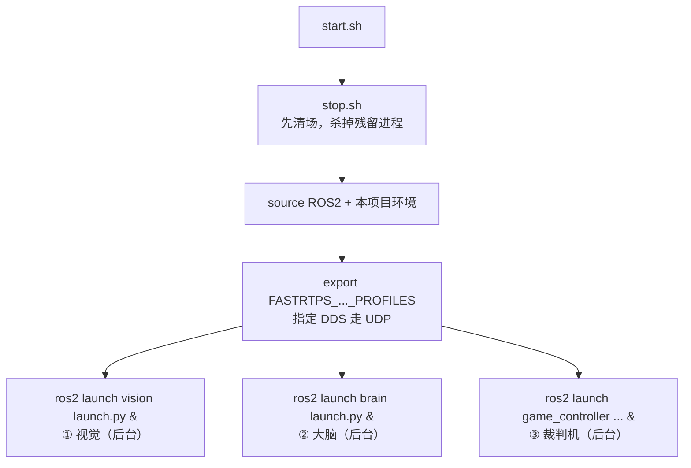

# 模块 01 · 启动与架构

本模块把"敲一条命令到三个进程跑起来"这条链路**拆到每一行脚本、每一个参数、每一条线程**来讲。它是理解整套系统如何被拉起、各进程如何隔离运行的起点。

## 子篇导航

| 子篇 | 讲什么 | 对应源码 |
|------|--------|----------|
| [1.1 入口脚本 start.sh / stop.sh 逐行](./1.1-入口脚本逐行.md) | 启动/停止脚本每一行的作用、环境变量、`nohup &` 的含义 | `scripts/start.sh` `scripts/stop.sh` |
| [1.2 脚本家族：仿真、多机、编译](./1.2-脚本家族.md) | `sim_start*` `build*` `start_brain/vision` 全部脚本 | `scripts/*.sh` |
| [1.3 launch 文件逐行详解](./1.3-launch文件逐行.md) | 四个包的 `launch.py`，层叠配置怎么生效，每个 `DeclareLaunchArgument` | `*/launch/*.py` |
| [1.4 main.cpp 与多线程模型](./1.4-main与多线程.md) | 大脑进程入口逐行、三线程结构、tick 心跳 | `src/brain/src/main.cpp` |
| [1.5 编译系统 colcon 与依赖](./1.5-编译与依赖.md) | `colcon`、`package.xml`、`CMakeLists.txt`、CUDA/ONNX 开关 | `*/CMakeLists.txt` `*/package.xml` |

## 本模块要点速览

整个系统是**三个独立的 ROS2 进程**（vision / brain / game_controller）+ 若干消息接口包，由 `start.sh` 一次性拉起，靠 ROS2 话题互联：

三条核心设计理念，会在子篇里反复印证：

1. **进程级隔离**：一个崩了不拖死其它两个（[1.1](./1.1-入口脚本逐行.md)）。
2. **层叠配置**：默认 → 本机 → 用户 → 命令行，逐层覆盖（[1.3](./1.3-launch文件逐行.md)）。
3. **线程级隔离**：大脑内部"感知回调线程写数据、100Hz 决策线程读数据"（[1.4](./1.4-main与多线程.md)）。

## 读完本模块你应该能回答

- `./scripts/start.sh role:=striker` 这条命令里的 `role:=striker` 是怎么一路传到 C++ 代码里的？
- 为什么大脑要开三个线程而不是一个？
- 真机和仿真在启动上差在哪？多机器人怎么用一份代码跑 6 个实例？
