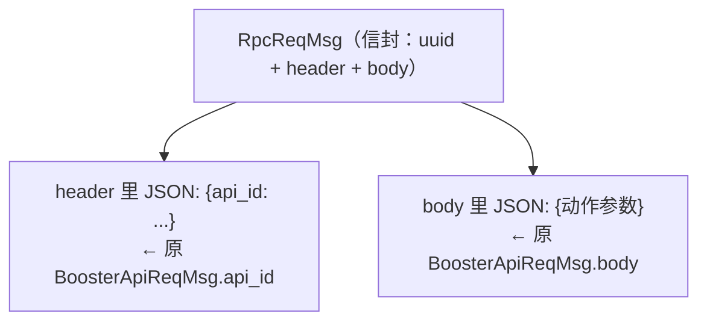

# 2.4 · booster_msgs（RPC 信封）与 brain/Kick + 消息怎么生成

本篇收尾两件事：
1. `booster_msgs` 包里的 **RPC 信封**（`RpcReqMsg`/`RpcRespMsg`/`BinaryData`）——大脑真正用来下发控制指令的运输工具；
2. 大脑自己定义的 **`brain/msg/Kick.msg`**——踢球决策广播；
最后讲清楚：这些 `.msg` 文件**是怎么变成 C++/Python 类**的（`rosidl_generate_interfaces`）。

---

## 一、`booster_msgs` —— RPC 信封

[2.3](./2.3-booster_ros2_interface.md) 讲过 `BoosterApiReqMsg`（`api_id + JSON body`）是"指令的内容"。但内容还得装进**信封**才能在网络上发——`booster_msgs` 就是这层信封。源码在 `src/interface/booster_msgs/msg/`。

### `RpcReqMsg.msg` —— 请求信封
源码 `src/interface/booster_msgs/msg/RpcReqMsg.msg`：
```
1 string uuid    # 本次调用的唯一标识（追踪/配对响应用）
2 string header  # 信封头，JSON 字符串（这里装 api_id）
3 string body    # 信封体，JSON 字符串（这里装动作参数）
```

### `RpcRespMsg.msg` —— 响应信封
源码 `src/interface/booster_msgs/msg/RpcRespMsg.msg`（结构与请求**完全相同**）：
```
1 string uuid    # 与请求相同的 uuid，用来认领"这是哪次请求的回复"
2 string header  # 响应头
3 string body    # 响应体
```

### `BinaryData.msg` —— 裸二进制
源码 `src/interface/booster_msgs/msg/BinaryData.msg`：
```
1 uint8[] data  # 任意长度字节数组
```
最底层的原始字节容器，需要传非文本数据时用。

### 信封是怎么被填的？

`RobotClient::call()`（`src/brain/src/robot_client.cpp:16-28`）把 [2.3](./2.3-booster_ros2_interface.md) 的 `BoosterApiReqMsg` 装进 `RpcReqMsg` 信封：

```cpp
int RobotClient::call(booster_interface::msg::BoosterApiReqMsg msg) {
    std::string uuid = gen_uuid();           // ① 生成唯一 id
    auto message = booster_msgs::msg::RpcReqMsg();
    message.uuid = uuid;

    nlohmann::json req_header;
    req_header["api_id"] = msg.api_id;        // ② api_id 放进 header(JSON)
    message.header = req_header.dump();
    message.body = msg.body;                  // ③ 参数 JSON 直接搬进 body
    publisher->publish(message);              // ④ 发布到话题
    return 0;
}
```

发布目标话题在 `robot_client.cpp:13` 建立：
```cpp
publisher = brain->create_publisher<booster_msgs::msg::RpcReqMsg>("LocoApiTopic" + suffix + "Req", 10);
```
即 `LocoApiTopicReq`（多机带 `/robot_name` 后缀）。

💡 三层嵌套，层层有责：



> - `BoosterApiReqMsg` 负责"内容语义"（哪个动作 + 什么参数）；
> - `RpcReqMsg` 负责"运输与配对"（uuid 用于把异步响应和请求对上，header/body 是序列化后的载荷）。
> - 为什么 `header`/`body` 是 string 而不是结构化字段？同样是为了**通用**——信封不关心里面装的是什么动作，纯当字符串搬运，新增任何 api 都不用改信封定义。

> 💡 注意 `call()` **发了就返回 `0`，不等响应**（fire-and-forget）。比赛决策每 10ms 一拍（100Hz），不能卡在等电机回执上。`RpcRespMsg` 的存在是为需要回执的场景预留，控制主链路并不阻塞等待它。完整控制流程见 [模块08](../08-机器人控制与底层/index.md)。

> 包名辨析：`booster_msgs`（信封）和 `booster_interface`（内容 + 硬件状态）是**两个不同的包**。`booster_msgs/CMakeLists.txt:18` 还 `ament_export_dependencies(booster_interface)`，因为信封里运输的正是 `booster_interface` 的内容。

---

## 二、`brain/msg/Kick.msg` —— 踢球决策广播

这是**大脑包自己定义**的唯一消息（不在 `interface/` 下，而在 `src/brain/msg/`）。当大脑决定踢球时，把"我打算怎么踢"打包发到 `/kick_ball` 话题，供控制/可视化/记录使用。

源码 `src/brain/msg/Kick.msg`：
```
1 std_msgs/Header header        # 时间戳 + 坐标系
2 float64 x                     # 球相对机器人的位置 x（m）
3 float64 y                     # 球相对机器人的位置 y（m）
4 float64 dir                   # 期望踢球方向，相对机器人，单位 rad
5 float64 goal_x                # 球门相对机器人的位置 x（m）
6 float64 goal_y                # 球门相对机器人的位置 y（m）
7 float64 robot_theta_to_field  # 机器人相对场地的朝向，单位 rad
8 float64 power                 # 期望踢球力度/射程
```

| 字段 | 行 | 含义 / 单位 | 说明 |
|------|----|------|------|
| `header` | 1 | 时间戳 + 坐标系 | 对齐用 |
| `x` / `y` | 2-3 | 球相对**机器人坐标系**的位置（米） | 告诉控制器球在脚边哪 |
| `dir` | 4 | 期望踢球方向，相对机器人，弧度 | 想把球往哪个方向踢 |
| `goal_x` / `goal_y` | 5-6 | 球门相对机器人的位置（米） | 瞄准目标 |
| `robot_theta_to_field` | 7 | 机器人在**场地坐标系**下的朝向，弧度 | 让接收方能把相对量换算到场地系 |
| `power` | 8 | 期望踢球力度（决定射程） | 近传/远射的力度档 |

**大脑怎么发布**（`src/brain/src/brain.cpp:266`）：
```cpp
pubKickBall = create_publisher<brain::msg::Kick>("/kick_ball", 10);
```

> 💡 为什么把"相对机器人的量"和"机器人在场地的朝向 `robot_theta_to_field`"一起发？因为 `x/y/dir/goal_*` 都是**机器人坐标系**下的相对量（控制器最方便直接用），但接收方若想知道"这一脚在场地上指向哪"，需要 `robot_theta_to_field` 把相对方向旋转到场地系。一条消息自带"相对量 + 参考朝向"，两种坐标系都能还原。坐标系定义见 [模块05](../05-大脑数据与坐标系/index.md)，踢球决策怎么算出这些值见 [模块07](../07-行为树与决策/index.md)。

---

## 三、`.msg` 是怎么变成 C++/Python 类的？

你写的只是几行文本字段，凭什么 C++ 里能 `#include` 出 `brain::msg::Kick`、Python 里能 `from brain.msg import Kick`？答案是 ROS2 的 **`rosidl`**（ROS Interface Definition Language）代码生成系统，在 `colcon build` 编译期自动跑。

### 入口：`rosidl_generate_interfaces`

每个接口包的 `CMakeLists.txt` 里都有一句它，把要生成的 `.msg`/`.srv` 列出来。例如：

`src/interface/vision_interface/CMakeLists.txt:16-28`：
```cmake
rosidl_generate_interfaces(${PROJECT_NAME}
  "msg/DetectedObject.msg"
  "msg/Detections.msg"
  ...
  "msg/Ball.msg"
  DEPENDENCIES std_msgs builtin_interfaces geometry_msgs sensor_msgs
)
```

`src/interface/booster_ros2_interface/CMakeLists.txt:15-35` 同样列出全部 `msg/*` 和 `srv/*`（含 `RpcService.srv`/`AgentService.srv`），`DEPENDENCIES std_msgs`。

`src/brain/CMakeLists.txt:36-39` 也用它生成自己的 `Kick`：
```cmake
rosidl_generate_interfaces(${PROJECT_NAME}
  "msg/Kick.msg"
  DEPENDENCIES std_msgs
)
```

### 三个关键点

1. **`DEPENDENCIES`**：声明你的消息引用了哪些**别的包的消息**。比如 `Detections` 用了 `std_msgs/Header`、`geometry_msgs/Pose`，就必须把 `std_msgs geometry_msgs` 列进 DEPENDENCIES，否则生成器找不到那些类型。`Kick` 只用了 `std_msgs/Header`，所以只依赖 `std_msgs`。

2. **`member_of_group` / `build_type`**（`package.xml`）：纯接口包的 `package.xml` 会写 `<member_of_group>rosidl_interface_packages</member_of_group>`（见 `vision_interface/package.xml:16`），告诉 ament 这是个"接口包"，并 `<build_type>ament_cmake</build_type>`。`<depend>` 列出 `std_msgs`/`sensor_msgs` 等运行/构建依赖。

3. **生成后怎么用**：`rosidl` 会为每条消息生成 C++ 头文件（如 `brain/msg/kick.hpp`，类名 `brain::msg::Kick`）和 Python 模块。`brain` 这种**既生成消息又用消息**的包还要额外把 typesupport 链回自己（`brain/CMakeLists.txt:48-50` 的 `rosidl_get_typesupport_target` + `target_link_libraries`），否则同包内引用自己的消息会链接失败——注释 `// otherwise cannot find msg in same pkg` 就说的这事。

> 💡 一句话总结生成链：**`.msg` 文本 → `rosidl_generate_interfaces`（编译期）→ C++/Python 类 → 各节点 `#include`/`import` 后收发**。所以"改了 `.msg` 必须重新 `colcon build`"，否则发收两端用的还是旧契约，字段对不上。编译系统的全貌见 [模块01 · 1.5 编译](../01-启动与架构/index.md)。

### 命名转换小贴士

`rosidl` 把消息文件名从 **CamelCase** 转成 C++ 头文件的 **snake_case**：
- `DetectedObject.msg` → `#include "vision_interface/msg/detected_object.hpp"`，类 `vision_interface::msg::DetectedObject`
- `RpcReqMsg.msg` → `booster_msgs/msg/rpc_req_msg.hpp`，类 `booster_msgs::msg::RpcReqMsg`
- 包名 `booster_ros2_interface` 文件夹下的消息，因 `project(booster_interface)`，命名空间是 `booster_interface::msg::*`

---

## 四、本篇小结

| 主题 | 关键点 |
|------|------|
| `RpcReqMsg` 信封 | `uuid`(配对) + `header`(JSON 装 api_id) + `body`(JSON 装参数)；`RobotClient::call` 填它，发到 `LocoApiTopicReq` |
| 三层嵌套 | `RpcReqMsg`(运输) ⊃ `BoosterApiReqMsg`(语义 api_id+JSON) ⊃ 具体动作参数 |
| fire-and-forget | `call()` 发了即返回，不阻塞等响应，保证 100Hz 决策不卡 |
| `Kick.msg` | 踢球意图：相对机器人的 `x/y/dir/goal`、力度 `power`、加上 `robot_theta_to_field` 供换算到场地系 |
| `rosidl` 生成 | `rosidl_generate_interfaces` 把 `.msg` 编译成 C++/Python 类；改 `.msg` 必须重编 |

至此，模块02 把项目中**所有节点间的数据契约**讲完了：视觉说什么、裁判机说什么、和身体怎么对话、控制指令怎么打包运输。带着这本"字典"，再去读 [模块03 视觉](../03-视觉模块/index.md)、[模块07 决策](../07-行为树与决策/index.md)、[模块08 控制](../08-机器人控制与底层/index.md) 的实现代码，每一条 `subscription`/`publisher` 收发的是什么、为什么这么设计，就都心里有数了。
