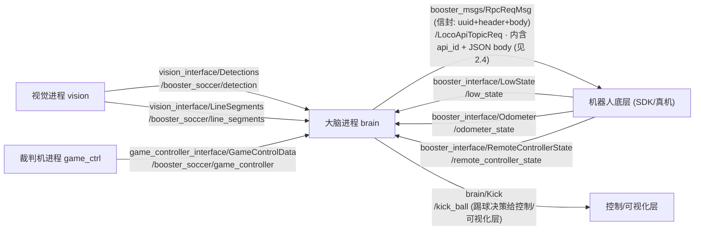

# 模块 02 · 接口与消息

**一句话理解本模块：消息（`.msg`/`.srv`）就是节点之间的"数据契约"。** 视觉、大脑、裁判机、底层控制四类进程谁也看不见谁的内部代码，它们只认一件事——"我往这个话题发这种结构的数据，你从这个话题收这种结构的数据"。

这个"结构"就写在一行行 `.msg` 文件里，由 ROS2 的 `rosidl` 工具在编译期把它们生成为 C++ / Python 的类。本模块把项目里**每一个 `.msg`/`.srv` 的每一个字段**都讲清楚：是什么、单位、取值范围、谁发谁收。

## 子篇导航

| 子篇 | 讲什么 | 对应源码 |
|------|--------|----------|
| [2.1 视觉输出消息](./2.1-vision_interface.md) | `DetectedObject` 的三套位置（`position`/`position_projection`/`position_cam`）区别与用途、`Detections`/`LineSegments`/分割消息逐字段，大脑怎么订阅 | `src/interface/vision_interface/msg/*.msg` |
| [2.2 裁判机消息](./2.2-game_controller_interface.md) | `GameControlData`（`state`/`secondary_state`/`secondary_state_info`）、`TeamInfo`、`RobotInfo`（`penalty`）逐字段及其对大脑的意义 | `src/interface/game_controller_interface/msg/*.msg` |
| [2.3 机器人硬件消息](./2.3-booster_ros2_interface.md) | 底层控制/状态反馈/手柄/手部/通用 API/原始字节，`message_utils.hpp` 工厂函数与 RPC 设计理念 | `src/interface/booster_ros2_interface/{msg,srv,include}/*` |
| [2.4 RPC 信封与 Kick](./2.4-booster_msgs与Kick.md) | `RpcReqMsg`/`RpcRespMsg`/`BinaryData` 信封、`Kick.msg`、`rosidl` 怎么把 `.msg` 生成 C++/Python | `src/interface/booster_msgs/msg/*`、`src/brain/msg/Kick.msg`、各 `CMakeLists.txt` |

## 本模块要点速览

### 谁发谁收：一张数据流总图

> 💡 注意一个关键分层：**大脑订阅的"感知/状态"消息是结构化字段**（`Detections` 里直接有 `xmin/position_projection`），但大脑**下发给机器人的控制指令**走的是另一套"RPC 信封"——`RpcReqMsg` 里塞一段 JSON 字符串（见 [2.4](./2.4-booster_msgs与Kick.md)）。前者追求"读起来方便"，后者追求"加新指令时不用改消息定义"。

### 四个接口包一览

| 包名 | 作用 | 谁生产 | 谁消费 | 详解 |
|------|------|--------|--------|------|
| `vision_interface` | 视觉识别结果（球、球门、场地线、分割） | 视觉进程 | 大脑 | [2.1](./2.1-vision_interface.md) |
| `game_controller_interface` | 官方裁判机 UDP 包的 ROS2 镜像 | 裁判机进程 | 大脑 | [2.2](./2.2-game_controller_interface.md) |
| `booster_interface` | 机器人硬件控制 / 状态反馈 / 手柄 / 手部 / 通用 API | 底层 SDK ⇄ 大脑 | 双向 | [2.3](./2.3-booster_ros2_interface.md) |
| `booster_msgs` + `brain/msg` | RPC 信封 `RpcReqMsg` 与踢球决策 `Kick` | 大脑 | 控制层 / 可视化 | [2.4](./2.4-booster_msgs与Kick.md) |

> 包名小注：消息源码文件夹叫 `booster_ros2_interface`，但 `CMakeLists.txt` 里 `project(booster_interface)`，所以编译出来的 ROS2 包名、C++ 命名空间都是 `booster_interface`。本模块凡说"包名"均指 `booster_interface`。

### 核心要点

1. **消息是契约，不是代码**：`.msg` 文件只描述"数据长什么样"，编译期由 `rosidl_generate_interfaces`（见各包 `CMakeLists.txt`）生成 C++/Python 类。改字段=改契约，发收两端都得重新编译。
2. **三套位置坐标是视觉模块的精髓**：`DetectedObject` 同时给 `position`（综合）、`position_projection`（地面投影）、`position_cam`（相机深度）三套坐标，大脑实际只用 `position_projection`（见 [2.1](./2.1-vision_interface.md) 与 `src/brain/src/brain.cpp:1986`）。视觉如何算出这三套见 [模块03](../03-视觉模块/index.md)。
3. 🏆 **裁判机消息直接映射 RoboCup 官方协议**：`GameControlData` 的字段顺序、类型严格对齐官方 `RoboCupGameControlData.h`，`penalty`/`state` 决定机器人"能不能动、该站哪"。详见 [模块04](../04-裁判机与通信/index.md)。
4. **控制走 RPC 信封**：大脑发指令不直接发 `MotorCmd`，而是把 `api_id + JSON` 包进 `RpcReqMsg`，由底层 SDK 解析执行——加新动作只要新增一个 `api_id`，消息定义零改动。控制链路细节见 [模块08](../08-机器人控制与底层/index.md)。

## 读完本模块你应该能回答

- `.msg` 文件是怎么在编译期变成 C++/Python 类、让发收两端共享同一份"数据契约"的？
- `DetectedObject` 为什么要同时带三套坐标？大脑实际用哪一套？
- 大脑下发控制指令为什么不直接发 `MotorCmd`，而要包进 `RpcReqMsg` 信封？这样设计有什么好处？
