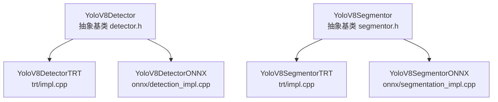

# 3.3 · 模型推理（检测与分割）精读

本篇讲神经网络这一层：怎么用**工厂模式 + 编译期开关**在 TensorRT 和 ONNX 两个后端间切换、9 个检测类别、`DetectionRes`/`SegmentationRes` 数据结构、ONNX 与 TensorRT 各自的推理流程、letterbox 预处理、NMS 与坐标缩放、逐类别置信度阈值、以及 `single_ball_assumption`。

涉及源码：`model/detector.cc`、`model/segmentor.cc`、`include/.../detector.h`、`segmentor.h`、`data_types.h`、`onnx/detection_impl.cpp`、`onnx/segmentation_impl.cpp`、`trt/model.cpp`、`trt/impl.cpp`、`trt/postprocess.cpp`。

---

## 一、双后端：工厂模式 + `NO_CUDA`

检测器/分割器都是**抽象基类 + 工厂方法**，运行时上层只认基类 `Inference()`，编译期决定具体后端。

```cpp
// detector.cc:17
std::shared_ptr<YoloV8Detector> YoloV8Detector::CreateYoloV8Detector(const YAML::Node &node, const std::string model_path_override) {
    std::string model_path = model_path_override.empty() ? node["model_path"].as<std::string>() : model_path_override;
    float conf_thresh = node["confidence_threshold"].as<float>();
    float nms_thresh  = node["nms_threshold"].as<float>();
#ifdef NO_CUDA
    detector_ptr = new YoloV8DetectorONNX(model_path);   // 无显卡：ONNX Runtime
#else
    detector_ptr = new YoloV8DetectorTRT(model_path);    // 有显卡：TensorRT
#endif
    detector_ptr->setConfidenceThreshold(conf_thresh);
    detector_ptr->setNMSThreshold(nms_thresh);
    return detector_ptr;
}
```

类层次：



基类只持有 `model_path_` / `confidence_` / `nms_threshold_` 和纯虚 `Inference()`（`detector.h:19`）。

> 💡 为什么用**编译期** `#ifdef NO_CUDA` 而不是运行时选择？因为 TensorRT 和 ONNX Runtime 是两套完全不同的依赖库，把不需要的那套也链接进来既增加体积又可能在没有 CUDA 的机器上链接失败。编译期裁剪让"无显卡环境"根本不碰 TensorRT 代码。`build.sh` 编出 TRT 版（真机），`build_no_cuda.sh` 定义 `NO_CUDA` 编出 ONNX 版（仿真/开发机）。详见 [模块01 · 1.5 编译](../01-启动与架构/1.5-编译与依赖.md)。

---

## 二、9 个检测类别 + 2 个分割类别

```cpp
// detector.cc:14
const std::vector<std::string> YoloV8Detector::kClassLabels{
    "Ball", "Goalpost", "Person", "LCross", "TCross", "XCross", "PenaltyPoint", "Opponent", "BRMarker"};
// segmentor.cc:11
const std::vector<std::string> YoloV8Segmentor::kClassLabels = {"CircleLine", "Line"};
```

| class_id | 检测类别 | 含义 |
|----------|----------|------|
| 0 | Ball | 球 |
| 1 | Goalpost | 门柱 |
| 2 | Person | 人（裁判/观众等） |
| 3 | LCross | 场地 L 形角点 |
| 4 | TCross | 场地 T 形交叉 |
| 5 | XCross | 场地 X 形交叉（中圈与中线交点等） |
| 6 | PenaltyPoint | 罚球点 |
| 7 | Opponent | 对手机器人 |
| 8 | BRMarker | 标记 |

分割模型识别 `CircleLine`（中圈线）和 `Line`（普通场地线）。

> 🏆 LCross/TCross/XCross/PenaltyPoint 这些场地标记的真值坐标记录在 `field.yaml`（见 [3.6](./3.6-标定与配置.md)），是大脑自定位的"地标"。哪种角点出现在场地的哪几个固定位置，是由比赛场地的标准画线规则决定的。

---

## 三、输出结构 `DetectionRes` / `SegmentationRes`

```cpp
// data_types.h
struct DetectionRes {
    cv::Rect bbox;          // 像素框（原图坐标）
    int class_id;
    std::string class_name;
    float confidence;
};
struct SegmentationRes {
    cv::Mat mask;                              // 全图大小的二值掩码
    std::vector<std::vector<cv::Point>> contour;  // 掩码轮廓（供 FitFieldLineSegments）
    cv::Rect bbox;
    int class_id;
    std::string class_name;
    float confidence;
};
```

分割比检测多了 `mask`（二值掩码）和 `contour`（轮廓点），后者交给 [3.4](./3.4-位姿估计几何.md) 的 `FitFieldLineSegments` 投到地面拟合直线。

---

## 四、ONNX 后端流程（无显卡 / 仿真）

文件：`onnx/detection_impl.cpp`。用 ONNX Runtime，按优先级尝试 **OpenVINO(Intel GPU) > CUDA > CPU** 执行后端（`detection_impl.cpp:88-120`）。

### 1. 预处理 letterbox（detection_impl.cpp:9 `PreProcess`）

```cpp
cv::cvtColor(src, dst, cv::COLOR_BGR2RGB);            // BGR → RGB
if (src.cols >= src.rows) {
    float s = src.cols / (float)dst_size.width;
    cv::resize(dst, dst, cv::Size(dst_size.width, src.rows / s));   // 按长边等比缩放
} else {
    float s = src.rows / (float)dst_size.width;
    cv::resize(dst, dst, cv::Size(src.cols / s, dst_size.height));
}
cv::Mat tempImg = cv::Mat::zeros(dst_size, CV_8UC3);  // 黑底
dst.copyTo(tempImg(cv::Rect(0, 0, dst.cols, dst.rows)));  // 贴到左上角
```

> 💡 letterbox（信箱填充）：YOLOv8 要正方形定长输入（如 640×640），而相机图是长方形。直接 resize 会拉伸变形、毁掉物体长宽比。letterbox 按**长边等比缩放**后**填充**到正方形，保持物体不变形。这里填到**左上角**（黑底），后处理时只需按同一缩放比 `resize_scales` 把框还原，不必处理偏移。

### 2. Blob 归一化（detection_impl.cpp:33 `BlobFromImage`）

把 HWC 的 `uint8` 图转成 CHW 的 `float`，并 `/255.0` 归一化到 [0,1]。支持 `float` 和 `float16`（`Ort::Float16_t`）两种数据类型，由模型输入张量的 `element_type_` 决定（`detection_impl.cpp:131-141`）。

### 3. 推理 + 后处理（detection_impl.cpp:182 `InferenceImpl`）

```cpp
auto output = session_->Run(...);                    // [1, 4+num_classes, num_anchors]
raw_data = cv::Mat(signal_res_num, stride_num, ...);
raw_data = raw_data.t();                              // 转置成 [num_anchors, 4+classes]
float resize_scales = max(w,h) / model_input_width;  // 与 letterbox 同比例
for (int i = 0; i < stride_num; ++i) {
    cv::Mat scores(1, kClassLabels.size(), CV_32FC1, data+4);
    cv::minMaxLoc(scores, ...);                       // 取最高分类别
    if (max_class_score > confidence_) {
        // 中心格式 (x,y,w,h) → 角点，× resize_scales 还原到原图
        int left = (x - 0.5*w) * resize_scales;  ...
        if (width < 3 || height < 3) continue;        // 过滤太小的框
        boxes/confidences/class_ids.push_back(...);
    }
}
cv::dnn::NMSBoxes(boxes, confidences, confidence_, nms_threshold_, nms_results);  // NMS
```

YOLOv8 的输出是 `[1, (4+类别数), anchor数]`，转置后逐 anchor 取最高分类别，超过阈值就把"中心格式框"换算成原图角点框，最后 `cv::dnn::NMSBoxes` 去重。

### 4. 分割 ONNX（segmentation_impl.cpp）

多一路 **proto 掩码**输出。YOLOv8-seg 输出两个张量：
- `output[0]`：检测 `[1, 类别数+4+32, anchor数]`（多 32 个 mask 系数）。
- `output[1]`：原型掩码 `[1, 32, mask_h, mask_w]`。

掩码生成（`segmentation_impl.cpp:318-331`）：每个检测的 32 个系数与 32 张原型掩码做**线性组合**再过 **sigmoid**：
```cpp
val = Σ mask_coeffs[c] * proto[c][y][x];  val = 1/(1+exp(-val));   // mask = sigmoid(coeffs @ proto)
```
然后 resize 回检测框、阈值 0.5 二值化、`findContours` 取轮廓。

---

## 五、TensorRT 后端流程（真机 GPU）

文件：`trt/impl.cpp`、`trt/model.cpp`、`trt/postprocess.cpp`。代码按 TensorRT 版本分两套：`#if NV_TENSORRT 8.6`（用 wang-xinyu 风格的 plugin engine + CUDA 后处理）和 `#elif 10.3`（用 `enqueueV3` + CPU 后处理）。这里抓关键算法概述。

### 1. engine 加载

`.engine` 是**预编译**的序列化引擎（`vision.yaml` 里 `best_digua_second_10.3.engine`）。`LoadEngine`（`impl.cpp:621`）反序列化、读出输入/输出张量维度。Init 里若发现路径不含 `.engine` 直接抛异常（`impl.cpp:533`）。

> 💡 engine 是针对**具体 GPU 架构 + TensorRT 版本**离线编出来的，所以仓库里有 `best_seg_orin_10.3.engine` 这种带平台/版本后缀的命名。换平台要用 `scripts/model/gen_wts.py` + builder 重新生成（model.cpp 里的 `buildEngineYolov8Det` 系列就是从 `.wts` 权重搭网络）。

### 2. 预处理（impl.cpp:463 `PreProcess`，10.3 版）

```cpp
cv::cvtColor(img, mat, cv::COLOR_BGR2RGB);
int max_len = std::max(rw, rh);
float factor = max_len / model_input_width;            // 缩放比
cv::Mat max_img(max_len, max_len, CV_8UC3, cv::Scalar(114,114,114));  // 灰底 letterbox
mat.copyTo(max_img(roi));                              // 贴左上角
cv::resize(max_img, resized, 640×640);
resized.convertTo(resized, CV_32FC3, 1.0/255.0);       // 归一化
for (c) cv::extractChannel(resized, input_buff+c*..., c);  // HWC → CHW
```

与 ONNX 一样是 letterbox，但填充色用 **(114,114,114) 灰**（YOLO 训练时的标准 padding 色），且填左上角、记一个 `factor` 供还原。8.6 版的 GPU 预处理在 `cuda_batch_preprocess`（CUDA 核函数）里做，更快。

### 3. NMS（postprocess.cpp:98 `nms`，8.6 版）

```cpp
void nms(std::vector<Detection>& res, float* output, float conf_thresh, float nms_thresh) {
    std::map<float, std::vector<Detection>> m;          // 按 class_id 分桶
    for (i ...) if (conf > conf_thresh) m[class_id].push_back(det);
    for (每个类别桶) {
        std::sort(dets, cmp);                            // 按 conf 降序
        for (m: 取最高 conf 的框 item) {
            res.push_back(item);
            for (n: 后面的框) if (iou(item, dets[n]) > nms_thresh) erase(dets[n]);  // 删重叠
        }
    }
}
```

这是经典的**逐类别 NMS**：先按类别分桶，桶内按置信度降序，贪心保留最高分框、删掉与它 IoU 超阈值的其余框。`iou`（`postprocess.cpp:75`）算两框交并比。10.3 版后处理在 `PostProcess`（`impl.cpp:655`）里改用 `cv::dnn::NMSBoxes`。

### 4. get_rect 坐标缩放（postprocess.cpp:10）

把模型输出的框（640 坐标系）换算回原图坐标，要**反向抵消 letterbox**：

```cpp
cv::Rect get_rect(cv::Mat& img, float bbox[4]) {
    float r_w = kInputW / img.cols, r_h = kInputH / img.rows;
    if (r_h > r_w) {                  // 原图更宽，填充在上下
        l = bbox[0] / r_w;
        t = (bbox[1] - (kInputH - r_w*img.rows)/2) / r_w;  // 减掉上方填充再除缩放
        ...
    } else {                          // 原图更高，填充在左右
        l = (bbox[0] - (kInputW - r_h*img.cols)/2) / r_h;
        ...
    }
    // clamp 到图像边界
}
```

10.3 版的等价逻辑用仿射逆变换 `invertAffineTransform(s2d, d2s)`（`impl.cpp:163`）：构造"原图→640"的缩放+偏移矩阵 `s2d`，求逆得 `d2s`，把每个框坐标乘 `d2s` 还原。

### 5. 分割掩码重建（impl.cpp:845 `PostProcess`，10.3 版）

与 ONNX 同思路：32 个 mask 系数 × 32 张原型掩码 → sigmoid → resize → 阈值 0.5 二值化 → `findContours`（用 `CHAIN_APPROX_TC89_L1` 近似轮廓）。

---

## 六、后处理：逐类别置信度阈值 + single_ball_assumption

这一层在 `VisionNode::ProcessData` 里（`vision_node.cpp:366`），对**所有后端通用**——基类只用一个全局 `confidence_` 阈值过滤，更细的逐类别阈值在节点层做。

### 逐类别置信度阈值

```yaml
# vision.yaml
post_process:
  confidence_thresholds:
    Ball: 0.2          # 球：宁可多检（漏球代价大）
    LCross: 0.1        # 角点：低阈值（多给点候选给自定位）
    Opponent: 0.5      # 对手：高阈值（误检会乱躲）
```

```cpp
// vision_node.cpp:370
for (auto &detection : detections) {
    auto classname = classnames_[detection.class_id];
    if (detection.confidence < confidence_map_[classname]) continue;  // 逐类阈值
    filtered_detections.push_back(detection);
}
```

> 🏆 不同物体的误检/漏检代价不一样：漏掉球可能错失进攻，所以球阈值低（0.2）；误把背景当成对手会让机器人乱躲乱让，所以对手阈值高（0.5）。逐类别阈值就是把"宁多 vs 宁少"按物体类型分别调。

### single_ball_assumption

```cpp
// vision_node.cpp:382
if (single_ball_assumption_) {
    // 把球检测单独拎出来，若有多个，只保留 confidence 最高的那一个
    auto max_ball = *std::max_element(ball_detections.begin(), ball_detections.end(),
                        [](const DetectionRes &a, const DetectionRes &b){ return a.confidence < b.confidence; });
    filtered_detections.push_back(max_ball);
}
```

> 🏆 RoboCup 赛场上只有**一个**球。开启 `single_ball_assumption` 后，即便网络误检出多个"球"，也只信置信度最高的那个，避免大脑被假球带偏。默认关闭（`vision.yaml` 里 `single_ball_assumption: false`），因为多机视角下偶尔也想保留全部候选。

---

## 七、绘制（调试用）

`DrawDetection`（`detector.cc:42`）和 `DrawSegmentation`（`segmentor.cc:31`）给每个类别分配随机但固定的颜色（`cv::RNG(class_id)` 同种子→同色），画框/掩码 + 类别名 + 置信度。仅在 `show_det_`/`show_seg_` 开启时用（[3.1](./3.1-节点与主流水线.md)）。

---

## 小结

- **工厂 + `NO_CUDA`**：编译期在 TensorRT（真机）和 ONNX Runtime（仿真/无显卡）间二选一，上层只认 `Inference()`。
- **9 检测类 + 2 分割类**；输出 `DetectionRes`（框）/ `SegmentationRes`（框+掩码+轮廓）。
- **预处理 letterbox**：等比缩放 + 填充到正方形，保持长宽比；后处理时反向抵消缩放/偏移还原坐标。
- **NMS**：逐类别按置信度贪心去重叠框。
- **节点层后处理**：逐类别置信度阈值（球宽对手严）+ single_ball_assumption（只信最高分的球）。
