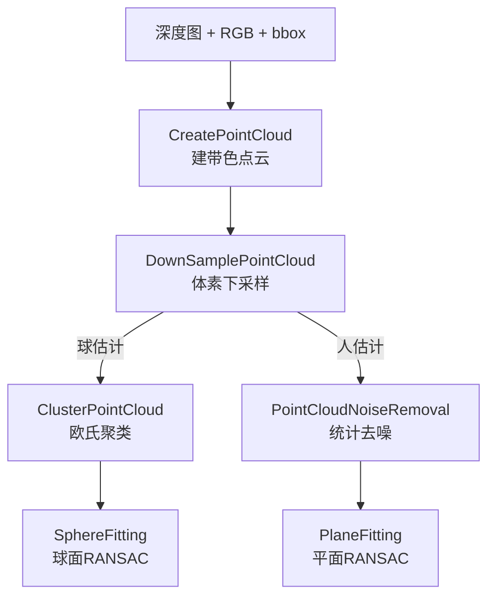

# 3.5 · 点云处理与图像桥精读

本篇讲两块"配套底座"：① 深度点云处理 `pointcloud_process`（建点云、下采样、去噪、聚类、球面/平面 RANSAC 拟合），它是 [3.4](./3.4-位姿估计几何.md) 里 `EstimateByDepth` 的实现支撑；② 图像桥 `img_bridge`，把各种编码的 ROS 图像消息正确转成 OpenCV `Mat`。

涉及源码：`base/pointcloud_process.cpp`/`.h`、`img_bridge.cpp`、`img_bridge.h`。

---

## 一、点云处理 `pointcloud_process`

基于 PCL（Point Cloud Library）。整条"深度精化"管线是：



### 1. 建点云 `CreatePointCloud`（pointcloud_process.cpp:98）

```cpp
for (v : [bbox.y, bbox.y+height))
  for (u : [bbox.x, bbox.x+width)) {
      float depth = depth_image.at<float>(v, u);
      if (!std::isnan(depth) && depth > 0) {
          auto cv_point = intrinsics.BackProject(cv::Point2f(u, v), depth);  // 像素+深度 → 相机系 3D
          point.x/y/z = cv_point;
          point.b/g/r = rgb_image.at<Vec3b>(v, u);                          // 附颜色
          cloud->points.push_back(point);
      }
  }
```

只对**检测框内**的像素建点云（省时），逐像素用 `BackProject(uv, depth)` 把"像素+深度"反投到相机系三维点，并染上 RGB 颜色。跳过 NaN / 非正深度（无效像素）。有个全图重载（`:119`）默认 bbox 取整图。

### 2. 下采样 `DownSamplePointCloud`（pointcloud_process.cpp:125）

```cpp
pcl::VoxelGrid<pcl::PointXYZRGB> voxel_filter;
voxel_filter.setLeafSize(leaf_size, leaf_size, leaf_size);   // 默认 0.01m
```

体素栅格滤波：把空间切成边长 `leaf_size`（1cm）的小立方体，每个立方体内的点合并成一个。

> 💡 为什么先下采样？深度图框内可能有上万个点，直接拟合又慢又容易被密集噪声带偏。体素下采样把点密度均匀化、数量降一两个数量级，后续聚类/RANSAC 快得多，且对结果几乎无损。

### 3. 统计去噪 `PointCloudNoiseRemoval`（pointcloud_process.cpp:133）

```cpp
pcl::StatisticalOutlierRemoval<pcl::PointXYZRGB> sor;
sor.setMeanK(neighbour_count);            // 看每点最近 K 个邻居（调用处传 50）
sor.setStddevMulThresh(multiplier);       // 距离超过 均值+multiplier×标准差 的点判为离群
```

统计离群点剔除：对每个点算它到 K 近邻的平均距离，全局看这个距离的分布，把明显偏大的点（孤立噪点）删掉。人估计用它清掉深度图边缘的飞点。

### 4. 欧氏聚类 `ClusterPointCloud`（pointcloud_process.cpp:143）

```cpp
pcl::EuclideanClusterExtraction<pcl::PointXYZRGB> ec;
ec.setClusterTolerance(cluster_distance_threshold);   // 点间距小于此值算同簇（球用 0.01）
ec.setMinClusterSize(100); ec.setMaxClusterSize(125000);
ec.extract(cluster_indices);
```

把点云按"点与点是否足够近"分成若干簇。

> 💡 球估计为什么要聚类？检测框里除了球，可能还有地面、远处背景的点。聚类把它们分成独立簇，再逐簇试球面拟合，就能从"球+杂物"里挑出真正像球的那一簇。

### 5. 球面 RANSAC `SphereFitting`（pointcloud_process.cpp:179）

```cpp
sphere = {0, 0, 0, 0};
confidence = 0;

if (cloud->points.empty()) return;                    // ⓪ 空点云 → 直接返回

seg.setModelType(pcl::SACMODEL_SPHERE);
seg.setMethodType(pcl::SAC_RANSAC);
seg.setDistanceThreshold(dist_threshold);
seg.segment(inliers, coefficients);                   // coefficients = [cx, cy, cz, r]

confidence = (float)inliers.indices.size() / cloud->points.size();   // 内点率
if (confidence < 0.5) return;                          // 不够像球面

if (coefficients.values.size() < 4) { confidence = 0; return; }  // ① 系数不足 4 个 → 否决
sphere = coefficients.values;
if (|r - radius_threshold| > 0.02) { confidence = 0; return; }  // 半径不对 → 否决
```

用 RANSAC 在点云里拟合一个球面，输出球心 `(cx,cy,cz)` 和半径 `r`。**双重校验**：内点率 > 0.5 且半径接近真实球径（0.109m ± 0.02）才认。

> 💡 半径校验是关键防误检手段：背景里某块弧形区域可能凑巧拟合出"一个球面"，但它的半径往往不对。强制半径≈0.109m，就把假球挡在外面。回到 [3.4](./3.4-位姿估计几何.md)，`confidence > 0.5` 时才把球心转 base 系返回。

> 💡 `393253a` 给球面拟合补了**两道数值护栏**（`pointcloud_process.cpp:184`、`203`）：
> 1. **空点云早退**（⓪）：`confidence = (float)inliers / cloud->points.size()` 里若 `cloud->points` 为空就是**除零**（得 `NaN`）。检测框可能整框都是无效深度（NaN/非正），`CreatePointCloud` 建出空点云。开头一句 `if (cloud->points.empty()) return;` 直接挡住。
> 2. **系数长度校验**（①）：RANSAC 分割在极端情况下可能返回不足 4 个系数（未收敛），后面 `sphere = coefficients.values` 再按 `[3]` 取半径会**越界读**。`size() < 4` 时把 `confidence` 归零并返回，视作拟合失败。两者都保证下游拿到的要么是合法球面、要么是"置信度 0"的明确失败信号。

### 6. 平面 RANSAC `PlaneFitting`（pointcloud_process.cpp:210）

```cpp
seg.setOptimizeCoefficients(true);
seg.setModelType(pcl::SACMODEL_PLANE);
seg.setMethodType(pcl::SAC_RANSAC);
seg.segment(*inliers, *coefficients);                 // [a, b, c, d]: ax+by+cz+d=0
if (inliers->size() < 100) return;                     // 内点太少 → 失败
plane = coefficients->values;
confidence = (float)inliers->size() / cloud->size();
```

拟合平面方程 `ax+by+cz+d=0`，供人/门柱估计与视线求交（[3.4](./3.4-位姿估计几何.md) 的 `HumanLikePoseEstimator`）。

### 可视化函数（调试用）

`VisualizePointCloud` / `VisualizePointCloudandPlane` / `VisualizePointCloudSphere`（`pointcloud_process.cpp:11~96`）用 `pcl::visualization::PCLVisualizer` 弹窗看点云/拟合结果，仅调试时用，正常流水线不调。

---

## 二、图像桥 `img_bridge`

`img_bridge.cpp`。ROS 图像消息（`sensor_msgs::msg::Image`）字段是裸字节 + 编码字符串，要正确转成 OpenCV `cv::Mat`，难点在**编码种类多 + 字节序**。核心函数 `toCVMat`（`img_bridge.cpp:87`）。

### 1. 特殊编码先单独处理

| 编码 | 处理 | 行号 |
|------|------|------|
| `MONO16`（深度） | 建 `CV_16UC1`，`memcpy` 拷数据，按需 16 位字节交换 | :89 |
| `nv12`（YUV 半平面） | 建 `H*3/2 × W` 的 `CV_8UC1`，`cvtColor(YUV2BGR_NV12)` | :112 |
| `BGRA8` | 建 `CV_8UC4`，`cvtColor(BGRA2BGR)` 去 alpha | :128 |

> 💡 为什么 `MONO16` 要单独处理且做字节序交换？深度图是 16 位无符号（毫米），跨平台时大小端可能不一致。代码比较 `源 is_bigendian` 与 `本机 native endian`，不一致就对每个 16 位值做 `(x>>8)|(x<<8)` 交换高低字节（`img_bridge.cpp:98-107`），否则深度值会错乱成天文数字。

> 💡 NV12 是很多硬件相机/编解码器的原生 YUV 格式（Y 平面 + 交错 UV 平面），高度按 `H*3/2` 排布。地瓜（D-Robotics）等平台常用它，必须先转 BGR 才能喂模型。

### 2. 通用编码路径（img_bridge.cpp:142）

非特殊编码走通用逻辑：
```cpp
int source_type = getCvType(source.encoding);          // 编码字符串 → CV 类型
int byte_depth  = bitDepth(encoding) / 8;
int num_channels = numChannels(encoding);
// 校验 step / size 合法性
cv::Mat mat(height, width, source_type, data, step);   // 零拷贝包裹

// 字节序一致（或单字节）→ clone 返回
if (本机与源端序一致 || byte_depth == 1) return mat.clone();

// 否则逐通道交换字节序：cv::mixChannels 做 fromTo 重排
```

`getCvType`（`img_bridge.cpp:42`）是一张大查表：`BGR8→CV_8UC3`、`MONO8→CV_8UC1`、`MONO16→CV_16UC1`、各种 Bayer、YUV422 等，还支持 `(8U|16U|32F...)C(n)` 这类通用正则（`:72`）。

> 💡 多字节（如 16/32 位）图像跨端序时，不能整块 `memcpy`，必须**按每个通道的字节逐个倒序**。代码用 `cv::mixChannels` 构造 `fromTo` 映射（`img_bridge.cpp:171-179`）把每个值的字节顺序翻转。单字节（8 位）无端序问题，直接 `clone`。

### 3. 在节点里的用法

- `ColorCallback` / `SegmentationCallback` / `DepthCallback` 用 `toCVMat(*msg)` 解码 raw 图（[3.1](./3.1-节点与主流水线.md)）。
- `rgb8` 编码额外 `cvtColor(RGB2BGR)`（OpenCV 习惯 BGR，`vision_node.cpp:531`）。
- 压缩话题（名含 `compressed`）不走 `toCVMat`，而用 `cv::imdecode`（JPEG/PNG 解压）。

---

## 小结

- **点云管线**：框内建带色点云 → 体素下采样 → （球：聚类→球面RANSAC｜人：去噪→平面RANSAC）。
- 球面拟合用**内点率 0.5 + 半径≈0.109m 双校验**过滤假球；平面拟合供高物体视线求交。
- 下采样/去噪是为了让 RANSAC 又快又稳。
- **图像桥** `toCVMat` 处理 MONO16/NV12/BGRA8 等特殊编码，并正确处理 16 位深度的**字节序交换**。
