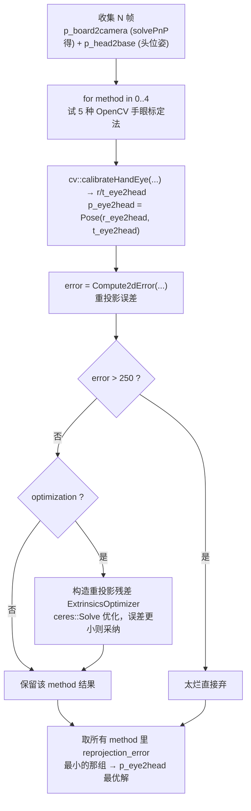
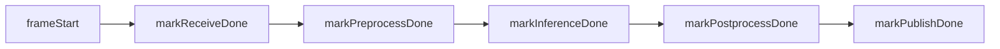

# 3.6 · 标定、配置、性能分析与数据记录

本篇收尾视觉模块的四块配套设施：① **手眼标定**（求相机外参 `p_eye2head`）；② **配置文件** `vision.yaml` / `field.yaml` 逐项；③ **性能分析** profiler；④ **数据记录** DataLogger。

涉及源码：`calibration/calibration.cpp`、`calibration_node.cpp`、`board_detector.cpp`、`vision_profiler.h`、`data_logger.hpp`、`config/vision.yaml`、`config/field.yaml`。

---

## 一、为什么要标定？

[3.4](./3.4-位姿估计几何.md) 的坐标链里有一项 `p_eye2head_`——相机相对头部的固定外参。它装在头里，无法用尺子量准（相机芯片中心、安装角度都有公差）。标定就是**用已知尺寸的棋盘格反推出这个 4×4 变换**，结果写回 `vision.yaml` 的 `extrin`。

> 💡 外参差 1°，落到 4 米外就是 7cm 偏差。标定是位置精度的"地基"。标定节点是**独立可执行**（`calibration_node`），平时不跑，只在装好相机后做一次。

---

## 二、棋盘格检测 `BoardDetector`

`board_detector.cpp`。负责在图像里找棋盘格角点并算棋盘位姿。

```cpp
bool DetectBoard(const cv::Mat &img) {                      // board_detector.cpp:42
    cv::cvtColor(img, gray_, COLOR_BGR2GRAY);
    return cv::findChessboardCorners(gray_, board_size_, board_uvs_,
                CALIB_CB_ADAPTIVE_THRESH | CALIB_CB_NORMALIZE_IMAGE);
}
std::vector<cv::Point2f> getBoardUVsSubpixel() {            // board_detector.cpp:17
    cv::cornerSubPix(gray_, board_uvs_, Size(11,11), ..., TermCriteria(EPS+COUNT, 30, 0.1));  // 亚像素精化
}
Pose getBoardPose() {                                       // board_detector.cpp:7
    cv::solvePnP(board_points_, board_uvs_, intr_.matrix(), intr_.distortion_coeffs, rvec, tvec);
    return Pose(rvec, tvec);                                // 棋盘相对相机的位姿
}
```

构造时按棋盘格尺寸生成角点的三维真值 `board_points_`（`board_detector.h:14`，`z=0` 的网格）。`board_w/h`、`square_size` 从参数读（默认 11×8，5cm 格，`calibration_node.cpp:103`）。

- `DetectBoard`：用 `findChessboardCorners` 找内角点（自适应阈值 + 归一化）。
- `getBoardUVsSubpixel`：`cornerSubPix` 把角点定位到亚像素级。
- `getBoardPose`：`solvePnP` 用"三维真值 + 二维观测 + 内参"解出棋盘相对相机的位姿 `p_board2camera`。

---

## 三、手眼标定流程

标定节点（`calibration_node.cpp`）收集多帧"棋盘姿态 + 头位姿"，调 `calibration.cpp` 求解。两种模式：

### 模式 1：`handeye`——求外参 `EyeInHandCalibration`（calibration.cpp:37）

经典 **Eye-in-Hand（相机装在运动部件上）** 标定：



- **5 种方法择优**：`cv::calibrateHandEye` 支持 Tsai/Park/Horaud/Andreff/Daniilidis 五种算法（`method 0..4`），各有适用场景，全跑一遍取重投影误差最小的。
- **Ceres 精化**（`calibration.cpp:104-172`）：把"相机外参 + 棋盘在 base 系的位姿"作为待优化变量，对每个角点建一个**重投影残差**（`ExtrinsicsOptimizer`），用 `EigenQuaternionManifold` 约束四元数在单位球面上，`DENSE_SCHUR` 求解。优化后误差更小才采纳。
- **重投影误差** `Compute2dError`（`calibration.cpp:9`）：把棋盘三维角点经 `p_base2eye·p_board2base` 变到相机系、`intr.Project` 投成像素，与实际检测的角点像素比，平均欧氏距离。`vision.yaml` 里记着上次标定的 `reprojection_error: 3.56`（像素）。

### 模式 2：`offset`——求补偿 `EyeInHandOffsetCalibration`（calibration.cpp:210）

不重标整套外参，只优化 [3.4](./3.4-位姿估计几何.md) 里那个在线补偿 `p_headprime2head_`（pitch/yaw/z）。

```cpp
// 对每帧：用已知场地地标真值 gt_3d 和观测射线 computed_3d_ray，建 3D 残差
ceres::CostFunction *cf = new AutoDiffCostFunction<ExtrinsicsOffsetOptimizer, 2, 4, 3>(...);
problem.AddResidualBlock(cf, new ceres::CauchyLoss(0.5), q_head2head_prime, t_head2head_prime);
// 平移分量被限制在 ±0.1m，without_translation=true 时干脆冻结平移只优化旋转
problem.SetParameterLowerBound(t..., 0, -0.1); ...
```

`Compute3dError`（`calibration.cpp:190`）算补偿后地面求交位置与地标真值的平均三维误差。

> 💡 offset 标定用的就是 [3.4](./3.4-位姿估计几何.md) 的射线-地面求交：让机器人看几个**位置已知的场地地标**（来自 `field.yaml`），调 pitch/yaw 让"算出来的落点"对齐"真实地标坐标"。`CauchyLoss(0.5)` 是鲁棒核，抑制个别离群观测的影响。`zero_translation` 时只调角度——因为高度/平移通常无需动，只有视线角度有系统偏差。

标定节点也支持离线模式（`RunOfflineCalibrationProcess`），从 DataLogger 录的数据集回放标定。

---

## 四、配置文件 `vision.yaml` 逐项

`config/vision.yaml`。按块拆解：

### camera 块

```yaml
camera:
  color_topic / depth_topic / intrin_topic   # 相机三话题（按平台注释切换：sim/d-robotics/orbbec/realsense/zed）
  intrin: {fx, fy, cx, cy, distortion_model, distortion_coeffs}   # 内参
  extrin: [4×4]                               # 外参 p_eye2head（标定得到）
  pitch_compensation / yaw_compensation / z_compensation: 0       # 在线补偿初值
```

- 多平台话题以注释形式并列，当前启用 d-robotics（地瓜）的 `/StereoNetNode/*`。
- `extrin` 是手眼标定输出的 4×4 矩阵；注释强调"pitch 补偿在代码里做，这里只放真实偏移"。
- `distortion_model: 0` 即 `kNone`（图像已矫正）。当前平台喂进来的是已矫正图，所以走 `kNone`；但一旦换用带畸变的相机、把 `distortion_model` 配成 1/2，去畸变函数 `Intrinsics::UnDistort` 就必须真正生效——这里曾潜伏一个把它完全"架空"的 bug（见下）。

#### `UnDistort` switch 落空 bug 修复（intrin.cpp:112）

`Intrinsics::UnDistort` 按畸变模型选择是否去畸变。`393253a` 修掉了一个 **switch 语句缺 `break`/`return` 导致 case 落空（fall-through）**的严重 bug：

```cpp
// 修复前（有 bug）：
cv::Point2f undistorted_point;
switch (model) {
case DistortionModel::kBrownConrady: // TODO(SS): fix this later
case DistortionModel::kInverseBrownConrady:
    undistorted_point = Project(BackProject(point));   // 算了去畸变结果……
case DistortionModel::kNone:                           // ……但没有 break，直接落到这里
default:
    undistorted_point = point;                         // 被原样覆盖！去畸变结果被丢弃
}
return undistorted_point;

// 修复后：每个 case 直接 return，杜绝落空
switch (model) {
case DistortionModel::kBrownConrady:
case DistortionModel::kInverseBrownConrady:
    return Project(BackProject(point));
case DistortionModel::kNone:
default:
    return point;
}
```

> 💡 这个 bug 的隐蔽之处在于：`kBrownConrady`/`kInverseBrownConrady` 分支算出的 `Project(BackProject(point))` 去畸变结果，因为**没有 `break`**，会一路落到下面的 `kNone`/`default` 分支，被 `undistorted_point = point` 无条件覆盖回原始点。结果就是——**无论配哪种畸变模型，`UnDistort` 都等于什么也没做**，直接返回原像素。在 `kNone`（已矫正图）平台上恰好"看起来正确"，所以长期没被发现；可一旦切到真正有畸变的相机，角点/球的像素不会被矫正，射线-地面求交（[3.4](./3.4-位姿估计几何.md)）就会系统性偏移。改成每个 `case` 直接 `return`，既修了落空、也顺手删掉了那句 `TODO(SS): fix this later`。

### detection_model 块

```yaml
detection_model:
  model_path: ./src/vision/model/best_digua_second_10.3.engine
  confidence_threshold: 0.2      # 全局默认阈值
  nms_threshold: 0.4
  classnames: [Ball, Goalpost, Person, LCross, TCross, XCross, PenaltyPoint, Opponent, BRMarker]
  post_process:
    single_ball_assumption: false
    confidence_thresholds: {Ball: 0.2, Opponent: 0.5, LCross: 0.1, ...}   # 逐类别阈值
```

逐类别阈值与 `single_ball_assumption` 见 [3.3](./3.3-模型推理.md)。

### segmentation_model 块

```yaml
segmentation_model:
  model_path: ./src/vision/model/best_seg_orin_10.3.engine
  confidence_threshold: 0.3
  nms_threshold: 0.9
```

### 位姿估计器块

```yaml
use_depth: false                  # 全局是否用深度
ball_pose_estimator:
  use_depth: false
  radius: 0.109                    # 球半径（球面拟合校验用）
  down_sample_leaf_size: 0.01      # 体素下采样 1cm
  cluster_distance_threshold: 0.01
  fitting_distance_threshold: 0.01
  minimum_cluster_size: 150
  filter_distance: 1.2             # 超过此距离不用深度
  check_ball_height: true          # 球心陷地下则否决
human_like_pose_estimator:
  use_depth / down_sample_leaf_size / fitting_distance_threshold / statistic_outlier_multiplier
field_marker_pose_estimator:
  refine: false                    # 是否霍夫精化角点
  line_segment_area_threshold: 75  # 场地线段最小面积
```

这些参数怎么被点云/估计器用，见 [3.4](./3.4-位姿估计几何.md) 和 [3.5](./3.5-点云与图像桥.md)。

### calibration 块

```yaml
calibration:
  sync_max_time_diff_ms: 1400      # 标定时图像/位姿允许的最大时间差
  offset: {exclude_distance: 2.0, zero_translation: true, field_marker_path: ./field.yaml}
  handeye: {calibration_time, reprojection_error: 3.56}    # 上次标定记录
```

### misc / profiler / robot_name

```yaml
misc:
  save_data_nonstationary: true    # 只在机器人移动时存盘
vision_profiler:
  enable: true
  alert_fps_min: 40.0              # FPS 低于 40 告警
  alert_drop_rate_max: 2.0         # 丢帧率 >2% 告警
  alert_e2e_p95_ms_max: 20.0       # 端到端 p95 >20ms 告警
  alert_jitter_ms_max: 5.0
  report_every_n_frames: 100
robot_name: ""                     # 多机器人时填 robot0/robot1，单机留空
```

---

## 五、场地地标真值 `field.yaml`

`config/field.yaml`。记录各场地标记在**场地坐标系**下的真值坐标（米）：

```yaml
TCross1: [ 5.955,  2.930]
LCross1: [ 7.465,  2.930]
XCross1: [ 4.505, -4.010]
PenalityPoint: [ 2.965,  0.885]
...
```

> 🏆 这些坐标由 RoboCup 标准场地尺寸决定（球门、禁区、中圈、罚球点的画线位置都是规则规定的固定值）。offset 标定（模式 2）和大脑自定位都拿它当"地面真值"：看到某个 TCross，就知道机器人相对这个已知点的位置，反推自身在场上的位姿。地标与观测的关联可用 [3.4 匈牙利匹配](./3.4-位姿估计几何.md) 完成。

---

## 六、性能分析 `VisionProfiler`

`vision_profiler.h`。纯插桩，不改业务逻辑，统计每帧各阶段耗时并周期报告。

### 打点（vision_profiler.h:42-77）

`ProcessData` 在各阶段后打点（[3.1](./3.1-节点与主流水线.md)）：

每段用 `steady_clock`（单调时钟）算毫秒差，存进 `recv_/pre_/inf_/post_/pub_/e2e_` 向量。

### 报告（vision_profiler.h:97）

攒满 `report_every_n_frames`（100）帧后输出一次：
- **FPS / jitter**：从相邻帧的 `frameStart` 间隔算。jitter = 间隔的标准差。
- **drop rate**：间隔比中位数大 1.8 倍以上的帧算"丢帧"（`vision_profiler.h:114`）。
- **各阶段 p50/p95**：用 `percentile`（线性插值）算分位数。
- **告警**：FPS<40、drop>2%、e2e p95>20ms、jitter>5ms 任一超标就 `cerr` 报警。

> 💡 为什么看 **p95 而非平均**？平均会被偶发的快帧拉低，掩盖卡顿。p95（95% 的帧都比这快）更能反映"最坏情况下的延迟"，对实时决策更有意义——比赛里偶尔一帧 50ms 就可能错过踢球时机。

> 🏆 FPS<40 告警阈值对应足球决策的实时性要求：球速快，视觉跟不上就会"看到的球已经不在那了"。profiler 让性能退化在日志里立刻暴露。

---

## 七、数据记录 `DataLogger`

`data_logger.hpp`。把彩色/深度/位姿存盘，攒数据集供训练或离线回放/标定。

### 异步写盘（data_logger.hpp:121）

```cpp
// 主线程只把"写任务"塞队列，后台线程取出执行
log_queue_.emplace([path, img]{ cv::imwrite(path, img); });
queue_cv_.notify_one();
// ProcessQueue 后台线程循环：等条件变量 → 取任务 → 执行
```

> 💡 为什么异步？`cv::imwrite` 写一张 JPEG/PNG 要几到十几毫秒，若在收图回调里同步写，会拖慢整条视觉流水线、掉帧。把写盘丢给独立后台线程，主流水线只做"入队"这种纳秒级操作。

后台循环 `ProcessQueue` 执行取出的写任务时，`393253a` 给它裹了一层 `try/catch`（`data_logger.hpp:134-138`）：

```cpp
try {
    log_task();
} catch (const std::exception& e) {
    std::cerr << "DataLogger: task failed: " << e.what() << std::endl;
}
```

> 💡 为什么要 catch？`log_task()` 里可能 `cv::imwrite` 到不存在/无权限的目录、磁盘满、或 YAML 序列化异常。这些是在**后台线程**抛出的——若不捕获，异常会逸出线程函数导致 `std::terminate` 直接**整个进程崩溃**。比赛中"存盘失败"绝不该拖垮视觉进程，所以这里吞掉异常、只打一行错误日志，让主流水线继续跑。

### 只存运动帧（data_logger.hpp:62 `LogDataBlock`）

```cpp
if (save_data_nonstationary_) {
    auto p_now2previous = p_previous_head2base_.inverse() * p_head2base;
    double angle = acos((trace(R)-1)/2) * 180/M_PI;        // 与上次的角度变化
    double distance = norm(translation_diff);              // 与上次的位移
    if (!(angle > 1.5 || distance > 0.05)) return;         // 没怎么动 → 不存
    p_previous_head2base_ = p_head2base;
}
// 存 color_<ts>.jpg / depth_<ts>.png / pose_<ts>.yaml
```

> 💡 为什么只存"运动帧"？机器人站着不动时连续几百帧几乎一样，存下来是冗余、浪费磁盘、也让数据集分布失衡。只在头/身体转动超过 1.5° 或移动超过 5cm 时才存，数据集更"多样"。文件名 `color_<时间戳>.jpg` 正是 [3.2](./3.2-数据同步.md) 离线 `DataSyncer::LoadData` 解析的格式。

`Init` 时还会 `LogYAML(node, "vision_local.yaml")` 把当时的完整配置一起存档（`vision_node.cpp:206`），保证数据集可复现。存盘频率由 `save_fps` 经 `save_every_n_frame_` 控制（[3.1](./3.1-节点与主流水线.md)）。

> 💡 `393253a` 还顺手修了 `DataLogger` 构造与调用处的两处隐患（`vision_node.cpp`）：
> 1. **`HOME` 环境变量为空**：日志根目录原来直接写 `std::string(std::getenv("HOME")) + "/Workspace/vision_log/..."`。若进程环境里没有 `HOME`（如以某些服务/容器方式启动），`getenv` 返回 `nullptr`，用它构造 `std::string` 是**未定义行为**（多半崩溃）。现在改成 `home_env ? home_env : "/tmp"`，缺失时回退到 `/tmp`。
> 2. **`data_logger_` 空指针**：`data_logger_` 只有在 `save_data_` 为真时才 `make_shared`，否则是 `nullptr`。原来的 `data_logger_->LogYAML(...)` 和 `data_logger_->LogDataBlock(...)` 都没判空，`save_data=false` 时就是**空指针解引用**。现在两处都加了 `if (data_logger_)` 守卫。

---

## 小结

- **标定**：棋盘格 `solvePnP` 得棋盘姿态 → 5 种手眼法择优 → Ceres 精化重投影 → 写回 `extrin`；offset 模式只用地标真值微调 pitch/yaw 补偿。
- **vision.yaml**：相机话题/内外参、检测/分割模型路径与阈值、四种估计器参数、标定记录、profiler 与多机配置。
- **field.yaml**：场地地标真值，供 offset 标定和自定位。
- **profiler**：插桩统计各阶段 p50/p95、FPS、抖动、丢帧，超标告警；看 p95 抓最坏延迟。
- **DataLogger**：后台线程异步写、只存运动帧、文件名带时间戳，与离线回放格式对应。

至此视觉模块讲完。下一模块看另外两条信息通路：裁判机和队内通信。
