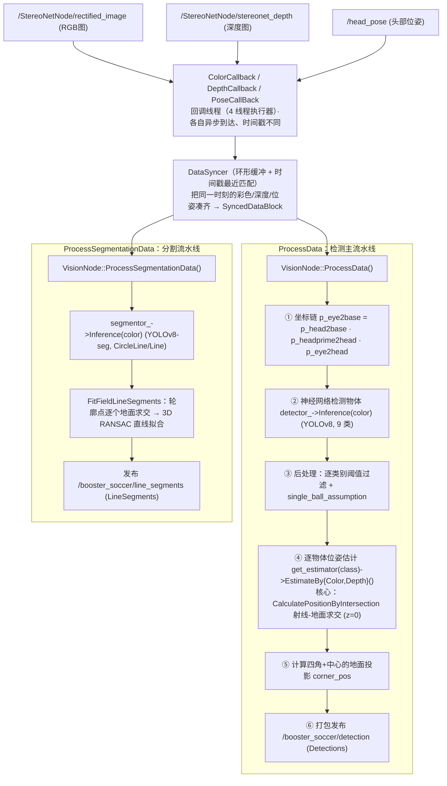

# 模块 03 · 视觉模块 vision

视觉模块要回答一个问题：**"我看到了什么，它在场上的哪里？"** 这分两步——先用神经网络在图像里框出物体（检测）和场地线（分割），再用几何把图像坐标变成三维场地坐标（位姿估计）。

本模块把这条流水线**拆到每一个函数、每一处坐标变换、每一行 RANSAC**来讲。代码在 `src/vision/`，约 7800 行 C++。

## 子篇导航

| 子篇 | 讲什么 | 对应源码 |
|------|--------|----------|
| [3.1 节点与主流水线](./3.1-节点与主流水线.md) | `main.cpp`、`VisionNode::Init` 初始化顺序、`ProcessData` 逐步骤、发布话题、相机内参动态更新、`show_det`/`save_data` 等开关 | `main.cpp` `vision_node.cpp` `launch.py` |
| [3.2 数据同步](./3.2-数据同步.md) | `DataSyncer` 环形缓冲 + 时间戳最近匹配逐行，为何倒序遍历提前退出，缓冲大小选择 | `base/data_syncer.{hpp,cpp}` |
| [3.3 模型推理](./3.3-模型推理.md) | 双后端工厂模式与 `NO_CUDA`、9 类别、`DetectionRes`/`SegmentationRes`、ONNX 与 TensorRT 流程、letterbox、NMS、坐标缩放、逐类别阈值、`single_ball_assumption` | `model/detector.cc` `segmentor.cc` `onnx/*` `trt/*` |
| [3.4 位姿估计几何](./3.4-位姿估计几何.md) | （核心）`Intrinsics` 投影/反投影、坐标变换链、`CalculatePositionByIntersection` 逐行、z=0 假设、四种专用估计器、`FitFieldLineSegments` 三维 RANSAC | `base/intrin.cpp` `base/pose.cpp` `pose_estimator/*` |
| [3.5 点云与图像桥](./3.5-点云与图像桥.md) | `pointcloud_process` 各步骤、深度球面/平面 RANSAC 拟合、`img_bridge` 各编码处理 | `base/pointcloud_process.cpp` `img_bridge.cpp` |
| [3.6 标定与配置](./3.6-标定与配置.md) | 手眼标定流程、`board_detector` 棋盘格、`vision.yaml`/`field.yaml` 逐项、性能分析 profiler、数据记录 | `calibration/*` `vision.yaml` `field.yaml` `vision_profiler.h` `data_logger.hpp` |

## 本模块要点速览

### 一帧图像的旅程（总览图）

入口 `src/vision/src/main.cpp` 很简单：创建 `VisionNode`，用 **4 线程的多线程执行器** 跑，并开启**进程内通信**（零拷贝传大图像）。

> 💡 整个模块的设计精髓：**神经网络只负责"在哪个像素"，几何负责"在场上哪里"**。最巧妙的一招是 [3.4 射线-地面求交](./3.4-位姿估计几何.md)——对贴地物体（球、对手、场地角点），不依赖深度相机也能几何精确定位。

### 核心要点

1. **两条独立流水线**：检测流水线（`ColorCallback → ProcessData`）输出物体位置；分割流水线（`SegmentationCallback → ProcessSegmentationData`）输出场地线段。它们各有一个 `DataSyncer`，跑在不同的回调组里，互不阻塞。

2. **核心是"神经网络检测 + 几何位姿估计"**：
   - 神经网络（YOLOv8）给出 `bbox` 和类别——这是"在哪个像素"。
   - 几何（射线-地面求交）给出三维场地坐标——这是"在场上哪里"。

3. **最巧妙的是射线-地面求交**（[3.4](./3.4-位姿估计几何.md)）：一个像素反投影成相机出发的一条射线，转到场地系后与地面 `z=0` 求交。对贴地物体几何精确，且不依赖深度。深度仅在近处作"精化"。

4. **双后端兼顾性能与通用**（[3.3](./3.3-模型推理.md)）：编译期 `NO_CUDA` 开关在 TensorRT（真机 GPU）和 ONNX Runtime（无显卡/仿真）之间二选一，对上层 `Inference()` 接口完全透明。

## 读完本模块你应该能回答

- 彩色图、深度图、头部位姿三个不同步的话题是怎么被对齐到"同一时刻"的？
- 神经网络只告诉我"图像第 320 行第 200 列有个球"，系统是怎么算出"球在场上 (2.1, -0.5)"的？
- 为什么球取检测框的**底边中点**，而一般物体取**框中心**？
- 真机和仿真在模型推理后端上差在哪？
