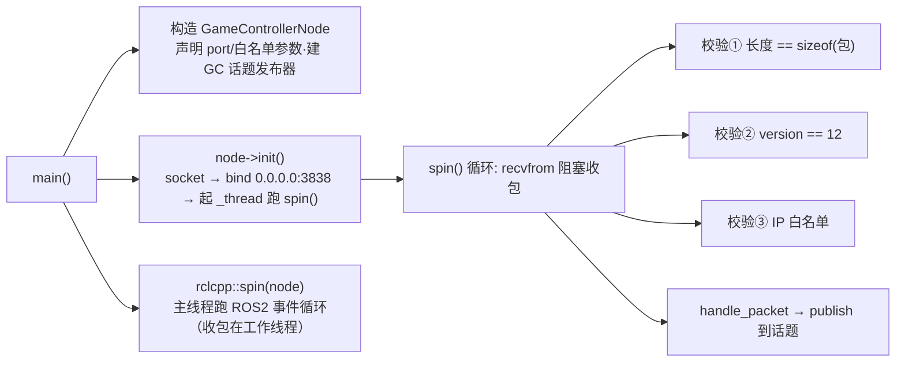

# 4.1 · game_controller 节点逐行精读

本篇把"裁判机的耳朵"——`game_controller` 这个**独立 ROS2 进程**——从入口 `main.cpp` 到收包线程、三道校验、二进制转 ROS、话题发布、launch 参数，**一行不漏**地讲透。涉及的协议常量（`STATE_*`、结构体字段含义）放到下一篇 [4.2](./4.2-RoboCup协议常量.md) 专门讲。

> 这个节点的活就一句话：**收裁判机的 UDP 二进制广播包 → 校验 → 逐字段翻译成 ROS2 消息 → 发布到话题**。

---

## 一、入口 `main.cpp`（全 18 行）

文件：`src/game_controller/src/main.cpp`

```cpp
int main(int argc, char *argv[]) {
    rclcpp::init(argc, argv);                                   // 第 7 行
    auto node = make_shared<GameControllerNode>("game_controller_node"); // 第 9 行
    node->init();                                               // 第 11 行
    rclcpp::spin(node);                                         // 第 13 行
    rclcpp::shutdown();                                         // 第 15 行
    return 0;
}
```

- **第 7 行** `rclcpp::init`：初始化 ROS2 运行时。
- **第 9 行**：构造节点对象，名字 `game_controller_node`。**注意构造函数里只声明/读取参数、建发布器，并不开 socket**（见下）。
- **第 11 行** `node->init()`：真正建 UDP socket、绑定端口、起收包线程。把"构造"和"init"分开，是为了让构造保持轻量、可测试，重活留给显式的 `init()`。
- **第 13 行** `rclcpp::spin(node)`：进入 ROS2 事件循环（处理参数回调等）。**真正的收包在另一个线程里跑**（`init()` 起的 `_thread`），所以这里 `spin` 即便没有定时器/订阅也没关系——它只是让进程不退出、让 ROS2 后台机制运转。
- **第 15 行**：`spin` 返回（进程被 Ctrl-C）后清理 ROS2。

> 💡 为什么收包不用 ROS2 的回调而是自己开线程？因为裁判机是**原始 UDP socket**，不是 ROS2 话题。ROS2 的 `spin` 机制管不到裸 socket，必须自己 `recvfrom()` 阻塞收。于是形成"主线程 spin + 工作线程收 UDP"的双线程结构。

---

## 二、头文件 `game_controller_node.h`：成员一览

文件：`src/game_controller/include/game_controller_node.h`

```cpp
class GameControllerNode : public rclcpp::Node {
public:
    GameControllerNode(string name);
    ~GameControllerNode();
    void init();
    void spin();                       // 收包循环（注意和 rclcpp::spin 同名但是不同的东西）
private:
    bool check_ip_white_list(string ip);
    void handle_packet(HlRoboCupGameControlData &data,
                       game_controller_interface::msg::GameControlData &msg);
    int _port;                         // 监听端口
    bool _enable_ip_white_list;        // 是否启用 IP 白名单
    vector<string> _ip_white_list;     // 白名单列表
    int _socket;                       // UDP socket 句柄
    thread _thread;                    // 收包工作线程
    rclcpp::Publisher<...GameControlData>::SharedPtr _publisher; // ROS 发布器
};
```

要点：成员 `spin()`（本类的收包循环）和 `rclcpp::spin()`（ROS2 全局函数）**是两回事**，别混淆。本类的 `spin()` 跑在 `_thread` 线程里。

---

## 三、构造函数：声明参数 + 建发布器

文件：`src/game_controller/src/game_controller_node.cpp:10`

```cpp
GameControllerNode::GameControllerNode(string name) : rclcpp::Node(name)
{
    _socket = -1;                                              // 第 12 行：socket 标记为未创建

    declare_parameter<int>("port", 3838);                     // 第 14 行
    declare_parameter<bool>("enable_ip_white_list", false);   // 第 15 行
    declare_parameter<vector<string>>("ip_white_list", vector<string>{}); // 第 16 行

    get_parameter("port", _port);                             // 第 18 行
    ...
    get_parameter("enable_ip_white_list", _enable_ip_white_list);
    get_parameter("ip_white_list", _ip_white_list);
    for (size_t i = 0; i < _ip_white_list.size(); i++) { ... } // 逐条打印白名单

    _publisher = create_publisher<...GameControlData>(
        "/booster_soccer/game_controller", 10);               // 第 29 行
}
```

逐项：

| 行号 | 代码 | 含义 |
|------|------|------|
| 12 | `_socket = -1` | socket 句柄初始化为 -1（无效值），析构时据此判断是否需要 `close` |
| 14 | `declare_parameter("port", 3838)` | 声明监听端口，默认 **3838**（RoboCup 裁判机广播标准端口，见 [4.2](./4.2-RoboCup协议常量.md) 的 `GAMECONTROLLER_DATA_PORT`） |
| 15 | `declare_parameter("enable_ip_white_list", false)` | 是否启用源 IP 白名单，**默认关**（接受所有来源） |
| 16 | `declare_parameter("ip_white_list", {})` | 白名单 IP 列表，默认空 |
| 18-27 | `get_parameter(...)` | 把声明的参数读进成员变量，并逐行打印到日志（方便上场前核对配置） |
| 29 | `create_publisher(...)` | 建发布器，话题 **`/booster_soccer/game_controller`**，队列深度 10。消息类型 `game_controller_interface::msg::GameControlData` 来自接口包（见 [模块02](../02-接口与消息/index.md)） |

> 💡 端口、白名单都做成 ROS 参数而非硬编码，是为了能在 launch 文件里改（见本篇末尾）。默认关白名单，是因为开发/仿真环境里裁判机 IP 经常变，开了反而容易"收不到包还查不出原因"。正式比赛若怕串台，再在 launch 里打开并填官方裁判机 IP。

---

## 四、`init()`：建 socket、绑定、起线程

文件：`game_controller_node.cpp:46`

```cpp
void GameControllerNode::init()
{
    _socket = socket(AF_INET, SOCK_DGRAM, 0);                 // 第 48 行：建 UDP socket
    if (_socket < 0) {                                        // 第 49 行：失败则抛异常
        RCLCPP_ERROR(...); throw runtime_error(strerror(errno));
    }

    sockaddr_in addr;                                        // 第 55 行
    addr.sin_family = AF_INET;
    addr.sin_addr.s_addr = htonl(INADDR_ANY);                // 第 57 行：监听所有网卡
    addr.sin_port = htons(_port);                            // 第 58 行：端口转网络字节序

    if (bind(_socket, (sockaddr *)&addr, sizeof(addr)) < 0) { // 第 60 行：绑定
        RCLCPP_ERROR(...); throw runtime_error(strerror(errno));
    }

    RCLCPP_INFO(..., "Listening for UDP broadcast on 0.0.0.0:%d", _port);
    RCLCPP_INFO(..., "Expected HlRoboCupGameControlData size: %ld",
                sizeof(HlRoboCupGameControlData));            // 第 67 行：打印期望包大小

    _thread = thread(&GameControllerNode::spin, this);       // 第 69 行：起收包线程
}
```

逐行：

- **第 48 行** `socket(AF_INET, SOCK_DGRAM, 0)`：建一个 IPv4(`AF_INET`)、数据报(`SOCK_DGRAM`，即 **UDP**)的 socket。裁判机用广播，必须是 UDP。
- **第 57 行** `htonl(INADDR_ANY)`：绑定地址设为 `0.0.0.0`，表示**监听本机所有网卡**。`htonl` 把主机字节序转网络字节序（大端）。
- **第 58 行** `htons(_port)`：端口同理转网络字节序。
- **第 60 行** `bind(...)`：把 socket 绑到 `0.0.0.0:3838`。绑定后才能收到发往这个端口的广播包。
- **第 67 行**：打印 `HlRoboCupGameControlData` 结构体的 `sizeof`。**这是一个非常实用的调试输出**——收到的包长度必须等于这个值，否则就是协议版本/对齐不匹配（见下面的校验）。
- **第 69 行** `_thread = thread(...)`：启动工作线程，跑成员函数 `spin()`。从此收包在新线程里进行，主线程回到 `main` 里的 `rclcpp::spin`。

> 💡 这里用 `throw` 而不是 `return false`：socket 建不起来、端口绑不上（比如被别的进程占用了 3838）属于致命错误，没法继续工作，直接抛异常让进程崩掉、在日志里留下 `strerror(errno)`（如 "Address already in use"），比悄悄返回更容易排查。

---

## 五、`spin()`：收包循环 + 三道校验

文件：`game_controller_node.cpp:72`。这是本节点的心脏。

```cpp
void GameControllerNode::spin()
{
    sockaddr_in remote_addr;                                 // 发送方地址
    socklen_t remote_addr_len = sizeof(remote_addr);
    HlRoboCupGameControlData data;                           // 收包缓冲（栈上复用）
    game_controller_interface::msg::GameControlData msg;     // ROS 消息（复用）

    while (rclcpp::ok())                                     // 第 80 行：ROS 没关就一直收
    {
        ssize_t ret = recvfrom(_socket, &data, sizeof(data), 0,
                               (sockaddr *)&remote_addr, &remote_addr_len); // 第 82 行：阻塞收一包
        if (ret < 0) {                                       // 第 83 行：收失败
            RCLCPP_ERROR(...); continue;
        }
        string remote_ip = inet_ntoa(remote_addr.sin_addr); // 第 89 行：发送方 IP 转字符串

        // ===== 校验①：长度 =====
        if (ret != sizeof(data)) {                           // 第 91 行
            RCLCPP_INFO(..., "invalid length=%ld, expected=%ld", ret, sizeof(data));
            continue;
        }
        // ===== 校验②：协议版本 =====
        if (data.version != HL_GAMECONTROLLER_STRUCT_VERSION) { // 第 97 行
            RCLCPP_INFO(..., "invalid version: %d", data.version);
            continue;
        }
        // ===== 校验③：IP 白名单 =====
        if (!check_ip_white_list(remote_ip)) {               // 第 103 行
            RCLCPP_INFO(..., "not in ip white list, ignore it");
            continue;
        }

        handle_packet(data, msg);                            // 第 109 行：解析
        _publisher->publish(msg);                            // 第 111 行：发布

        RCLCPP_INFO(..., "handle packet successfully ip=%s, packet_number=%d",
                    remote_ip.c_str(), data.packetNumber);   // 第 113 行
    }
}
```

逐段拆解：

### 5.1 阻塞收包（第 82 行）

`recvfrom` 是**阻塞**调用：没有包来时，线程睡在这里不占 CPU；一来包就把数据填进 `data`，并把发送方地址填进 `remote_addr`。返回值 `ret` 是实际收到的字节数。

> 💡 把 `data` 和 `msg` 声明在循环外、循环内复用，避免每包都重新构造对象。`msg` 复用带来一个坑：里面的**可变长数组字段必须每次清空**，否则会残留上一包的数据——这一点在 `handle_packet` 里有专门处理（见 [4.2](./4.2-RoboCup协议常量.md)）。

### 5.2 三道校验（缺一不可）

| 校验 | 行号 | 判断 | 不通过怎么办 |
|------|------|------|--------------|
| ① 长度 | 91 | `ret == sizeof(HlRoboCupGameControlData)` | 长度对不上说明根本不是这个协议的包（或版本对齐不同），`continue` 丢弃 |
| ② 版本 | 97 | `data.version == HL_GAMECONTROLLER_STRUCT_VERSION`（=12） | 版本不符可能是 SPL 包或旧版裁判机，丢弃 |
| ③ 白名单 | 103 | `check_ip_white_list(remote_ip)` | 源 IP 不在白名单（且白名单已启用），丢弃 |

> ⚠️ 注意校验①只比了长度，**没有显式校验 `header` 魔术字 `"RGme"`**。版本号校验(②)起到了类似的"是不是我们认识的包"的过滤作用。长度+版本两关一起，已经能挡掉绝大多数无关 UDP 流量。

### 5.3 IP 白名单 `check_ip_white_list`

文件：`game_controller_node.cpp:118`

```cpp
bool GameControllerNode::check_ip_white_list(string ip)
{
    if (!_enable_ip_white_list) return true;        // 没启用：放行所有
    for (size_t i = 0; i < _ip_white_list.size(); i++)
        if (ip == _ip_white_list[i]) return true;   // 命中白名单：放行
    return false;                                    // 否则拦截
}
```

逻辑很直白：**白名单没开就全放行**；开了就只放行列表里的 IP。

> 🏆 白名单的用途：比赛场地局域网里可能有别的队的裁判机测试流量、或恶意/误发的包。开白名单 + 填官方裁判机 IP，能保证"只听官方那一台"。但调试时务必记得关掉，否则裁判机 IP 一变就静默丢包。

### 5.4 解析并发布

校验全过后：`handle_packet(data, msg)` 把二进制结构体逐字段拷进 ROS 消息（详见 [4.2](./4.2-RoboCup协议常量.md) 第三节），然后 `_publisher->publish(msg)` 发到 `/booster_soccer/game_controller` 话题。大脑订阅这个话题，在 `gameControlCallback` 里消费（也见 [4.2](./4.2-RoboCup协议常量.md)）。最后打一行成功日志，带上发送方 IP 和包序号 `packetNumber`（递增，可用来判断丢包）。

> ⚠️ **消费侧的越界防护（大脑 `gameControlCallback`）**：本节点只做了长度/版本/白名单三道校验，但**没有校验 `state` 字段的取值范围**——它只是把裸字节原样转成 ROS 消息发出去。裁判机的 `state` 是一个整数枚举，大脑收到后要用它去查一张字符串表 `gameStateMap = {"INITIAL","READY","SET","PLAY","END"}`（只有 5 个元素）。如果收到的包被篡改、协议扩展或对齐错位，导致 `state` 越界（如 5、255），直接 `gameStateMap[state]` 就是**数组越界读**，行为未定义甚至崩溃。因此大脑侧做了兜底校验：
>
> ```cpp
> // 文件：src/brain/src/brain.cpp:1466
> int stateIdx = static_cast<int>(msg.state);
> string gameState = (stateIdx >= 0 && stateIdx < static_cast<int>(gameStateMap.size()))
>                    ? gameStateMap[stateIdx]
>                    : "INITIAL"; // 越界则安全回退到 INITIAL
> ```
>
> 越界时回退到 `"INITIAL"`（最保守的"players prepare off the field"状态），宁可让机器人待命也不让越界读把进程带崩。这是"生产者不校验、消费者也要自保"的防御式编程——网络来的整数索引在下标访问前**必须**先夹到合法区间。

---

## 六、析构函数：收尾

文件：`game_controller_node.cpp:32`

```cpp
GameControllerNode::~GameControllerNode()
{
    if (_socket >= 0) close(_socket);       // 关 socket（会让阻塞中的 recvfrom 返回）
    if (_thread.joinable()) _thread.join(); // 等收包线程退出
}
```

`close(_socket)` 会让正卡在 `recvfrom` 的工作线程返回（`ret < 0`），循环条件 `rclcpp::ok()` 此时通常也已为假，线程退出，`join()` 回收。顺序是先关 socket 再 join，保证线程能醒过来。

---

## 七、launch 参数 `launch.py`

文件：`src/game_controller/launch/launch.py`

```python
def generate_launch_description():
    return LaunchDescription([
        Node(
            package ='game_controller',
            executable='game_controller_node',
            name='game_controller',
            output='screen',
            parameters=[{
                "port": 3838,                       # 监听端口
                "enable_ip_white_list": False,      # 默认不启用白名单
                "ip_white_list": ["127.0.0.1"],     # 白名单内容（仅在上面为 True 时生效）
            }]
        ),
    ])
```

- 这三个参数正好对应构造函数里 `declare_parameter` 的三个。launch 里给的值会覆盖代码默认值。
- 这个节点**不接受命令行透传参数**（对比 [模块01](../01-启动与架构/index.md) 里 brain 的 `"$@"`）——端口等都写死在 launch 里，因为裁判机配置一般不随每次启动变化。
- `output='screen'`：日志直接打到终端（实际跑时 `start.sh` 又把它重定向到了 `game_controller.log`）。

### CMakeLists.txt 要点

文件：`src/game_controller/CMakeLists.txt`

```cmake
find_package(game_controller_interface REQUIRED)   # 依赖接口包（提供 GameControlData 消息）
add_executable(game_controller_node src/main.cpp src/game_controller_node.cpp)
ament_target_dependencies(game_controller_node game_controller_interface rclcpp)
install(DIRECTORY launch DESTINATION share/${PROJECT_NAME})  # 装 launch 文件
install(TARGETS game_controller_node DESTINATION lib/${PROJECT_NAME})
```

注意编译选项里有 `-Wno-unknown-pragmas`——因为协议头文件 `RoboCupGameControlData.h` 里用了 `#pragma region`（见 [4.2](./4.2-RoboCup协议常量.md)），这是 MSVC 的写法，GCC 不认识，加这个开关消掉警告。

---

## 小结



一句话：**双线程结构（主线程 spin + 工作线程裸 UDP recvfrom），三道校验（长度/版本/IP），逐字段翻译成 ROS 消息发布**。下一篇深入协议本身，看那些字节到底是什么意思。
