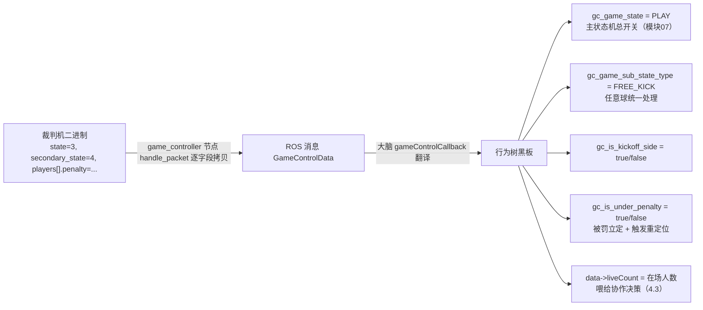

# 4.2 · RoboCup 协议常量字典 + 大脑怎么翻译

上一篇讲了节点怎么收包、怎么把二进制翻成 ROS 消息。本篇专门拆 `RoboCupGameControlData.h` 这本"协议字典"——里面每一个魔法数字的含义，以及大脑 `gameControlCallback` 怎么把这些数字最终变成行为树黑板里的字符串变量。

> 🏆 这个头文件来自 RoboCup 官方，**同时定义了 HL(Humanoid League，人形组) 和 SPL(Standard Platform League，标准平台组) 两套常量**，因为两个联赛规则不同。本项目是人形组，用的是 **HL 那套**（`Hl` 前缀的结构体、`HL_*` 前缀的常量）。SPL 那套一并讲，便于读懂头文件全貌、避免用错。

文件：`src/game_controller/include/RoboCupGameControlData.h`

---

## 一、顶部宏：端口、魔术字、版本

```cpp
#define GAMECONTROLLER_DATA_PORT          3838   // 裁判机广播端口（节点监听这个）
#define GAMECONTROLLER_RETURN_PORT        3939   // 机器人回包端口（上报"我还活着"，见 4.3）

#define GAMECONTROLLER_STRUCT_HEADER      "RGme" // 包头魔术字
#define HL_GAMECONTROLLER_STRUCT_VERSION  12     // 人形组协议版本（节点用它做校验②）
#define GAMECONTROLLER_STRUCT_VERSION     15     // SPL 协议版本

#define MAX_NUM_PLAYERS                   20     // SPL 每队最多 20 人
#define HL_MAX_NUM_PLAYERS                11     // 人形组每队最多 11 人（本项目按这个开数组）

#define GAMECONTROLLER_RETURN_STRUCT_HEADER  "RGrt" // 回包魔术字
```

记住三个数：监听 **3838**、回包 **3939**、人形组版本 **12**。`HL_MAX_NUM_PLAYERS=11` 这个常量在大脑里被反复用来开队友状态数组（`penalty[11]`、`tmStatus[11]` 等，见 [4.3](./4.3-队内通信BrainCommunication.md)）。

> 💡 头文件用 `#pragma region ... #pragma endregion` 把内容分成 "Humanoid"/"SPL" 几大块。这是 MSVC 的代码折叠语法，GCC 不认识，所以 [4.1](./4.1-game_controller节点.md) 提到的 CMakeLists 要加 `-Wno-unknown-pragmas` 消警告。

---

## 二、队伍颜色常量

SPL 一套（10 种颜色）：

```cpp
#define TEAM_BLUE 0  TEAM_RED 1  TEAM_YELLOW 2  TEAM_BLACK 3  TEAM_WHITE 4
#define TEAM_GREEN 5 TEAM_ORANGE 6 TEAM_PURPLE 7 TEAM_BROWN 8 TEAM_GRAY 9
```

HL 一套（只有两色 + 摔球）：

```cpp
#define TEAM_CYAN     0    // 青
#define TEAM_MAGENTA  1    // 品红
#define DROPBALL      255  // 争球/摔球（没有归属方）
```

`kickOffTeam`（开球方）字段若等于 `DROPBALL(255)`，表示这是个**争球**，没有任何一队是开球方。

比赛类型：

```cpp
#define GAME_KID_SIZE 0   // 儿童尺寸组
#define GAME_ADULT    1   // 成人尺寸组
#define GAME_DROPIN   2   // 临时混编组
```

---

## 三、主状态 `STATE_*`（最重要）

```cpp
#define STATE_INITIAL   0   // 开赛前：机器人在场外准备
#define STATE_READY     1   // 准备：机器人入场，走到各自起始位
#define STATE_SET       2   // 就位：静止站好，等裁判开哨
#define STATE_PLAYING   3   // 正常比赛进行中
#define STATE_FINISHED  4   // 本节/本场结束
#define STATE_DANIEL    15  // 一个特殊/调试值（罕用）
```

这是整局比赛的**主状态机**，对应 `HlRoboCupGameControlData.state` 字段。大脑的整棵行为树都按它分支（见 [模块07](../07-行为树与决策/index.md)）。状态流转大致是：`INITIAL → READY → SET → PLAYING → FINISHED`，进球或犯规后又会回到 `READY/SET`。

---

## 四、副状态 `STATE2_*`（任意球等）

副状态描述"正常比赛之外的特殊局面"，对应 `secondaryState` 字段：

```cpp
#define STATE2_NORMAL            0   // 普通比赛
#define STATE2_PENALTYSHOOT      1   // 点球大战
#define STATE2_OVERTIME          2   // 加时
#define STATE2_TIMEOUT           3   // 暂停（队伍暂停或裁判暂停）
#define STATE2_DIRECT_FREEKICK   4   // 直接任意球
#define STATE2_INDIRECT_FREEKICK 5   // 间接任意球
#define STATE2_PENALTYKICK       6   // 点球
#define STATE2_CORNER_KICK       7   // 角球
#define STATE2_GOAL_KICK         8   // 球门球
#define STATE2_THROW_IN          9   // 掷界外球
```

> 🏆 这些就是足球规则里的各种"死球后恢复方式"。大脑对它们的处理见第六节——除了 TIMEOUT，其余基本都被归并成一类 `"FREE_KICK"` 走同一套定位摆位逻辑。

SPL 那套对应的是 `SET_PLAY_*`（`SET_PLAY_GOAL_KICK=1`、`SET_PLAY_CORNER_KICK=3` 等）和 `GAME_PHASE_*`，语义类似，本项目不用。

---

## 五、罚则常量 `PENALTY_*` / `HL_*`（两套）

罚则表示"某个机器人因为犯规被罚下/暂停"，对应每个 `HlRobotInfo.penalty` 字段。

**通用 / 无罚则：**

```cpp
#define PENALTY_NONE   0     // 没有处罚（在场正常踢）—— 大脑用它判断队友是否 alive
#define UNKNOWN        255
#define NONE           0
#define SUBSTITUTE     14    // 替补
#define MANUAL         15    // 手动罚下
```

**SPL 罚则（旧式，`SPL_*`）：**

```cpp
#define SPL_ILLEGAL_BALL_CONTACT   1  // 非法触球
#define SPL_PLAYER_PUSHING         2  // 推人
#define SPL_ILLEGAL_MOTION_IN_SET  3  // SET 状态下乱动
#define SPL_INACTIVE_PLAYER        4  // 不活动
#define SPL_ILLEGAL_DEFENDER       5
#define SPL_LEAVING_THE_FIELD      6  // 出界
#define SPL_KICK_OFF_GOAL          7
#define SPL_REQUEST_FOR_PICKUP     8  // 请求抱起
#define SPL_COACH_MOTION           9
```

**HL 人形组罚则（本项目相关）：**

```cpp
#define HL_BALL_MANIPULATION    30  // 非法持球/用手
#define HL_PHYSICAL_CONTACT     31  // 身体接触/推人
#define HL_ILLEGAL_ATTACK       32  // 非法进攻
#define HL_ILLEGAL_DEFENSE      33  // 非法防守
#define HL_PICKUP_OR_INCAPABLE  34  // 被抱起/失能
#define HL_SERVICE              35  // 维护/服务
```

**SPL 新式罚则（`PENALTY_SPL_*`，含义更细）：**

```cpp
#define PENALTY_SPL_ILLEGAL_BALL_CONTACT    1   // 持球/用手
#define PENALTY_SPL_PLAYER_PUSHING          2
#define PENALTY_SPL_ILLEGAL_MOTION_IN_SET   3   // 听错哨太早动
#define PENALTY_SPL_INACTIVE_PLAYER         4   // 摔倒不动
#define PENALTY_SPL_ILLEGAL_POSITION        5
#define PENALTY_SPL_LEAVING_THE_FIELD       6
#define PENALTY_SPL_REQUEST_FOR_PICKUP      7
#define PENALTY_SPL_LOCAL_GAME_STUCK        8
#define PENALTY_SPL_ILLEGAL_POSITION_IN_SET 9
#define PENALTY_SPL_PLAYER_STANCE           10
#define PENALTY_SUBSTITUTE                  14  // 替补（大脑用它标记某队友是替补、忽略其信息）
#define PENALTY_MANUAL                      15
```

> 💡 大脑真正关心的不是"因为什么被罚"，而是 **"penalty 是不是 0"**。`PENALTY_NONE(0)` = 在场可踢，非 0 = 被罚停了。唯一例外是 `PENALTY_SUBSTITUTE(14)`：标记替补球员，[4.3](./4.3-队内通信BrainCommunication.md) 的通信接收端会直接忽略替补发来的状态。

**回包消息类型（机器人 → 裁判机）：**

```cpp
#define HL_GAMECONTROLLER_RETURN_STRUCT_VERSION  2
#define GAMECONTROLLER_RETURN_MSG_MAN_PENALISE   0  // 手动罚下
#define GAMECONTROLLER_RETURN_MSG_MAN_UNPENALISE 1  // 手动解罚
#define GAMECONTROLLER_RETURN_MSG_ALIVE          2  // "我还活着"心跳（4.3 每秒发这个）
```

---

## 六、核心结构体（人形组）

### 6.1 `HlRobotInfo`：单个机器人的状态（`:131`）

```cpp
struct HlRobotInfo {
  uint8_t penalty;             // 罚则状态（PENALTY_NONE / HL_* / SUBSTITUTE...）
  uint8_t secsTillUnpenalised; // 估计还有几秒解罚
  uint8_t numberOfWarnings;    // 警告次数
  uint8_t yellowCardCount;     // 黄牌数
  uint8_t redCardCount;        // 红牌数（>0 大脑当作替补处理）
  uint8_t goalKeeper;          // 是否守门员
};
```

### 6.2 `HlTeamInfo`：一队的信息（`:141`）

```cpp
struct HlTeamInfo {
  uint8_t teamNumber;          // 队号（唯一标识，大脑用它对号入座）
  uint8_t fieldPlayerColour;   // 队伍颜色
  uint8_t score;               // 比分
  uint8_t penaltyShot;         // 点球计数
  uint16_t singleShots;        // 点球成功的位图
  uint8_t coachSequence;       // 教练消息序号
  uint8_t coachMessage[SPL_COACH_MESSAGE_SIZE]; // 教练消息（253 字节，见 SPLCoachMessage.h）
  struct HlRobotInfo coach;                     // 教练机器人状态
  struct HlRobotInfo players[HL_MAX_NUM_PLAYERS]; // 11 名球员各自的状态
};
```

### 6.3 `HlRoboCupGameControlData`：整包（`:154`）

```cpp
struct HlRoboCupGameControlData {
  char header[4];            // "RGme"
  uint16_t version;          // 12（节点校验②就查这个）
  uint8_t packetNumber;      // 包序号（递增，可判丢包）
  uint8_t playersPerTeam;    // 每队人数
  uint8_t gameType;          // 比赛类型
  uint8_t state;             // 主状态 STATE_*  ← 最重要
  uint8_t firstHalf;         // 1=上半场
  uint8_t kickOffTeam;       // 开球方队号，或 DROPBALL(255)
  uint8_t secondaryState;    // 副状态 STATE2_*
  char secondaryStateInfo[4];// 副状态附加信息（[0]=哪队主导，[1]=子阶段）
  uint8_t dropInTeam;        // 上次掷界外球的队
  uint16_t dropInTime;       // 距上次掷界外球的秒数
  uint16_t secsRemaining;    // 本节剩余秒数（估计）
  uint16_t secondaryTime;    // 副计时（如任意球倒计时）
  struct HlTeamInfo teams[2];// 两队信息
};
```

### 6.4 回包 `HlRoboCupGameControlReturnData`（`:173`）

机器人发给裁判机的"我还活着"包（[4.3](./4.3-队内通信BrainCommunication.md) 用）：

```cpp
struct HlRoboCupGameControlReturnData {
  char header[4];   // "RGrt"（构造函数自动填）
  uint8_t version;  // 2（构造函数自动填）
  uint8_t team;     // 我的队号
  uint8_t player;   // 我的球员号（从 1 开始）
  uint8_t message;  // 三种之一，通常是 ALIVE(2)
  // C++ 构造函数会自动填好 header 和 version
};
```

> 💡 这个结构体很小（8 字节），构造时自动把 `header="RGrt"`、`version=2` 填好，发送方只需填 `team/player/message` 三个字段。设计上让"发心跳"变得极简。

### 6.5 SPL 结构体（仅了解）

`RobotInfo`/`TeamInfo`/`RoboCupGameControlData`（`:195` 起）是 SPL 版本，字段更多（`competitionPhase`、`setPlay`、`messageBudget` 等）。其中 `RoboCupGameControlReturnData`（`:232`）比人形版多了**机器人位姿 `pose[3]` 和球的位置 `ball[2]`**——SPL 要求机器人把自定位结果回报给裁判机。本项目人形组**不用**这套。

---

## 七、附属协议头：SPLStandardMessage / SPLCoachMessage

这两个头文件被协议头 include，定义了 SPL 的队内标准消息和教练消息。本项目人形组的队内通信**自己另写了一套**（`TeamCommunicationMsg`，见 [4.3](./4.3-队内通信BrainCommunication.md)），并不用这两个，但它们解释了上面 `coachMessage[SPL_COACH_MESSAGE_SIZE]` 等字段的来历。

**`SPLCoachMessage.h`：**

```cpp
#define SPL_COACH_MESSAGE_PORT   6666   // 教练消息端口
#define SPL_COACH_MESSAGE_SIZE   253    // 教练消息长度（HlTeamInfo.coachMessage 就用它）
struct SPLCoachMessage {
  char header[4];   // "SPLC"
  uint8_t version;  // 4
  uint8_t team;     // 队号
  uint8_t sequence; // 序号
  uint8_t message[SPL_COACH_MESSAGE_SIZE]; // 教练给全队的消息
};
```

**`SPLStandardMessage.h`：** SPL 各队机器人之间互相广播的"标准消息"，字段很丰富——位姿 `pose[3]`、目标点 `walkingTo[2]`、射门点 `shootingTo[2]`、球位 `ball[2]`、球速 `ballVel[2]`、对每个队友的建议 `suggestion[5]`、自身意图 `intention`、定位置信度等，外加 780 字节自由数据区 `data[]`。

> 💡 把 SPL 的 `SPLStandardMessage` 和本项目的 `TeamCommunicationMsg`（[4.3](./4.3-队内通信BrainCommunication.md)）对比看很有意思：两者的设计目标一致（队友间共享球位、意图、角色），字段也高度对应（`pose↔robotPoseToField`、`ball↔ballPosToField`、`intention↔isLead/cmd`）。本项目相当于针对人形组重写了一份更精简的队内协议。

---

## 八、大脑怎么翻译：`gameControlCallback`

终于到大脑这一侧。节点发布的 `/booster_soccer/game_controller` 话题，由大脑的 `gameControlCallback` 订阅消费。文件：`src/brain/src/brain.cpp:1414`。它把上面那些**数字字段翻译成行为树黑板里的字符串/布尔变量**。

### 8.1 agent 模式直接跳过（`:1416`）

```cpp
if (get_parameter(GAME_AGENT_MODE_PARAM).as_bool()) {
    prtWarn("Agent mode, ignore game control");
    return;   // agent 模式不听裁判机
}
data->timeLastGamecontrolMsg = get_clock()->now(); // 记录收到裁判机消息的时刻
```

> 💡 `agent_mode` 是"脱离正式比赛、做单机 demo"的模式。此时由上层 App 控制，裁判机消息一概忽略。

### 8.2 翻译主状态（`:1423`）

```cpp
vector<string> gameStateMap = {"INITIAL","READY","SET","PLAY","END"};
string gameState = gameStateMap[static_cast<int>(msg.state)];   // 数字 → 字符串
tree->setEntry<string>("gc_game_state", gameState);             // 写黑板
bool isKickOffSide = (msg.kick_off_team == teamId);             // 我方是否开球方
tree->setEntry<bool>("gc_is_kickoff_side", isKickOffSide);
```

`msg.state`（0~4）直接当下标查 `gameStateMap`，得到 `"INITIAL"/"READY"/"SET"/"PLAY"/"END"`，写进黑板变量 **`gc_game_state`**。这就是行为树的总开关（[模块07](../07-行为树与决策/index.md)）。同时算"我方是不是开球方"写进 **`gc_is_kickoff_side`**。

### 8.3 翻译副状态（`:1441`）

一个大 `switch(msg.secondary_state)`，把 10 种 `STATE2_*` 归并：

| `secondary_state` | `gc_game_sub_state_type`（黑板） | `data->realGameSubState`（内部细分） | 备注 |
|---|---|---|---|
| 0 NORMAL | `"NONE"` | `"NONE"` | 普通 |
| 3 TIMEOUT | `"TIMEOUT"` | `"TIMEOUT"` | 暂停 |
| 4 DIRECT_FREEKICK | `"FREE_KICK"` | `"DIRECT_FREEKICK"` | 置 `isDirectShoot=true`（可直接射门） |
| 5 INDIRECT_FREEKICK | `"FREE_KICK"` | `"INDIRECT_FREEKICK"` | |
| 6 PENALTY_KICK | `"FREE_KICK"` | `"PENALTY_KICK"` | 置 `isDirectShoot=true` |
| 7 CORNER_KICK | `"FREE_KICK"` | `"CORNER_KICK"` | |
| 8 GOAL_KICK | `"FREE_KICK"` | `"GOAL_KICK"` | 置 `isDirectShoot=true` |
| 9 THROW_IN | `"FREE_KICK"` | `"THROW_IN"` | |
| 其它 | `"FREE_KICK"` | — | 兜底 |

> 💡 设计精髓：对行为树暴露的 `gc_game_sub_state_type` 只有 `NONE/TIMEOUT/FREE_KICK` 三种粗粒度，**各种任意球统一走一套摆位逻辑**；但内部用 `realGameSubState` 保留细分，并用 `isDirectShoot` 标记"这种任意球能不能直接射门"（直接任意球/点球/球门球可以）。粗暴露、细保留，既简化决策又不丢信息。

接着翻译子阶段（`:1488`）：

```cpp
vector<string> gameSubStateMap = {"STOP","GET_READY","SET"};
string gameSubState = gameSubStateMap[msg.secondary_state_info[1]]; // 副状态附加信息[1]
tree->setEntry<string>("gc_game_sub_state", gameSubState);
bool isSubStateKickOffSide = (msg.secondary_state_info[0] == teamId); // [0]=哪队主导
tree->setEntry<bool>("gc_is_sub_state_kickoff_side", isSubStateKickOffSide);
```

`secondaryStateInfo[0]` 告诉你这个任意球**是哪队主导**（我方主罚还是对方主罚），`[1]` 是子阶段（STOP→GET_READY→SET：先停、再走到攻/防位、再站定）。

### 8.4 对号入座找到我方/对方（`:1497`）

```cpp
if (msg.teams[0].team_number == teamId) { myTeamInfo=teams[0]; oppoTeamInfo=teams[1]; }
else if (msg.teams[1].team_number == teamId) { myTeamInfo=teams[1]; oppoTeamInfo=teams[0]; }
else { prtErr("received invalid ... teamId not in packet"); return; } // 包里没我方，丢弃
```

裁判机包里 `teams[2]` 不保证哪个是我方，靠 `team_number == teamId` 认领。两队都不是我方就报错返回。

### 8.5 统计罚则与存活数 `liveCount`（`:1515`）

```cpp
for (int i = 0; i < HL_MAX_NUM_PLAYERS; i++) {     // 遍历我方 11 个位置
    data->penalty[i] = myTeamInfo.players[i].penalty;
    if (myTeamInfo.players[i].red_card_count > 0)   // 红牌 → 当替补处理
        data->penalty[i] = PENALTY_SUBSTITUTE;
    if (data->penalty[i] == PENALTY_NONE) liveCount++;  // 罚则为 0 才算"在场存活"

    data->oppoPenalty[i] = oppoTeamInfo.players[i].penalty;  // 对方同理
    if (oppoTeamInfo.players[i].red_card_count > 0) data->oppoPenalty[i] = PENALTY_SUBSTITUTE;
    if (data->oppoPenalty[i] == PENALTY_NONE) oppoLiveCount++;
}
data->liveCount = liveCount;          // 我方在场人数
data->oppoLiveCount = oppoLiveCount;  // 对方在场人数
```

`liveCount` = 我方没被罚下的人数，这是 [4.3](./4.3-队内通信BrainCommunication.md) 协作决策（守门员换人、角色切换）的关键输入：场上人不齐时守门员要压上当前锋。红牌(`red_card_count>0`)的球员被标成 `PENALTY_SUBSTITUTE`，等同永久离场。

### 8.6 我自己被罚了吗 + 进球庆祝（`:1534`）

```cpp
bool lastIsUnderPenalty = tree->getEntry<bool>("gc_is_under_penalty");
bool isUnderPenalty = (data->penalty[playerId - 1] != PENALTY_NONE); // 我（playerId-1）被罚了吗
tree->setEntry<bool>("gc_is_under_penalty", isUnderPenalty);
if (isUnderPenalty && !lastIsUnderPenalty)
    tree->setEntry<bool>("odom_calibrated", false);  // 刚被罚 → 要重新入场 → 标记需重定位

data->score = myTeamInfo.score;             // 更新比分
data->oppoScore = oppoTeamInfo.score;
data->secsRemaining = msg.secs_remaining;   // 剩余时间
```

`gc_is_under_penalty` 告诉行为树"我现在是不是被罚停了，该立定不动"。关键细节：**从未被罚变成被罚的那一刻**，把 `odom_calibrated` 置 false——因为被罚下后要被搬到场边重新入场，原来的自定位作废，必须重新定位（见 [模块06](../05-大脑数据与坐标系/index.md) 之后的定位篇）。

> 🏆 这段逻辑直接对应规则：被罚的机器人会被裁判从场上拿走、过一会儿从场边放回。位置变了，所以里程计/定位必须重置。

---

## 小结



一句话：**协议头是字典，`gameControlCallback` 是翻译官**——把官方的魔法数字变成行为树能直接 `if/switch` 的字符串与布尔量。下一篇看队友之间怎么"说悄悄话"。
