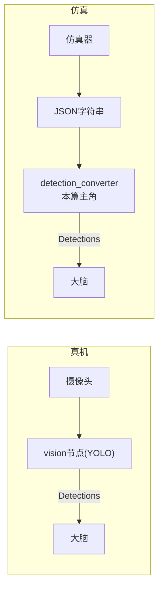

# 4.4 · 仿真适配 detection_converter

`detection_converter` 是一个**仿真专用的小 Python 节点**，只有一个文件 `src/detection_converter/scripts/detection_converter_node.py`（214 行）。它干一件事：把仿真器输出的 **JSON 字符串检测**翻译成大脑认识的标准 `vision_interface` 消息。本篇逐段讲透，并解释这个"适配层"为什么是工程上的点睛之笔。

---

## 一、它解决什么问题？

真机上，视觉链路是：摄像头 → YOLO 神经网络（`vision` 节点）→ 发 `Detections` 消息（见 [模块03](../03-视觉模块/index.md)）。

仿真器（Booster Studio）里**不需要也没有真摄像头和 YOLO**——仿真器自己就知道场上每个物体的精确位置，它直接以 **JSON 字符串**形式发出来。但这个 JSON 的格式和真机视觉发的 `Detections` 消息不一样，大脑看不懂。

`detection_converter` 就是中间的翻译官：



> 💡 **核心价值：接口统一、实现可换。** 经过转换后，大脑收到的是和真机**一模一样**的 `Detections`/`LineSegments` 消息——大脑完全不知道、也不需要知道底层是真摄像头还是仿真器。于是同一份大脑代码、同一套行为树，真机和仿真**无缝切换**。这是"在接口边界做适配"的经典工程范式。

---

## 二、节点初始化 `__init__`（`:16`）

```python
class DetectionConverter(Node):
    def __init__(self):
        super().__init__('detection_converter')
        # 三个话题名都可由 launch 参数覆盖（多机用）
        self.declare_parameter('input_topic', '/camera/robot0_rgbd_camera/detections')
        self.declare_parameter('detections_topic', '/booster_soccer/detection')
        self.declare_parameter('line_segments_topic', '/booster_soccer/line_segments')
```
声明三个可覆盖参数：**输入** JSON 话题、**输出**检测话题、**输出**线段话题。

> 💡 这三个参数就是 [模块01](../01-启动与架构/index.md) 里 `sim_start_multi.sh` 给每个机器人传不同值的地方——`input_topic:="/camera/robot1_rgbd_camera/detections"`、`detections_topic:="/booster_soccer/detection/robot1"`。这样每个机器人一个 converter 实例，各转各的，话题命名空间隔离。

### QoS 配置（`:27`）
```python
sensor_qos = QoSProfile(
    reliability=ReliabilityPolicy.RELIABLE,   # 可靠传输，保证不丢
    durability=DurabilityPolicy.VOLATILE,     # 不为后加入的订阅者保留历史
    history=HistoryPolicy.KEEP_LAST,
    depth=10                                   # 只缓存最近 10 条
)
```
**QoS（服务质量）** 是 ROS2 里发布/订阅双方必须匹配的"通信合同"。这里用 RELIABLE（可靠）+ KEEP_LAST(10)：检测数据要可靠送达，但只关心最近的，旧的丢掉无所谓。

### 订阅与发布（`:38`）
```python
self.subscription = self.create_subscription(String, input_topic, self.detection_callback, sensor_qos)
self.publisher = self.create_publisher(Detections, detections_topic, sensor_qos)
self.line_segments_publisher = self.create_publisher(LineSegments, line_segments_topic, sensor_qos)
```
订阅 `String`（JSON 文本），发布 `Detections` 和 `LineSegments`。还初始化了 `last_timestamp`(去重用)、`msg_count`/`pub_count`(统计用) 三个状态变量。

---

## 三、转换回调 `detection_callback`（`:62`）—— 核心

每来一条 JSON 就触发一次。整个函数包在 `try/except` 里防止单条坏数据崩掉节点。

### 1. 解析 + 去重（`:64`）
```python
data = json.loads(msg.data)            # 解析 JSON
self.msg_count += 1
timestamp = data.get('timestamp', 0.0)
if timestamp == self.last_timestamp and timestamp > 0:
    self.get_logger().warn('Skipping duplicate message ...')
    return                              # 同一时间戳的重复包，跳过
self.last_timestamp = timestamp
```
> 💡 **去重**：仿真器有时会把同一帧发两次。用时间戳判重，避免大脑对同一帧重复处理（会干扰 [模块06](../06-定位与球预测/index.md) 的球预测器）。

### 2. 时间戳转换（`:82`）
```python
if timestamp > 0:
    sec = int(timestamp)                       # 整数秒
    nanosec = int((timestamp - sec) * 1e9)     # 小数部分转纳秒
    detections_msg.header.stamp.sec = sec
    detections_msg.header.stamp.nanosec = nanosec
else:
    detections_msg.header.stamp = self.get_clock().now().to_msg()  # 无效则用当前时间
detections_msg.header.frame_id = f"camera_{data.get('camera_id', 0)}"
```
JSON 里时间戳是一个浮点秒数，ROS2 的 `stamp` 是 `{sec, nanosec}` 两个整数，所以要拆分。
> ⚠️ 时间戳很重要：大脑里很多逻辑（球记忆超时、定位是否够新、预测的 dt）都靠这个时间戳，必须忠实传递仿真时钟的时间。

### 3. 防段错误的数组初始化（`:96`）
```python
detections_msg.radar_x = []
detections_msg.radar_y = []
detections_msg.corner_pos = [0.0] * 10   # 5 个角点 × 2 坐标 = 10 个元素
```
即使仿真没这些数据，也要把数组字段填成合法长度，否则下游 C++ 读取时可能越界崩溃。注释明确写了 `corner_pos` 必须是 10 个元素。

### 4. 逐个转换检测物体（`:102`）
```python
for det in data.get('detections', []):
    detected_obj = DetectedObject()
    detected_obj.label = det.get('type', 'Unknown')   # 类别
    detected_obj.confidence = 99.0                     # 仿真"完美视觉"，置信度写死 99
    # bbox 像素框
    bbox = det.get('bbox', None)
    if bbox and len(bbox)==4:
        detected_obj.xmin/ymin/xmax/ymax = int(bbox[0..3])
    # 三维位置
    pos = det.get('pos', [0,0,0])
    detected_obj.position = [float(p) for p in pos]
    detected_obj.position_projection = detected_obj.position  # 仿真里两者相同
    detected_obj.target_uv = []
    detected_obj.position_cam = [float(p) for p in det.get('camera_pos', [0,0,0])]
    radius = det.get('radius', 0.0)
    detected_obj.color = f"radius_{radius}"   # 借 color 字段暂存球半径
    detected_obj.position_confidence = 1
    detections_msg.detected_objects.append(detected_obj)
```
几个值得注意的点：
- **置信度写死 99**：仿真是"上帝视角"完美检测，不存在不确定性。这里要 ≥ 大脑的 `ball_confidence_threshold`(默认 50) 才会被采纳（见 [模块06](../06-定位与球预测/index.md) 选球流水线）。
- **`position` 和 `position_projection` 相同**：真机里这俩是"深度估计位置"和"地面投影位置"两套（见 [模块02](../02-接口与消息/index.md) 和 [模块03](../03-视觉模块/index.md)），仿真直接给真值，所以填一样。
- **借 `color` 字段存半径**：`detected_obj.color = f"radius_{radius}"` 是个小技巧——消息里没有专门的半径字段，就把球半径塞进 `color` 字符串里临时携带。

### 5. 发布检测 + 转换线段（`:155`）
```python
self.publisher.publish(detections_msg)
self.pub_count += 1

line_coordinates = data.get('line_coordinates', [])
line_coordinates_uv = data.get('line_coordinates_uv', [])
if line_coordinates or line_coordinates_uv:
    line_segments_msg = LineSegments()
    line_segments_msg.header = detections_msg.header  # 复用同一时间戳/frame
    line_segments_msg.coordinates = [float(x) for x in line_coordinates]     # 场地系线段端点
    line_segments_msg.coordinates_uv = [float(x) for x in line_coordinates_uv] # 像素系
    self.line_segments_publisher.publish(line_segments_msg)
```
场地线数据（供大脑自定位用，见 [模块06](../06-定位与球预测/index.md)）单独转换发布，复用检测消息的时间戳和坐标系。

### 6. 统计与异常处理（`:184`）
```python
if self.pub_count % 30 == 0:
    self.get_logger().info(f'Stats: received={msg_count}, published={pub_count}, ...')
except json.JSONDecodeError as e:
    self.get_logger().error(f'Failed to parse JSON: {e}')
    self.get_logger().error(f'Message data: {msg.data[:200]}...')  # 打印前200字符帮排查
except Exception as e:
    self.get_logger().error(f'... {traceback.format_exc()}')
```
每 30 条打一次统计；JSON 解析失败打印前 200 字符方便定位坏数据；其它异常打完整调用栈。**关键是异常被捕获，不会让整个节点崩溃**——单条坏数据只丢一帧。

---

## 四、入口 `main`（`:199`）

```python
def main(args=None):
    rclpy.init(args=args)
    node = DetectionConverter()
    try:
        rclpy.spin(node)              # 阻塞，处理回调
    except KeyboardInterrupt:
        pass
    finally:
        node.destroy_node()
        rclpy.shutdown()
```
标准的 ROS2 Python 节点骨架。

---

## 五、launch 与多机

`detection_converter.launch.py`（见 [模块01 · 1.3](../01-启动与架构/1.3-launch文件逐行.md)）声明三个话题参数，`emulate_tty=True` 让 Python 的彩色/行缓冲输出在日志里正常显示。

多机仿真（`sim_start_multi.sh`）时，**每个机器人启动一个 converter 实例**，靠覆盖 `input_topic`/`detections_topic`/`line_segments_topic` 把各机器人的检测流隔离到带名字后缀的话题上。CMakeLists.txt 把这个 Python 脚本安装成可执行（`detection_converter_node.py`），`stop.sh` 用 `pkill -f detection_converter_node.py` 来杀它（见 [模块01 · 1.1](../01-启动与架构/1.1-入口脚本逐行.md)）。

---

## 小结

- `detection_converter` 是仿真专用适配层：JSON 字符串 → 标准 `Detections`/`LineSegments`。
- 关键处理：去重、时间戳拆分、数组防越界、置信度写死 99、`position==position_projection`、借 color 存半径。
- 全程 try/except，坏数据只丢一帧不崩节点。
- 它让大脑对"真机 vs 仿真"完全无感——同一份代码两处跑。

至此模块 04 全部讲完。下一模块进入大脑内部地基。
