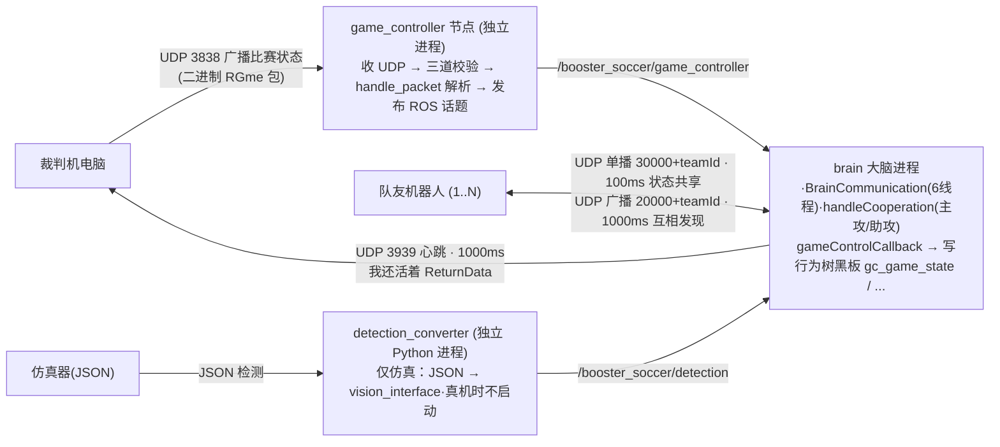

# 模块 04 · 裁判机与队内通信

机器人除了"看"球，还要"听"两类声音：

1. **裁判机的口令**——比赛官方有一台"裁判机电脑"，按 RoboCup 标准协议在局域网里广播比赛状态（开赛、就位、开始、罚下、任意球…）。由独立进程 `game_controller` 节点负责接收、翻译，再以 ROS2 话题喂给大脑。
2. **队友的悄悄话**——多机器人组队时要协调"谁去追球、谁助攻、守门员要不要压上"。由大脑内部的 `BrainCommunication` 通过 UDP 实现。

本模块把这两条"耳朵"链路，以及让大脑在**真机/仿真间无感切换**的 `detection_converter` 适配层，**拆到每一行代码、每一个字段、每一条线程**来讲。

## 子篇导航

| 子篇 | 讲什么 | 对应源码 |
|------|--------|----------|
| [4.1 game_controller 节点逐行](./4.1-game_controller节点.md) | UDP socket 建立/绑定/监听线程、三道包校验、`handle_packet` 二进制转 ROS、话题发布、launch 参数 | `src/game_controller/src/*` `launch/launch.py` |
| [4.2 RoboCup 协议常量字典](./4.2-RoboCup协议常量.md) | `RoboCupGameControlData.h` 逐组常量（主状态/副状态/罚则 HL与SPL两套）、包结构体、大脑 `gameControlCallback` 怎么把数字翻译成黑板变量 | `include/RoboCupGameControlData.h` `brain.cpp:1414` |
| [4.3 队内通信 BrainCommunication](./4.3-队内通信BrainCommunication.md) | 三通道+六线程逐个讲、发现协议、`TeamCommunicationMsg` 字段、`handleCooperation` 协作逻辑、`updateCostToKick` 代价计算 | `src/brain/src/brain_communication.cpp` `brain.cpp:577/1069` |
| [4.4 仿真适配 detection_converter](./4.4-仿真适配detection_converter.md) | JSON→ROS 转换逐段、时间戳/去重/QoS、为何让大脑真机/仿真无感、多机每机一个 converter | `src/detection_converter/scripts/*` |

## 本模块要点速览

整条数据流如下图。注意 `game_controller` 是**独立 ROS2 进程**（见 [模块01](../01-启动与架构/index.md)），而 `BrainCommunication` 跑在**大脑进程内部的若干线程**上：

四条核心设计理念，会在子篇里反复印证：

1. **协议隔离**：裁判机用紧凑 C 结构体二进制（省带宽、跨语言），大脑只认 ROS 消息。中间靠 `game_controller` 节点逐字段翻译，两边解耦（[4.1](./4.1-game_controller节点.md)/[4.2](./4.2-RoboCup协议常量.md)）。
2. **队伍隔离**：发现/通信端口都带 `teamId`（`20000+teamId`、`30000+teamId`），加上 `validation` 魔数和 `teamId` 双重校验，不同队伍天然互不串台（[4.3](./4.3-队内通信BrainCommunication.md)）。
3. **滞回防抖**：协作决策里"谁当主攻"用 hysteresis（滞回），抢 lead 要明显更优且持续一段时间才生效，避免两机来回让球（[4.3](./4.3-队内通信BrainCommunication.md)）。
4. **接口统一、实现可换**：`detection_converter` 把仿真 JSON 翻译成和真机一模一样的 `Detections` 消息，大脑完全无感（[4.4](./4.4-仿真适配detection_converter.md)，引用 [模块03](../03-视觉模块/index.md)/[模块02](../02-接口与消息/index.md)）。

> 🏆 **先记一条规则红线**：最新 RoboCup 规则**禁止机器人之间的单播通信**并限制通信预算（包数/包大小）。当前开源实现的 [4.3](./4.3-队内通信BrainCommunication.md) 单播通道**尚未适配**这条新规，正式比赛若要开通信，必须改 `brain_communication.cpp`。详见 4.3 末尾。

## 读完本模块你应该能回答

- 裁判机那个 `state=3` 的二进制字节，是怎么一路变成行为树黑板里 `gc_game_state="PLAY"` 的字符串的？（[4.2](./4.2-RoboCup协议常量.md)）
- 两个队友为什么不会同时去抢同一个球？滞回是怎么防抖的？（[4.3](./4.3-队内通信BrainCommunication.md)）
- 同一份大脑代码，真机和仿真在"视觉输入"这一环差在哪？（[4.4](./4.4-仿真适配detection_converter.md)）
