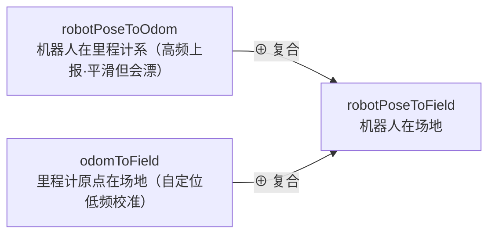

# 5.4 · 三套坐标系与变换（核心）

这是看懂所有决策几何的钥匙。机器人**没有 GPS**，却要知道"我在场上哪、球在场上哪、该往哪走"。本篇讲透三套坐标系、它们怎么靠里程计和定位串起来，以及 `calibrateOdom` 这个把定位结果落地的核心函数。

---

## 一、三套坐标系

系统里同时存在三个坐标系：

```
①相机系(cam)          ②机器人系(robot/base)         ③场地系(field)
原点：相机            原点：机器人脚下              原点：球场中心
x轴：相机朝向         x轴：机器人正前方            x轴：指向对方球门
随头转动             随机器人走动/转身            固定不动（裁判视角）
   │ camToHead外参       │ 里程计+定位                 │
   └──── camToRobot ────┘──── robotPoseToField ───────┘
```

- **场地系 ③**：球场中心为原点，x 轴指向对方球门，**固定不变**。所有"战略层"判断都在这里：球在我方半场还是对方半场、往哪个球门踢、机器人该退守还是压上。`posToField`、`robotPoseToField`、`kickDir` 都在场地系。
- **机器人系 ②**：机器人脚下为原点，x 轴是它正前方。**"控制层"**最自然的系：往前走是 +x、向左是 +y、左转是 +θ。`posToRobot`、`yawToRobot`、`setVelocity` 的参数都在机器人系。
- **相机系 ①**：视觉模块内部用（见 [模块03](../03-视觉模块/index.md)）。到了大脑这层，物体位置基本已是机器人系或场地系。

> 💡 为什么要这么多系？因为**不同任务的"自然语言"不同**。"球门在场地 x=7 处"用场地系最简单；"球在我左前方 30°"用机器人系最简单。决策时在场地系思考，控制时换到机器人系执行。坐标变换就是这两种语言间的翻译。

---

## 二、没有 GPS，怎么知道"我在场地哪"？—— odom 中转

机器人能直接得到的只有**里程计（odometry）**：通过累积脚步估计"我相对开机点走了多远"。但里程计有两个问题：① 原点是开机时的随机位置，和场地无关；② 会**漂移**（走久了误差累积）。

解决办法：引入一个**中转坐标系 odom**，把"机器人在场地"拆成两段复合：



- **`robotPoseToOdom`**：机器人本体高频上报（`odometerCallback`），平滑连续，但会漂。
- **`odomToField`**：里程计原点相对场地——这一段由**自定位**算法低频校准（`calibrateOdom`），准确但偶尔失败、频率低。

> 💡 **这套"里程计高频中转 + 定位低频校准"是移动机器人的经典做法。** 里程计提供每帧平滑的位姿（机器人走路不会瞬移），定位提供准确但低频的修正（看到角点才能定位）。两者复合：平时用里程计平滑外推，定位成功时校准一下 `odomToField` 把累积的漂移拉回来。既平滑又不漂。

### `odometerCallback`（`brain.cpp:1637`）
```cpp
void Brain::odometerCallback(const Odometer &msg) {
    data->robotPoseToOdom.x = msg.x * config->get_robot_odom_factor();   // 乘标度补偿
    data->robotPoseToOdom.y = msg.y * config->get_robot_odom_factor();
    data->robotPoseToOdom.theta = msg.theta;
    // 复合出场地系位姿
    transCoord(robotPoseToOdom..., odomToField..., => robotPoseToField);
}
```
> 注意 `odom_factor`（[5.2](./5.2-BrainConfig静态配置.md) 提过）：不同机器人步幅不同，里程计原始读数要乘一个标度才准。K1 是 0.8、T1 是 1.2。

---

## 三、`calibrateOdom`：把定位结果落地（`brain.cpp:1249`）

自定位算法（[模块06](../06-定位与球预测/index.md) 的 `Locator`）算出"机器人此刻在场地的真实位姿 (x,y,θ)"后，调 `calibrateOdom(x,y,θ)` 反推出 `odomToField`。逐段：

### 1. 先算"odom 原点在机器人系"
```cpp
// or = odom relative to robot
x_or = -cos(robotPoseToOdom.theta)*robotPoseToOdom.x - sin(...)*robotPoseToOdom.y;
y_or =  sin(robotPoseToOdom.theta)*robotPoseToOdom.x - cos(...)*robotPoseToOdom.y;
theta_or = -robotPoseToOdom.theta;
```
这是 `robotPoseToOdom` 的**逆变换**——已知"机器人在 odom 系"，求"odom 原点在机器人系"。

### 2. 复合得到 `odomToField`
```cpp
transCoord(x_or, y_or, theta_or,        // odom 原点在机器人系
           x, y, theta,                  // 机器人在场地系（定位结果）
           odomToField.x, odomToField.y, odomToField.theta);  // => odom 原点在场地系
```
> 💡 核心思路：既然 "机器人在场地" 已知（定位给的）、"odom 原点在机器人系" 也算出来了，把这两段复合就得到 "odom 原点在场地" = `odomToField`。这一步是整个定位落地的关键——它不直接改 `robotPoseToField`，而是改 `odomToField`，这样后续里程计每次更新都会基于这个校准过的 `odomToField` 复合出正确的场地位姿。

### 3. 用新的 `odomToField` 刷新一切
```cpp
transCoord(robotPoseToOdom..., odomToField..., => robotPoseToField);  // 刷新自身
transCoord(ball.posToRobot..., robotPoseToField..., => ball.posToField);  // 刷新球
for (auto& r : robots)    updateFieldPos(r);    // 刷新对手
for (auto& g : goalposts) updateFieldPos(g);    // 刷新门柱
for (auto& m : markings)  updateFieldPos(m);    // 刷新角点
```
定位一成功，所有物体的场地坐标立即用新位姿重算一遍。

定位成功后，调用方（定位节点，见 [模块06](../06-定位与球预测/index.md)）还会置 `odom_calibrated=true`、更新 `lastSuccessfulLocalizeTime`。后者决定**定位是否"够新、可信"**——这直接影响要不要用场地系球预测（见 [模块06](../06-定位与球预测/index.md) 的 `isLocalizationTrusted`）。

---

## 四、坐标变换工具

### `transCoord`（`math.h:80`）—— 最底层的 SE(2) 复合
```cpp
void transCoord(xs,ys,thetas,  xst,yst,thetast,  &xt,&yt,&thetat) {
    thetat = toPInPI(thetas + thetast);
    xt = xst + xs*cos(thetast) - ys*sin(thetast);
    yt = yst + xs*sin(thetast) + ys*cos(thetast);
}
```
含义：源系里的位姿 `(xs,ys,thetas)`，已知源系原点在目标系是 `(xst,yst,thetast)`，求该位姿在目标系的坐标 `(xt,yt,thetat)`。本质是 2D 刚体变换（旋转+平移）。

### `robot2field` / `field2robot`（`brain_data.cpp:48`/`:59`）
基于当前 `robotPoseToField` 封装的便捷互转：
```cpp
Pose2D robot2field(poseToRobot) {
    transCoord(poseToRobot..., robotPoseToField..., => poseToField);
}
Pose2D field2robot(poseToField) {
    // 先算 field 原点在 robot 系（robotPoseToField 的逆），再复合
    xfr = -cos(θ)*x - sin(θ)*y;  yfr = sin(θ)*x - cos(θ)*y;  thetafr = -θ;
    transCoord(poseToField..., xfr,yfr,thetafr, => poseToRobot);
}
```
决策代码里到处用，比如 [模块07](../07-行为树与决策/index.md) 的追球节点把"球的场地预测位置"转成机器人系来算速度。

### `updateRelativePos` / `updateFieldPos`（`brain.cpp:2313`/`:2327`）
- `updateRelativePos(obj)`：已知物体场地位置，算它相对机器人的位置、距离 `range`、偏航 `yawToRobot`。
- `updateFieldPos(obj)`：已知物体机器人系位置，算它的场地位置。

每个 tick 的 `updateMemory` 会刷新这些（见 [模块06](../06-定位与球预测/index.md)）。

### `trans`（`math.h:96`）—— 矩阵版变换
用 Eigen 3×3 齐次矩阵实现的另一种变换，`dir="forth"` 世界→局部、`"back"` 局部→世界。`RobotClient` 仿真路径时用（见 [模块08](../08-机器人控制与底层/index.md)）。

---

## 五、一个完整例子串起来

机器人看到球，到知道"球在场地哪"：
```
1. 视觉：球在图像某像素 → 地面求交 → 球在机器人系 ball.posToRobot（模块03）
2. ball.posToField = robot2field(ball.posToRobot)
                   = transCoord(posToRobot, robotPoseToField)
   而 robotPoseToField = transCoord(robotPoseToOdom, odomToField)
   其中 odomToField 由上次 calibrateOdom（定位）校准
3. 决策在场地系判断：球在对方半场吗？往哪个球门踢？
4. 要追球时：field2robot(球的场地预测位置) → 机器人系 → 算 setVelocity
```
一环扣一环，全靠这三套坐标系和它们之间的变换。

---

## 小结

- 三套坐标系：**场地系**(战略/决策)、**机器人系**(控制/执行)、相机系(视觉内部)。
- 无 GPS → 里程计高频中转 + 定位低频校准：`robotPoseToField = odomToField ⊕ robotPoseToOdom`。
- `calibrateOdom` 把定位结果反推成 `odomToField` 落地，并刷新所有物体场地坐标。
- `transCoord` 是底层 SE(2) 复合，`robot2field/field2robot` 是常用封装。

下一篇收尾本模块：那些到处被调用的工具函数。
