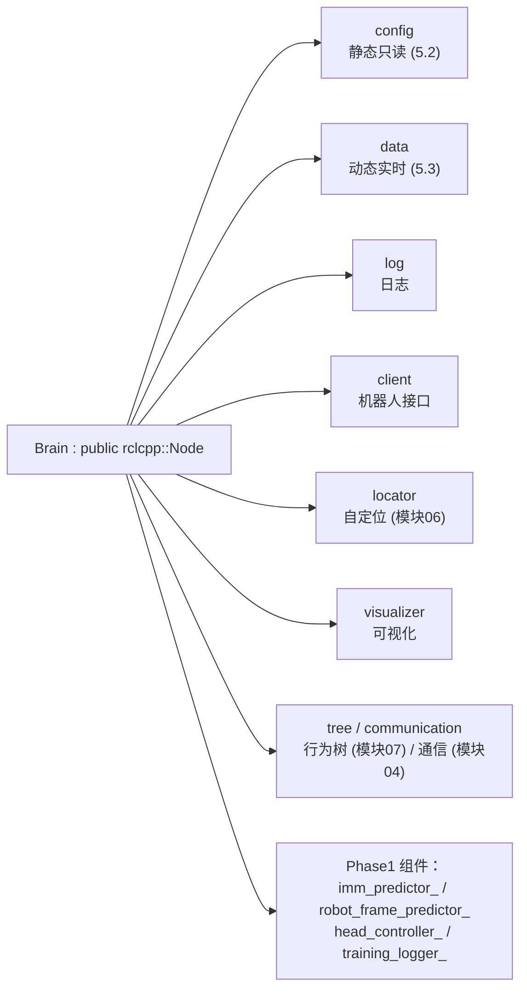
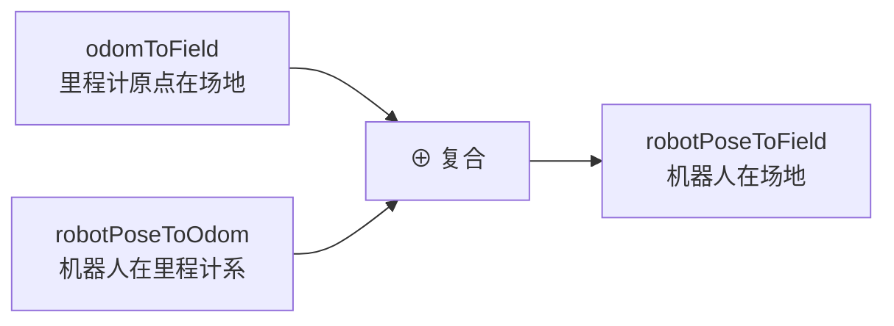

# 模块 05 · 大脑数据与坐标系

要读懂决策代码，必须先搞清三件事：**大脑这个总容器怎么搭起来的**、**数据放在哪**、以及**坐标系怎么换算**。本模块是后续所有决策篇章（[模块07](../07-行为树与决策/index.md)、[模块08](../08-机器人控制与底层/index.md)）的地基。

## 子篇导航

| 子篇 | 讲什么 | 对应源码 |
|------|--------|----------|
| [5.1 Brain 类与初始化](./5.1-Brain类与初始化.md) | `Brain` 总容器结构、构造函数里一大串 `declare_parameter`、`init()` 怎么创建子对象与订阅话题（机器人名后缀做多机隔离）、`loadConfig()`、agent 模式参数热切换 | `brain.h` `brain.cpp` |
| [5.2 BrainConfig 静态配置](./5.2-BrainConfig静态配置.md) | 配置分类（比赛/本体/策略/避障/RLVisionKick/定位/Phase1）、三种场地尺寸、`handle()` 选场地、`calcMapLines/calcMapMarkings` 算真值地图、层叠配置怎么读进来 | `brain_config.h` `brain_config.cpp` `types.h` |
| [5.3 BrainData 动态数据](./5.3-BrainData动态数据.md) | 所有字段分类（比赛状态/位姿/球/视野物体/踢球意图/队友/摔倒）、为何用互斥锁、`GameObject` 结构、`getMarkingsByType/getMarkersForLocator` | `brain_data.h` `brain_data.cpp` `types.h` |
| [5.4 三套坐标系与变换](./5.4-三套坐标系与变换.md) | **（核心）** 相机系/机器人系/场地系、为何靠里程计中转、`robotPoseToField = odomToField ⊕ robotPoseToOdom`、`calibrateOdom` 逐行、`transCoord/robot2field/field2robot/updateRelativePos/updateFieldPos`、`odometerCallback` | `brain.cpp` `brain_data.cpp` `math.h` |
| [5.5 工具函数](./5.5-工具函数.md) | `math.h/misc.h/print.h` 各工具逐个：`toPInPI/cap/sigmoid/transCoord/MergeYAML/gen_uuid/颜色码` 等 | `utils/*.h` |

## 本模块要点速览

### `Brain` 的总装车间

`src/brain/include/brain.h:66` 里的 `Brain` 继承自 `rclcpp::Node`，是整个大脑进程的总容器。它的设计哲学是 **"数据不直接堆在 Brain 里，而是拆进若干子对象"**（`brain.h:60-64` 的注释明确写了这条纪律）：

> 💡 **`config` 静态 vs `data` 动态的分工**是这个项目的一条核心纪律：凡是启动后不变的（场地尺寸、限速、队伍号）放 `config`；凡是每帧都可能变的（球在哪、机器人在哪）放 `data`。这样决策代码一眼能看出"我读的是配置还是实时状态"。行为树节点会拿到 `brain` 指针，直接访问 `brain->config` 和 `brain->data`。

### 三套坐标系（理解一切几何的钥匙）

机器人**没有 GPS**，只能靠**里程计（odometry）**累积脚步估计走了多远，但里程计原点是开机随机位置且会漂。于是引入一个**中转坐标系 odom**：

- `robotPoseToOdom`：机器人本体高频上报（`odometerCallback`），平滑但会漂。
- `odomToField`：由**自定位**算法低频校准（`calibrateOdom`），准确但偶尔失败。

两者复合，既平滑又不漂。这套"odom 高频中转 + 定位低频校准"是移动机器人的经典做法，详见 [5.4 篇](./5.4-三套坐标系与变换.md)。

## 读完本模块你应该能回答

- `Brain` 为什么把数据拆成 `config` 和 `data` 两半？
- 6 个机器人跑同一份代码，话题怎么不打架？（话题名后缀，见 [5.1](./5.1-Brain类与初始化.md) 与 [模块01](../01-启动与架构/index.md)）
- `config.yaml` → `config_local.yaml` 的层叠是怎么读进 C++ 的？（见 [5.2](./5.2-BrainConfig静态配置.md) 与 [模块01](../01-启动与架构/index.md) 的 launch 层叠）
- 为什么 `BrainData` 里的列表要加互斥锁？（回调线程写、tick 线程读，见 [5.3](./5.3-BrainData动态数据.md)）
- 没有 GPS，机器人怎么知道自己在场地哪？（见 [5.4](./5.4-三套坐标系与变换.md)）
