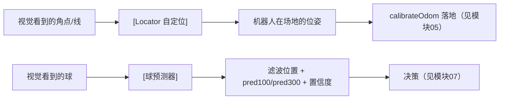

# 模块 06 · 自定位与球预测

本模块讲大脑里两个**算法引擎**：`Locator`（回答"我在场上哪？"）和球预测器（回答"球下一刻会在哪？"）。它们是决策的两大输入支柱，分别为定位与追球提供基础。

## 子篇导航

| 子篇 | 讲什么 | 对应源码 |
|------|--------|----------|
| [6.1 自定位 Locator](./6.1-自定位Locator.md) | 粒子滤波 + 收缩搜索完整算法、真值角点地图、残差与收敛、为何用粒子滤波 | `locator.cpp` `locator.h` |
| [6.2 定位行为树节点](./6.2-定位行为树节点.md) | `SelfLocate*` 各节点、三种模式、限频/校准落地、`Locate` 子树串联 | `locator.cpp:348+` `subtree_locate.xml` |
| [6.3 球预测 IMM](./6.3-球预测IMM.md) | **（核心）** IMM 双模型卡尔曼滤波完整推导、摩擦/遮挡/门控、pred100/pred300 | `pos_predictor.cpp` `pos_predictor.h` |
| [6.4 机器人系预测与选球](./6.4-机器人系预测与选球.md) | 机器人系预测器、两套预测器切换、`detectProcessBalls` 6 步选球流水线 | `robot_frame_predictor.cpp` `brain.cpp:866/2007` |

## 本模块要点速览

### 两大引擎

### Locator：粒子滤波自定位

把"机器人在场地的位姿 (x,y,θ)"当未知数，撒一堆候选粒子，靠"哪个假设让看到的角点最贴合真值地图"逐轮淘汰收敛。

> 💡 为何用粒子滤波而非解方程？角点匹配有**歧义**（L 角点四个长得一样、对称场地两端对称），是多峰问题。粒子滤波能并行探索多个假设，比梯度法鲁棒。

### 球预测：IMM 双模型卡尔曼

球有两种运动——**静止**或**滚动（带摩擦减速）**，事先不知道。用 IMM（交互式多模型）同时维护两个卡尔曼滤波器，按观测自动判断当前更像哪种，输出平滑位置 + 100ms/300ms 预测 + 置信度。

### 两套预测器的取舍

- 场地系 `BallImmPredictor`：能给 pred300、知道球往哪个球门去，**但前提是定位可信**。
- 机器人系 `RobotFramePredictor`：只给 pred100、**不依赖定位**，是定位失效时的退路。
- `isLocalizationTrusted()` 决定用哪个（见 [6.4](./6.4-机器人系预测与选球.md)）。

## 读完本模块你应该能回答

- 机器人看到几个角点，怎么就算出自己站在场上哪了？（[6.1](./6.1-自定位Locator.md)）
- 为什么 L 角点这么多还能定位不混淆？（[6.1](./6.1-自定位Locator.md)）
- 球被挡住看不见时，机器人怎么还知道往哪追？（[6.3](./6.3-球预测IMM.md)/[6.4](./6.4-机器人系预测与选球.md)）
- 一帧检测出三个"球"，怎么挑出真的那个？（[6.4](./6.4-机器人系预测与选球.md)）
