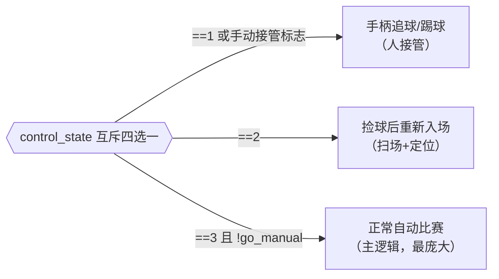
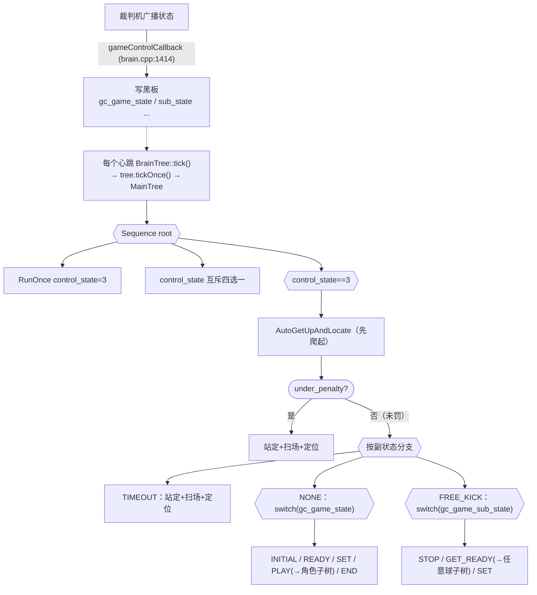

# 7.2 · 主树 game.xml 逐层分支

本篇把主树 `src/brain/behavior_trees/game.xml` **逐层逐分支**讲透：手柄控制模式、按裁判机主状态（INITIAL/READY/SET/PLAY/END）、罚则/暂停、任意球副状态，以及为什么全程用 `ReactiveSequence`、各子树何时进入。

---

## 一、文件骨架与 `<include>`（`game.xml:1-11`）

```xml
<root BTCPP_format="4">
    <include path="./subtrees/subtree_cam_find_and_track_ball.xml" />
    <include path="./subtrees/subtree_striker_play.xml" />
    <include path="./subtrees/subtree_goal_keeper_play.xml" />
    <include path="./subtrees/subtree_striker_freekick.xml" />
    <include path="./subtrees/subtree_goal_keeper_freekick.xml" />
    <include path="./subtrees/subtree_locate.xml" />
    <include path="./subtrees/subtree_auto_standup_and_locate.xml" />
    <BehaviorTree ID="MainTree">
        ...
    </BehaviorTree>
</root>
```

- `BTCPP_format="4"`：用 BehaviorTree.CPP v4 的 XML 语法。
- 七个 `<include>` 把所有子树文件预加载进工厂（[7.1](./7.1-行为树框架与黑板.md) 讲过），这样 `MainTree` 里 `<SubTree ID="StrikerPlay">` 才能解析到。`MainTree` 是 `createTree("MainTree")` 的入口。

---

## 二、根 Sequence 与控制模式分层（`game.xml:12-13`）

```xml
<Sequence name="root">
    <RunOnce><Script code="control_state=3" /></RunOnce>
    ...
```

- 根是一个普通 `Sequence`。
- `<RunOnce>` 包的 `<Script code="control_state=3" />` 只在**第一帧**执行一次，把黑板 `control_state` 设为 3（正常自动比赛模式）。之后人类操作员可用手柄改写它（见下）。

接下来是**四个并列的 `ReactiveSequence`，分别对应不同 `control_state`**。因为它们都用 `_while` 互斥地判断 `control_state`，同一时刻只有一个会真正执行：



> 💡 `control_state` 给人类操作员**接管与急停**的能力，对应手柄按键：`LT+X`→1、`LT+A`→2、`LT+B`→3。比赛中机器人犯傻时，操作员可切到 1 手动遥控追球/踢球，或切到 2 把机器人捡起来重新摆位标定。这是安全兜底，也是调试利器。

### 2.1 control_state==1 / 手动辅助（`game.xml:14-19`）

```xml
<ReactiveSequence _while="control_state==1 || assist_kick || go_manual || assist_chase">
    <SimpleChase _while="assist_chase" vx_limit="1.5" vy_limit="0.1" stop_dist="0.0" stop_angle="0.3" />
    <Sequence _while="assist_kick">
        <Kick speed_limit="0.9" min_msec_kick="1000"/>
    </Sequence>
</ReactiveSequence>
```

手柄辅助模式：`assist_chase` 时用 `SimpleChase`（朴素追球，见 [7.6](./7.6-找球与移动节点.md)）冲向球；`assist_kick` 时直接踢一脚。

### 2.2 control_state==2 / 捡球后重新入场（`game.xml:21-25`）

```xml
<ReactiveSequence _while="control_state==2" name="...press LT+A, recalibrate and locate...">
    <CamScanField  _while="!odom_calibrated"/>
    <SubTree ID="CamFindAndTrackBall" _autoremap="true" _while="odom_calibrated" />
    <SelfLocateEnterField />
</ReactiveSequence>
```

> 🏆 比赛中机器人可被罚下或被人为捡离场地。重新放回场边时，里程计已经"飘"了，必须**重新标定定位**。这一支的流程：定位没标定好（`!odom_calibrated`）时先 `CamScanField` 扫整个场地找特征线（喂给定位）；标定好了再 `CamFindAndTrackBall` 找/追球；`SelfLocateEnterField` 在入场点定位。完成后操作员按 `LT+B` 切回 3 继续比赛。

---

## 三、control_state==3：正常自动比赛主干（`game.xml:27`）

```xml
<ReactiveSequence _while="control_state==3 && (!go_manual)" name="wrap a layer for control strategy switch...">
    <SubTree ID="AutoGetUpAndLocate" _autoremap="true" />
    ...
```

这是最庞大的一支。注意它是 `ReactiveSequence`——**每帧从头重判**，所以下面所有"比赛状态分支"都能立刻响应裁判机切换。

### 3.1 永远先检查：摔倒就爬起（`game.xml:28`）

```xml
<SubTree ID="AutoGetUpAndLocate" _autoremap="true" />
```

`AutoGetUpAndLocate` 子树（`subtree_auto_standup_and_locate.xml`）只包一个 `CheckAndStandUp` 节点（见 [7.6](./7.6-找球与移动节点.md)）。它放在 `ReactiveSequence` 的**第一位**，意味着**无论比赛处于什么状态，每帧都先检查"我摔了没"，摔了就爬**。`CheckAndStandUp` 返回 `SUCCESS` 放行，后面的比赛逻辑才接着跑。

> 💡 把"爬起来"放在最高优先级是合理的：摔倒时其它任何决策都没意义，必须先恢复站立。它返回 `SUCCESS`（即使在爬）让序列继续，是因为爬起动作由底层异步执行，行为树这边不必阻塞。

### 3.2 被罚下 / 换人（`game.xml:29-34`）

```xml
<ReactiveSequence _while="gc_is_under_penalty" name="currently under penalty or substitute state">
    <SetVelocity />
    <CamScanField  _while="!odom_calibrated"/>
    <SubTree ID="CamFindAndTrackBall" _autoremap="true" _while="odom_calibrated" />
    <SelfLocateEnterField />
</ReactiveSequence>
```

> 🏆 `gc_is_under_penalty` 为真表示裁判机判我"被罚下/正在换人"。此时**必须站着不动**（`SetVelocity` 不带参数 = 全 0 速度 = 站立），同时偷偷扫场定位、找球，为复出做准备。出场点的定位用 `SelfLocateEnterField`。

### 3.3 未被罚：正常比赛（`game.xml:36`）

```xml
<ReactiveSequence _while="!gc_is_under_penalty" name="no penalty, normal play">
```

进一步按副状态类型 `gc_game_sub_state_type` 分三支：`TIMEOUT`（暂停）、`NONE`（正常）、`FREE_KICK`（任意球）。

#### 3.3.1 TIMEOUT 暂停（`game.xml:37-42`）

```xml
<ReactiveSequence _while="gc_game_sub_state_type=='TIMEOUT'" name="game paused. during pause, game state must be INITIAL">
    <SetVelocity />
    <CamScanField _while="!odom_calibrated"/>
    <SubTree ID="CamFindAndTrackBall" _autoremap="true" _while="odom_calibrated" />
    <SelfLocateEnterField />
</ReactiveSequence>
```

> 🏆 比赛暂停（如教练叫停）时和被罚下处理一样：站定、扫场、找球、定位。注释点明暂停期间主状态固定是 INITIAL。

---

## 四、NONE 正常比赛：按主状态分支（`game.xml:44-72`）

```xml
<ReactiveSequence _while="gc_game_sub_state_type=='NONE'" name="normal play">
```

这是比赛主流程，按裁判机**主状态** `gc_game_state` 分五支。

> 🏆 RoboCup 标准比赛状态机：`INITIAL`（入场前）→ `READY`（各队走到己方半场起始位）→ `SET`（站定等开哨）→ `PLAY`（开踢）→ `END`（结束）。裁判机广播这些状态，机器人必须严格遵守——比如 SET 时绝不能动，否则违规。

| 主状态 | 子句（`game.xml`） | 机器人行为 |
|--------|-------------------|-----------|
| `INITIAL` | 45-49 | 站在入场位：扫场/追球 + `SelfLocateEnterField` 入场点定位 |
| `READY` | 51-55 | 走到我方起始位：`MoveHead` 低头看路 + `GoToReadyPosition` + `Locate` 定位 |
| `SET` | 57-61 | 站定等开哨：`CamFindAndTrackBall` 追球 + `SetVelocity`(站定) + `Locate` |
| `PLAY` | 63-66 | **开踢**：按角色进 `StrikerPlay` / `GoalKeeperPlay` 子树 |
| `END` | 68-70 | 停：`SetVelocity`(站定) |

### 4.1 READY：走到起始位（`game.xml:51-55`）

```xml
<ReactiveSequence _while="gc_game_state=='READY'" name="move to own starting position inside the field">
    <MoveHead pitch="0.35" yaw="0.0" />
    <GoToReadyPosition  vx_limit="0.7" />
    <SubTree ID="Locate" _autoremap="true" />
</ReactiveSequence>
```

> 🏆 READY 阶段（一般 30 秒）各队从场边走进自己半场的开球阵型位。`MoveHead pitch=0.35` 让头微微下俯看路；`GoToReadyPosition`（[7.6](./7.6-找球与移动节点.md)）按角色和 `myStrikerIDRank` 算出该去哪个站位点并导航过去；`Locate` 子树一路做完整定位。

### 4.2 SET：站定等开哨（`game.xml:57-61）`

```xml
<ReactiveSequence _while="gc_game_state=='SET'" name="stand ready and wait for the game to start">
    <SubTree ID="CamFindAndTrackBall" _autoremap="true" />
    <SetVelocity />
    <SubTree ID="Locate" _autoremap="true" />
</ReactiveSequence>
```

> 🏆 SET 阶段身体必须**完全静止**（`SetVelocity` 不带参 = 0 速）。但**头可以动**——`CamFindAndTrackBall` 让相机盯着球，`Locate` 继续优化定位，这样裁判一吹哨进 PLAY，机器人已经知道球在哪、自己在哪，能瞬间开踢。

### 4.3 PLAY：核心，按角色分子树（`game.xml:63-66`）

```xml
<ReactiveSequence _while="gc_game_state=='PLAY'" name="game play">
    <SubTree ID="StrikerPlay" _autoremap="true" _while="player_role == 'striker'" />
    <SubTree ID="GoalKeeperPlay" _autoremap="true" _while="player_role == 'goal_keeper'" />
</ReactiveSequence>
```

按黑板 `player_role` 选子树：前锋走 `StrikerPlay`（[7.3](./7.3-前锋决策.md)），守门员走 `GoalKeeperPlay`（[7.4](./7.4-守门员与任意球.md)）。两个 `_while` 互斥，同帧只进一个。

> 💡 注意 `player_role` 并非一成不变——`handleCooperation`（`brain.cpp:577`）会在队伍不满员时把守门员临时切成前锋（见 [模块04](../04-裁判机与通信/index.md)）。因为这里每帧重判 `_while`，角色一变下帧就切子树。

---

## 五、FREE_KICK 任意球（`game.xml:74-90`）

```xml
<ReactiveSequence _while="gc_game_sub_state_type=='FREE_KICK' && gc_game_state=='PLAY'" name="free kick">
    <ReactiveSequence _while="gc_game_sub_state=='STOP'">         <!-- 阶段① 静止 -->
        <SubTree ID="CamFindAndTrackBall" _autoremap="true" />
        <SubTree ID="Locate" _autoremap="true" _while="ball_location_known"/>
        <SetVelocity />
    </ReactiveSequence>
    <ReactiveSequence _while="gc_game_sub_state=='GET_READY'">    <!-- 阶段② 就位 -->
        <SubTree ID="Locate" _autoremap="true" _while="ball_location_known" />
        <SubTree ID="StrikerFreekick" _autoremap="true" _while="player_role == 'striker'" />
        <SubTree ID="GoalKeeperFreekick" _autoremap="true" _while="player_role == 'goal_keeper'"/>
    </ReactiveSequence>
    <ReactiveSequence _while="gc_game_sub_state=='SET'">          <!-- 阶段③ 待发 -->
        <SubTree ID="CamFindAndTrackBall" _autoremap="true" />
        <SubTree ID="Locate" _autoremap="true" _while="ball_location_known" />
        <SetVelocity />
    </ReactiveSequence>
</ReactiveSequence>
```

> 🏆 任意球（FREE_KICK，包括开球、角球、球门球等）有三个**副状态阶段** `gc_game_sub_state`：
> - **STOP**：所有人静止（`SetVelocity`），只追球+定位。
> - **GET_READY**：双方走到合规位置。进攻/防守方都去各自的任意球站位——前锋走 `StrikerFreekick`、守门员走 `GoalKeeperFreekick`（见 [7.4](./7.4-守门员与任意球.md)）。这一阶段是任意球唯一允许移动就位的窗口。
> - **SET**：就位完毕，静止待裁判发令。发令后通常会切回 NONE/PLAY 进入正常 `StrikerPlay`。

任意球子树会按 `gc_is_sub_state_kickoff_side`（我方是否执行任意球方）分进攻位 / 防守位，详见 [7.4](./7.4-守门员与任意球.md)。

---

## 六、为什么几乎全是 ReactiveSequence？

回顾整棵树，从根到叶子层层都是 `ReactiveSequence + _while`。这是一个刻意的设计：

> 💡 `ReactiveSequence` **每帧从头重新评估所有 `_while` 条件**。于是这棵树本质上是一个"每帧重新匹配当前比赛状态/角色/决策"的巨型 switch。带来的好处：
> 1. **零延迟响应裁判机**：裁判从 SET 切到 PLAY，黑板 `gc_game_state` 一变，下一帧 `_while="gc_game_state=='SET'"` 变假、`_while="gc_game_state=='PLAY'"` 变真，立刻切到比赛逻辑。
> 2. **任何动作随时可被打断**：哪怕机器人正在 `Chase`，只要更高层条件变了（比如球突然出界 `ball_out` 变真），下帧就被切走去 `GoBackInField`。
> 3. **无隐藏状态**：树本身几乎不记忆"上一帧在哪个分支"，状态全在黑板里，逻辑可预测、好调试。

代价是每帧都要重新走一遍条件判断，但这点开销对 100Hz 决策完全可接受。

---

## 七、主树时序图收尾



## 小结

- `game.xml` 是按"控制模式 → 罚则/暂停 → 主状态 → 副状态"层层分支的大 `ReactiveSequence`。
- `control_state`（1/2/3，手柄切换）给人类接管/急停；正常自动比赛是 3。
- 正常比赛按 `gc_game_state` 走 INITIAL/READY/SET/PLAY/END 五支，PLAY 时按角色进 `StrikerPlay`/`GoalKeeperPlay`。
- 任意球按 `gc_game_sub_state` 走 STOP/GET_READY/SET，GET_READY 进任意球子树就位。
- 全程 `ReactiveSequence` 保证每帧重判，零延迟响应裁判机、任何动作随时可打断。

下一篇钻进 `StrikerPlay`，看前锋的两层决策。
