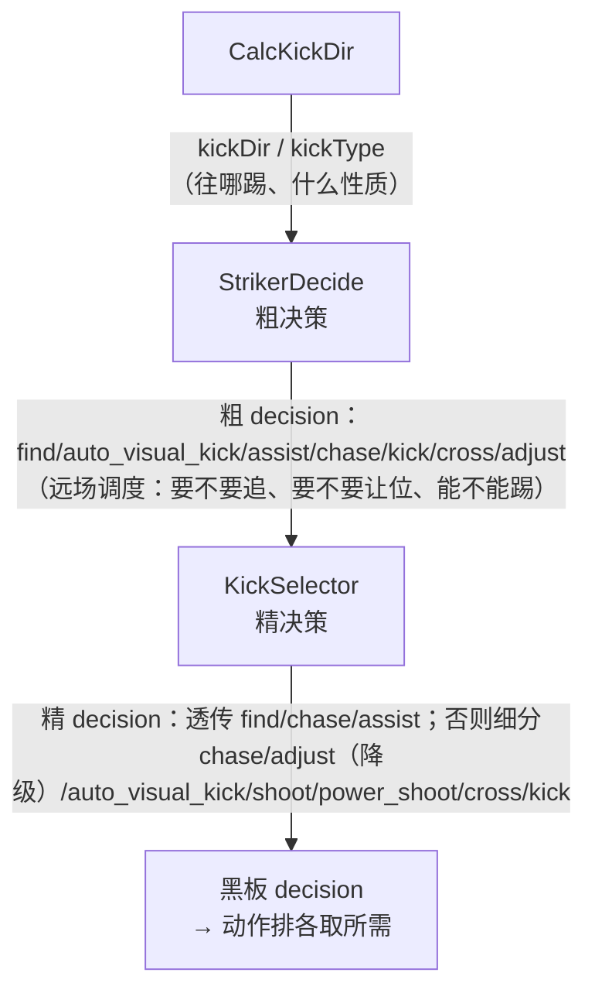

# 7.3 · 前锋决策

[7.2](./7.2-主树game_xml.md) 讲到 PLAY 阶段前锋会进 `StrikerPlay` 子树。本篇把这棵子树**逐层**拆开，再深入三个核心 C++ 函数：`CalcKickDir`（算往哪踢）、`StrikerDecide`（粗决策）、`KickSelector`（精决策）。读完你就明白大脑是怎么"一帧之内"决定"追球 / 绕调 / 踢 / 射 / 传中"的。

源码：`subtree_striker_play.xml`、`brain_tree.cpp:769/814/994`。

---

## 一、StrikerPlay 子树逐层（`subtree_striker_play.xml`）

整棵子树是一个大 `ReactiveSequence`（每帧重判，见 [7.1](./7.1-行为树框架与黑板.md)）。从外到内分四层：

```xml
<ReactiveSequence>                                  <!-- 顶层 -->
  <SelfLocate mode="trust_direction" />             <!-- ① 持续定位 -->
  <SubTree ID="Locate" _autoremap="true" _while="decision!='find'" />
  <ReactiveSequence _while="wait_for_opponent_kickoff"> <!-- ② 等对方开球 -->
     <SubTree ID="CamFindAndTrackBall" _autoremap="true" />
     <SetVelocity />                                <!-- 只看球、身体不动 -->
  </ReactiveSequence>
  <ReactiveSequence _while="!wait_for_opponent_kickoff"> <!-- ③ 正常 -->
     <Sequence _while="ball_out"> ... GoBackInField ... </Sequence> <!-- 球出界→回场 -->
     <ReactiveSequence _while="!ball_out">          <!-- ④ 核心决策-动作 -->
        ...
     </ReactiveSequence>
  </ReactiveSequence>
</ReactiveSequence>
```

- **① 定位**：`SelfLocate`/`Locate` 一路持续优化自身定位（[模块06](../06-定位与球预测/index.md)）。注意 `_while="decision!='find'"`——当决策是"找球"时不做完整定位（找球时自身可能在转身，定位反而不稳）。
- **② 等对方开球**（`wait_for_opponent_kickoff`）：对方开球期间规则要求我方退到中圈外、不得碰球，这里就**只追踪球、`SetVelocity` 站定不动**。这个标志由 `updateKickoffMemory`（`brain.cpp:985`）维护，详见 [7.4](./7.4-守门员与任意球.md)。
- **③ 球出界**（`ball_out`）：追球 + `GoBackInField` 走回场内 + 定位。`ball_out` 由 `updateBallOut`（`brain.cpp:1206`）算，见 [7.4](./7.4-守门员与任意球.md)。
- **④ 核心**：球在场内、可以正常踢球时的"决策→动作"主链。

### 1.1 核心层：决策 + 动作排（`subtree_striker_play.xml:20-37`）

这是本项目**决策-动作分离**范式最典型的体现（[README](./index.md) 已铺垫）：

```xml
<ReactiveSequence>
   <SubTree ID="CamFindAndTrackBall" _autoremap="true" />     <!-- 头：盯球 -->
   <CalcKickDir />                                            <!-- 算踢球方向 -->
   <Sequence>
      <ReactiveSequence>                                     <!-- 决策段 -->
         <StrikerDecide decision_out="{decision}" decision_in="{decision}" chase_threshold="1.0" />
         <KickSelector  decision_in="{decision}" decision_out="{decision}" />
         <SubTree ID="FindBall" _while="decision=='find'" _autoremap="true" />
      </ReactiveSequence>
      <!-- 动作排：只有 decision 命中的那个执行 -->
      <Assist       _while="decision == 'assist'"        ... />
      <Chase        _while="decision == 'chase'"         ... />
      <RLVisionKick _while="decision == 'auto_visual_kick'" ... />
      <Adjust       _while="decision =='adjust'"         ... />
      <Kick         _while="decision == 'kick'"        speed_limit="0.8" .../>
      <Kick         _while="decision == 'shoot'"       speed_limit="0.9" .../>
      <Kick         _while="decision == 'power_shoot'" speed_limit="1.0" .../>
      <Kick         _while="decision == 'cross'"       speed_limit="0.4" .../>
   </Sequence>
</ReactiveSequence>
```

> 💡 看清这个结构：先 `CalcKickDir` 算出"球该往哪个方向踢"（写进 `brain->data->kickDir`），再 `StrikerDecide`→`KickSelector` **两级**把决策写进黑板 `decision`，最后一排动作节点各挂 `_while="decision=='xxx'"`，**同一帧只有匹配的那个真正下发速度**。注意四个 `decision` 都映射到同一个 `Kick` 节点，只是参数不同（射门更快、传中更慢更短）——这就是"动作积木复用"。

> 💡 注意 `decision_in="{decision}"` 把上一帧的决策也喂回 `StrikerDecide`。这是**滞回**用的：很多判据会根据"上一帧是不是 chase"调整阈值，避免在临界点反复横跳（见下文 `*0.9`）。

---

## 二、CalcKickDir：往哪个方向踢（`brain_tree.cpp:769`）

`CalcKickDir` 每帧算出 `brain->data->kickType`（踢球类型）和 `brain->data->kickDir`（场地系下的踢球方向角），供后面的决策和动作共用。它把局面分成三类：

| kickType | 触发条件 | 踢向哪里 |
|----------|----------|----------|
| `cross`（传中） | 球门张角太小（`thetal-thetar < crossThreshold`）**且**球已过中圈（`ball.x > circleRadius`） | 踢向对方禁区前沿一点（`length/2 - penaltyDist/2`），把球横传过去 |
| `block`（清球） | `isDefensing()`（我方在防守任意球） | 朝**远离本方球门**的方向把球清出去 |
| `shoot`（射门） | 其它情况（默认） | 直接瞄对方球门中心（`length/2 - bPos.x`） |

```cpp
// brain_tree.cpp:782 —— cross：射门角太窄就改横传
if (thetal - thetar < crossThreshold && bPos.x > fd.circleRadius) {
    kickType = "cross";
    kickDir = atan2(-bPos.y, fd.length/2 - fd.penaltyDist/2 - bPos.x);
}
else if (brain->isDefensing()) {                  // block：防守清球
    kickType = "block";
    kickDir = atan2(bPos.y, bPos.x + fd.length/2); // 朝本方门往外的反方向
} else {                                           // shoot：默认瞄门
    kickType = "shoot";
    kickDir = atan2(-bPos.y, fd.length/2 - bPos.x);
    if (bPos.x > fd.length/2) kickDir = 0;         // 球已到底线后，直接朝正前
}
```

两个细节：
- **滞回**（`brain_tree.cpp:775`）：如果**上一次**就是 `cross`，`crossThreshold += 0.1`，让传中决策更"黏"一点，不在临界角度反复切。
- `thetal/thetar` 是用 `getGoalPostAngles(0)` 算的对方左右门柱视角（`brain.cpp:1021`）。两柱张角越小 = 射门窗口越窄 = 越该传中而不是硬射。

> 🏆 为什么"球门张角窄就传中"？因为在很斜的角度硬射，球大概率被门将/门柱挡掉。把球横传给跑到门前更正位置的队友，进球概率更高。这是足球的基本战术，编码进了 `CalcKickDir`。

---

## 三、StrikerDecide：粗决策（`brain_tree.cpp:814`）

`StrikerDecide` 是"老逻辑"的粗筛，输出 6 种 `decision` 之一。它按**优先级从高到低**一串 `if-else`，命中第一个就定（`brain_tree.cpp:860-902`）：

```
①  不知道球在哪              → "find"        （自己和队友都看不到球）
②  满足视觉踢一堆门槛         → "auto_visual_kick"
③  我不是主攻（!tmImLead）   → "assist"      （让位，去接应）
④  球还远（ballRange>阈值）  → "chase"
⑤  对准了 + 球近 + 没障碍    → "kick" 或 "cross"
⑥  否则                      → "adjust"      （绕球调角）
```

### 3.1 各分支判据细看

**① find**（`brain_tree.cpp:860`）：`!(ball_location_known || tm_ball_pos_reliable)`——自己记不得球位、队友也没给可靠球位，只能去找球。

**② auto_visual_kick**（`brain_tree.cpp:863`）：Phase1 新增的"交给底层做视觉踢球"。门槛非常多，全部满足才触发：

| 门槛 | 含义 |
|------|------|
| `get_enable_auto_visual_kick()` | 总开关打开 |
| `tmImLead && tmMyCostRank==0` | 我是主攻且 cost 排第一（见 [模块04](../04-裁判机与通信/index.md)） |
| `!ball_out && !lose_ball` | 球没出界、没丢 |
| `tmMyCost < 7.0` | 我够球的代价够低 |
| `dist_min < ball.range < dist_max` | 球距离在视觉踢的有效区间 |
| `|ball.yawToRobot| < angle*1.3` | 球大致在正前方 |
| 球与机器人都在对方半场某个矩形区内 | `posToField.x` 够靠前、`|y|<5` |

命中后置 `tmImInVisualKick=true`，动作走 `RLVisionKick`（见 [7.5](./7.5-动作节点-追球调整踢球.md)）。

**③ assist**（`brain_tree.cpp:880`）：`!tmImLead`——我不是本队主攻，那就别抢球，去接应位（`Assist` 节点，见 [7.6](./7.6-找球与移动节点.md)）。主攻/助攻由 `handleCooperation` 按 cost 排序得出（[模块04](../04-裁判机与通信/index.md)）。

**④ chase**（`brain_tree.cpp:882`）：

```cpp
else if (ballRange > chaseRangeThreshold * (lastDecision == "chase" ? 0.9 : 1.0))
    newDecision = "chase";
```

> 💡 这里就是**滞回**的经典写法：`chase_threshold` 默认 1.0（XML 里传）。球比 1.0m 远才追。但**如果上一帧已经在追**，门槛降到 `1.0*0.9=0.9`——意思是"既然已经在追，就追近一点（0.9m）再停"，避免在 1.0m 附近反复"追一下→停→又追"地抖动。

**⑤ kick / cross**（`brain_tree.cpp:885`）：这是"可以踢了"的判定，要同时满足：

```cpp
((angleGoodForKick && !isFreekickKickingOff) || reachedKickDir)  // 对准了
 && ballDetected                                                  // 真看得见球
 && fabs(ball.yawToRobot) < M_PI/2                                // 球在身前半圆
 && !avoidKick                                                    // 前方没障碍要避
 && ball.range < 1.5                                              // 球够近
```

- `angleGoodForKick = isAngleGood(0.3, "kick")`：身体朝向与 `kickDir` 的夹角足够小（留 0.3 的门柱余量）。
- `reachedKickDir`（`brain_tree.cpp:849`）：另一条"够准"的判据——`deltaDir`（目标方向偏差）**刚刚穿过 0**（`deltaDir*lastDeltaDir<=0`，即这帧由正转负或反之，说明正好对上）且 `|deltaDir|<π/6` 且两帧间隔 `<100ms`；或者干脆 `|deltaDir|<0.1`。
- `avoidKick`（`brain_tree.cpp:838`）：开了"踢球时避让"且不在对方球门区附近、且球方向上有近障碍——那就先别踢（怕踢到人犯规）。
- 命中后：`kickType=="cross"` 则 `decision="cross"`，否则 `"kick"`；并清掉 `isFreekickKickingOff`。

> 💡 为什么用 `reachedKickDir` 这个"穿零"判据补充 `angleGoodForKick`？因为机器人转身对准球门是个动态过程，`angleGoodForKick` 要求稳定对准，可能一直差一点点。而"偏差刚好穿过 0"捕捉的是"扫过正对方向的那一瞬"，让机器人能抓住转身路过正方向的时机果断起脚，不必死等完全静止。

**⑥ adjust**（`brain_tree.cpp:899`）：以上都不满足（球近了但没对准/有障碍）→ 绕球调整角度（`Adjust` 节点，见 [7.5](./7.5-动作节点-追球调整踢球.md)）。

最后 `setOutput("decision_out", newDecision)` 写黑板，并发可视化 marker。

---

## 四、KickSelector：精决策（`brain_tree.cpp:994`）

`StrikerDecide` 出的粗决策再喂进 `KickSelector`（Phase1 新增），把"踢"这件事进一步细分成 **踢 / 射门 / 大力射 / 传中 / 视觉踢**，并能在球况变差时把决策"降级"回 chase/adjust。

### 4.1 透传：只精化"近球"决策（`brain_tree.cpp:1001`）

```cpp
if (decisionIn=="find" || decisionIn=="chase" || decisionIn=="assist" || decisionIn=="") {
    setOutput("decision_out", decisionIn);   // 原样放行
    return SUCCESS;
}
```

> 💡 找球/追球/助攻/空 这四类决策跟"怎么踢"无关，`KickSelector` 直接透传，不插手。它**只负责精化"已经到了球边、准备处理球"的局面**。两级串接的边界很清楚：`StrikerDecide` 管"远场粗调度"，`KickSelector` 管"近场踢法选择"。

### 4.2 七分支精决策（`brain_tree.cpp:1015-1038`）

剩下的（粗决策是 kick/cross/auto_visual_kick/adjust 等）进入七选一，仍是优先级 if-else：

| # | 输出 | 触发条件（核心） |
|---|------|------------------|
| 1 | `chase` | `conf < abort_confidence` 或**已摔倒** —— 球太不可信/摔了，退回追球 |
| 2 | `adjust` | `!pred300_valid` 或 `yawDeg > adjust_yaw_deg` 或 `!ballInKickZone()` —— 没对准/球不在踢球区，去调整 |
| 3 | `auto_visual_kick` | 一长串门禁全过（主攻+cost第一+预测有效+球近+对准+置信高+在场内） |
| 4 | `shoot` | `enable_shoot && isInShootWindow()` —— 对准球门且离门够近 |
| 5 | `power_shoot` | `powerShoot.enable && isPositionGoodForPowerShoot() && robotStable()` —— 位置好、机器人稳，大力射 |
| 6 | `cross` | `!tmImLead && kickType=="cross" && teammateInReceivePosition()` —— 有队友在接应位 |
| 7 | `kick` | 默认 —— 普通一脚 |

### 4.3 七个辅助判据方法（`brain_tree.cpp:930-992`）

| 方法 | 行号 | 在算什么 |
|------|------|----------|
| `distToOpponentGoal()` | 930 | 球到对方球门中心的距离 |
| `ballInKickZone()` | 936 | 球是否"近 + 在身前 + 在场内"（`range<1.5`、`|yaw|<π/2`、不出场边 0.5m） |
| `kickAlignmentYawDeg()` | 948 | `kickDir` 与 `robotBallAngleToField` 偏差的度数（对准程度） |
| `isInShootWindow()` | 953 | `isAngleGood(0.3,"shoot")` 且离门 `< max_dist_to_goal_m` |
| `isPositionGoodForPowerShoot()` | 959 | 离门在 `[min,max]` 区间 **且** 球门张角 `> min_goal_angle_deg`（窗口够宽） |
| `robotStable()` | 969 | `recoveryState==IS_READY`（站稳了）才允许大力射 |
| `teammateInReceivePosition()` | 974 | 有活着的队友在球的"前方+大致沿 kickDir 方向"、距离 0.5~6m、夹角 <40° |

> 💡 这几个判据把"什么时候该用哪种踢法"量化了：**离门近且对准 → 射门**；**离门中等、角度宽、站得稳 → 大力射**（远射需要更稳的支撑）；**自己不是主攻但球该横传、且真有队友接 → 传中**；都不满足就**普通踢一脚**把球往前带。`robotStable()` 的存在很关键——大力射对平衡要求高，没站稳就不冒这个摔倒风险。

> 🏆 `teammateInReceivePosition()` 检查"队友是否在球门方向的接球位"，对应真实足球的"传球要有人接"。没人接的横传等于把球送给对手，所以 cross 分支必须确认接应队友存在。

---

## 五、两层决策串接：为什么要分两层？



> 💡 **为什么不揉成一个函数？** ① `StrikerDecide` 是项目早期就有的稳定粗逻辑，`KickSelector` 是 Phase1 后加的精细射门选择——分两层让新功能**叠加**而不破坏旧逻辑（透传机制保证 find/chase/assist 完全不受影响）。② 职责清晰：粗层管"调度/让位/远近"，精层管"近球时具体怎么处理"。③ `KickSelector` 还能把粗层的"kick"在球况变差时**降级**回 chase/adjust（分支 1、2），相当于近球阶段的二次安全检查。

---

## 小结

- `StrikerPlay` 子树分四层：持续定位 → 等对方开球(只看不动) → 球出界回场 → 核心决策-动作链；全程 `ReactiveSequence` 每帧重判。
- `CalcKickDir`（`brain_tree.cpp:769`）按局面定 `kickType`：射门角窄且过中圈→cross，防守→block 清球，否则→shoot；并写 `kickDir`。
- `StrikerDecide`（`brain_tree.cpp:814`）粗决策优先级：find → auto_visual_kick → assist → chase → kick/cross → adjust，多处用 `*0.9` 滞回、`reachedKickDir` 穿零判据防抖。
- `KickSelector`（`brain_tree.cpp:994`）对 find/chase/assist 透传，其余七选一精化为 chase/adjust/auto_visual_kick/shoot/power_shoot/cross/kick，靠 7 个辅助判据量化"该用哪种踢法"。
- 两层串接让新精细逻辑叠加在旧粗逻辑之上、职责分明，且精层能对粗层结果做近球安全降级。

下一篇看守门员决策与任意球处理。
