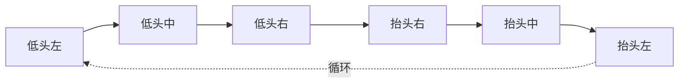

# 7.6 · 找球与移动节点

[7.5](./7.5-动作节点-追球调整踢球.md) 讲了"处理球"的核心动作。本篇收尾剩下的所有节点，分四类：**头部控制**（转头看球/扫场）、**找球**（找不到球时怎么找）、**场地移动**（去起始位/接应位/回场内/导航）、**杂项**（站定、挥手、爬起、调试）。

源码：`brain_tree.cpp` 余下节点、`subtree_find_ball.xml`。底层接口（`moveHead`/`moveToPoseOnField` 等）见 [模块08](../08-机器人控制与底层/index.md)。

---

## 一、头部控制节点

机器人头部（俯仰 pitch + 偏航 yaw）独立于身体控制，专门负责"用相机看球/看场地"。

### 1.1 共同前提：让位给 HeadController

四个 Cam 节点开头都有同一句（如 `brain_tree.cpp:152`）：

```cpp
if (brain->config->headController.enable) return NodeStatus::SUCCESS;
```

> 💡 Phase1 引入了独立的 `HeadController`（[模块08](../08-机器人控制与底层/index.md)）接管头部。一旦它开启，行为树里的 Cam 节点就**直接放行、不再下发头部指令**——否则两边同时控头会冲突（一个想追球、一个想扫场，头来回抽搐）。这是典型的"控制权移交"保护。

### 1.2 CamTrackBall：像素闭环追球（`brain_tree.cpp:148`）

让相机中心对准球。看得见球时用**像素误差闭环**：

```cpp
ballX = mean(bbox.xmax, bbox.xmin); ballY = mean(bbox.ymax, bbox.ymin);  // 球框中心像素
deltaX = ballX - xCenter; deltaY = ballY - yCenter;                      // 偏离视野中心多少像素
if (|deltaX|<容差 && |deltaY|<容差) return SUCCESS;                        // 已在中心→不动
double deltaYaw = deltaX/imageWidth * fovX / smoother;                   // 像素差→角度增量
double deltaPitch = deltaY/imageHeight * fovY / smoother;
moveHead(headPitch + deltaPitch, headYaw - deltaYaw);                    // 比例调头
```

看不见球（但记得球位）时，用 0.01 的小系数**平滑地**把头转向最后已知球位（自己的 `ball` 或队友的 `tmBall`，`brain_tree.cpp:169`）。容差是视野宽高的 3/10——球落在中心区域就不调，避免头一直微抖。

### 1.3 CamFindBall：6 点扫描找球（`brain_tree.cpp:203/229`）

看不见球时，按固定的 **6 个 (pitch, yaw) 点**依次转头扫描（构造函数 `brain_tree.cpp:203` 定义序列）：



（`lowPitch=1.0, highPitch=0.2, yaw=±1.1`）

每 `_cmdIntervalMSec=1000` 毫秒走一格（`brain_tree.cpp:240`），转一圈停在每点 1 秒让相机看清；超过 `_cmdRestartIntervalMSec=60` 秒没找到就从头来（`brain_tree.cpp:244`）。一旦 `ballDetected` 立刻返回 `SUCCESS`。

> 💡 6 点覆盖"近低头—远抬头 × 左中右"，是个朴素但有效的全视野搜索。停顿 1 秒是因为相机+检测需要时间，转太快会漏球。

### 1.4 CamScanField：正弦扫场（`brain_tree.cpp:258`）

定位用——头部连续左右摆扫整个场地找特征线。yaw 按时间做**三角波**往返（`leftYaw↔rightYaw`），pitch 在半周期切换高低，扫遍远近：

```cpp
int cycleTime = msec % msecCycle;
pitch = cycleTime > msecCycle/2 ? lowPitch : highPitch;
yaw   = 三角波(cycleTime, leftYaw, rightYaw);   // 来回线性扫
```

与 `CamFindBall`（离散 6 点、为找球）不同，`CamScanField` 是连续平滑扫描、为定位喂场地线。

### 1.5 CamFastScan：快速扫（`brain_tree.cpp:1451`）

`StatefulActionNode`，找球时的"快速版"——7 个点（`brain_tree.h:234`：pitch 0.45/1.0，yaw ±1.1）一次性扫完就返回 `SUCCESS`，每点间隔 `msecs_interval`（比 `CamFindBall` 的 1 秒短）。用在 `FindBall` 子树里配合转身快速搜索。

### 1.6 MoveHead：直接设头部角度（`brain_tree.cpp:1623`）

```cpp
brain->client->moveHead(pitch, yaw);
```

最简单的头部节点，把头摆到 XML 给定的固定角度（如 READY 阶段 `MoveHead pitch=0.35` 低头看路）。

---

## 二、找球节点

### 2.1 RobotFindBall：原地转身找球（`brain_tree.cpp:1419`）

头转一圈还没找到球（`CamFindBall` 受脖子角度限制看不到身后），就让**整个身体原地转**：

```cpp
onStart():  if (ballDetected) { setVelocity(0,0,0); return SUCCESS; }
            _turnDir = ball.yawToRobot > 0 ? 1.0 : -1.0;       // 朝球最后方位转
onRunning(): if (ballDetected) { setVelocity(0,0,0); return SUCCESS; }  // 找到就停
             setVelocity(0, 0, vyawLimit * _turnDir);          // 原地旋转
```

按"球最后出现的方位"选转向，提高尽快转到球的概率。

### 2.2 TurnOnSpot：累积角度转身（`brain_tree.cpp:1474`）

转一个**指定角度**（如 `rad="3.14"` 转半圈）。靠里程计累积实际转过的角度，转够就停：

```cpp
onStart():  _angle = rad; _cumAngle = 0;
            if (towards_ball) _angle = |angle| * (球在画面左? +1 : -1);  // 朝球那侧转
onRunning(): deltaAngle = toPInPI(curOdomθ - lastθ); _cumAngle += deltaAngle;  // 累积
            if (|_cumAngle| >= |_angle| || turnTime > 5000ms) { stop; return SUCCESS; }
            setVelocity(0, 0, (_angle - _cumAngle)*2);          // 剩余角越大转越快
```

> 💡 累积里程计角度（而非靠时间估）保证转得准；`(_angle - _cumAngle)*2` 是简单的比例控制，越接近目标转越慢，平稳收尾。5 秒超时兜底防止卡死。

### 2.3 FindBall 子树（`subtree_find_ball.xml`）

`decision=="find"` 时进这棵子树，把找球动作串起来：

```xml
<Sequence>
   <ReactiveSequence> <GoBackInField/> <CamFastScan/> </ReactiveSequence>   <!-- 回场内 + 快扫 -->
   <TurnOnSpot rad="3.14" towards_ball="true"/>                             <!-- 转半圈 -->
   <ReactiveSequence> <GoBackInField/> <CamFastScan/> </ReactiveSequence>   <!-- 再扫一次 -->
   <ReactiveSequence> <GoToReadyPosition vx_limit="0.7"/> <Sleep msec="5000"/> </ReactiveSequence> <!-- 还没找到→回起始位等 -->
</Sequence>
```

> 💡 找球策略逐级升级：先**原地快扫一圈**（边回场内边扫，防止扫的时候走出界）→**转身**看身后→**再扫**→实在找不到就**回到 ready 起始位**站定等（球迟早会被别人弄回视野）。`GoBackInField` 始终伴随，保证找球过程不会失控走出场。

---

## 三、场地移动节点

### 3.1 GoToReadyPosition：去起始站位（`brain_tree.cpp:1535`）

READY 阶段走到我方开球阵型位。按 `player_role` 和 `myStrikerIDRank`（前锋 0~3）、`gc_is_kickoff_side`（是否我方开球）算目标点（`brain_tree.cpp:1558`）：

| 角色/Rank | 站位 |
|-----------|------|
| striker 0 | 中圈前（我方开球更靠前 `-circleRadius-0.5`，否则 `-circleRadius*2`），y=0（**开球主罚位**） |
| striker 1 | 同 x，y=-1.5（侧应） |
| striker 2/3 | 禁区前，y=±circleRadius/2（后排补位） |
| goal_keeper | 球门区前 `-length/2+goalAreaLength`，y=0 |

> 🏆 我方开球时 rank0 站得更靠近中圈（准备开球），非开球时退得更远（规则要求退出中圈）。`distToBorder() > -1` 时（靠近边线）自动降速到 0.6/0.4，防止冲出界。导航交给底层 `moveToPoseOnField2`（[模块08](../08-机器人控制与底层/index.md)）。

### 3.2 GoBackInField：出界回场（`brain_tree.cpp:1582`）

机器人自己走出场地边界时，朝最近的"往场内"方向走回去：

```cpp
if (robotX > length/2 - valve)      dir = -M_PI;      // 越过对方底线→往回
else if (robotX < -length/2 + valve) dir = 0;          // 越过我方底线→往前
else if (robotY > width/2 + valve)   dir = -M_PI/2;    // 越过左边线→往右
else if (robotY < -width/2 - valve)  dir = M_PI/2;     // 越过右边线→往左
else { setVelocity(0,0,0); return SUCCESS; }           // 在场内→不动
vx = 0.4*cos(dir_r); vy = 0.4*sin(dir_r);              // 朝场内匀速走
```

`valve` 是边界余量。它判的是**机器人自己**是否出界（区别于 `ball_out` 判球），常和找球/球出界逻辑串联，确保动作不把自己带出场。

### 3.3 Assist：助攻接应站位（`brain_tree.cpp:595`）

`decision=="assist"`（我不是主攻）时走这里，跑到一个**有利接应位**等队友传球或抢二点球：

```cpp
// 若场上还有另一个助攻前锋，且他比我更靠前→我当"次助攻"(secondary)，站更后
for (队友) if (alive && !isLead && role=="striker") {
    has2Assists = true;
    if (tm.x > robotPose.x) isSecondary = true;
}
targetPose.x = isSecondary ? ballPos.x - 4.0 : ballPos.x - 2.0;     // 站球后 2m 或 4m
targetPose.x = max(targetPose.x, -length/2 + distToGoalline);       // 不退过我方门前线
targetPose.y = ballPos.y * (targetX+length/2)/(ballPos.x+length/2); // 沿"门→球"线投影
if (has2Assists) targetPose.y += isSecondary ? -0.5 : 0.5;          // 两助攻错开站位
```

> 💡 助攻位逻辑：站在球的**后方**（2m 或 4m，看自己是主助攻还是次助攻），y 方向沿"本方门→球"的连线投影（保持在进攻轴线上）。有两个助攻时一个偏左、一个偏右（±0.5）错开，避免挤在一起。带避障，逻辑与 `Chase` 同款（`brain_tree.cpp:657`）。

算出朝接应位的 `(vx, vy, vtheta)` 后，下发前统一限幅（`brain_tree.cpp:684`）：

```cpp
vx = cap(vx, vxLimit, -0.25);      // 后退最多 -0.25
vy = cap(vy, vyLimit, -vyLimit);
vtheta = cap(vtheta, 2.0, -2.0);   // 转向夹到 ±2.0 rad/s
brain->client->setVelocity(vx, vy, vtheta);
```

> 💡 **安全加固：`Assist` 的后退速度与转向速度封顶。** 这里 `vx` 来自"机器人系下的目标点 x"、`vtheta = ball.yawToRobot * 4.0`，都可能算出较大的负/大值。旧代码 `vx` 下界是 `-1.0`（允许高速倒退），且 `vtheta` 完全不封顶。改成 `vx` 下界 **`-0.25`**、`vtheta` 夹到 **`±2.0`** 后：接应时最多慢速微退、不会为够身后目标点而猛倒车失稳，转向也不会因大偏航角急旋发散。这与 [7.5](./7.5-动作节点-追球调整踢球.md) §1.5 的 `SimpleChase` 是**同一组封顶**——本次提交对所有"直接拿球位/目标点当速度"的节点统一加的稳定性护栏。

### 3.4 MoveToPoseOnField：通用导航（`brain_tree.cpp:1512`）

最通用的"走到场地某点 (x,y,θ)"节点，所有参数（限速、容差、是否避障）从 XML 读，直接转调底层 `moveToPoseOnField2`。`GoToReadyPosition`/`GoToFreekickPosition` 等本质上都是它的"带站位计算"的特化版。

---

## 四、杂项节点

| 节点 | 行号 | 作用 |
|------|------|------|
| `SetVelocity` | 127 | 直接下发 `(x,y,θ)` 速度；**不带参数=全 0=站定**。SET/END/暂停都用它站定 |
| `StepOnSpot` | 139 | 原地极小幅踏步（`vx∈[-0.01,0.01]` 随机），保持步态活性 |
| `StandStill` | 1388 | Stateful，站定指定 `msecs` 毫秒后返回 SUCCESS；`onHalted` 把计时拨远使其立即"过期" |
| `WaveHand` | 1612 | 进球庆祝挥手（`action="start"/"stop"` 调 `client->waveHand`） |
| `CheckAndStandUp` | 1632 | 摔倒检测+爬起状态机（见下） |
| `CalibrateOdom` | 1672 | 用给定 (x,y,θ) 标定里程计到场地系（调试/重定位用） |
| `PrintMsg` | 1683 | 打印一条调试消息 |

### 4.1 CheckAndStandUp：摔倒爬起状态机（`brain_tree.cpp:1632`）

放在主树最高优先级（[7.2](./7.2-主树game_xml.md) §3.1），每帧检查"摔了没、该不该爬"：

```cpp
// 被罚下 或 处于模式2 → 重置爬起状态，不爬
if (under_penalty || currentRobotModeIndex==2) { 重置; return SUCCESS; }

// 摔倒了 且 还没爬过 且 重试次数没到上限 → 爬一次
if (!recoveryPerformed && recoveryState==HAS_FALLEN && modeIndex==1 && retryCount<max) {
    shouldExitRLVisionKick = true;      // 顺便打断视觉踢
    client->standUp();
    recoveryPerformed = true;
}
// 爬的过程进入模式10 → 重试次数+1，允许下次再爬
if (recoveryPerformed && modeIndex==10) { retryCount++; recoveryPerformed=false; }
// 爬成功(IS_READY 且 模式8/20) → 全部重置
if (recoveryState==IS_READY && (modeIndex==8||20)) { 重置 retryCount/Performed; }
return SUCCESS;
```

> 💡 这是个带**重试上限**的小状态机：`recoveryPerformed` 防止一帧内反复发爬起命令；`recoveryPerformedRetryCount` 限制重试次数（爬不起来就别死磕，避免无限尝试）；爬起时主动置 `shouldExitRLVisionKick` 打断进行中的视觉踢（[7.5](./7.5-动作节点-追球调整踢球.md)）。始终返回 `SUCCESS`——爬起由底层异步执行，行为树不阻塞，后续比赛逻辑照常往下走。

---

## 五、节点全景小结

把本模块所有节点按职责归类，方便回查：

```
决策      StrikerDecide / KickSelector / GoalieDecide / CalcKickDir   （7.3 / 7.4）
处理球    Chase / Adjust / Kick / RLVisionKick / SimpleChase          （7.5）
头部      CamTrackBall / CamFindBall / CamScanField / CamFastScan / MoveHead
找球      RobotFindBall / TurnOnSpot / (FindBall 子树)
场地移动  GoToReadyPosition / GoToFreekickPosition / GoToGoalBlockingPosition
          GoBackInField / Assist / MoveToPoseOnField
杂项      SetVelocity / StepOnSpot / StandStill / WaveHand
          CheckAndStandUp / CalibrateOdom / PrintMsg
```

---

## 小结

- **头部节点**全部在 `headController.enable` 时让位给 `HeadController`（[模块08](../08-机器人控制与底层/index.md)）：`CamTrackBall` 像素闭环追球、`CamFindBall` 离散 6 点扫、`CamScanField` 正弦连续扫场（喂定位）、`CamFastScan` 7 点快扫。
- **找球**：`RobotFindBall` 朝球最后方位原地转、`TurnOnSpot` 按里程计累积角度转指定度数，`FindBall` 子树把"回场内+快扫+转身+回ready位"串成逐级升级的搜索。
- **场地移动**：`GoToReadyPosition`/`GoToFreekickPosition` 按角色+`myStrikerIDRank` 算专属站位，`GoToGoalBlockingPosition` 门前封堵，`GoBackInField` 把走出界的自己拉回场内，`Assist` 算助攻接应位（下发前后退封 `-0.25`、`vtheta` 封 `±2.0`，与 `SimpleChase` 同款护栏），底层都走 `moveToPoseOnField`。
- **杂项**：`SetVelocity`(站定)、`StandStill`(定时站)、`WaveHand`(庆祝)、`CheckAndStandUp`(带重试上限的爬起状态机，放在主树最高优先级)、`CalibrateOdom`/`PrintMsg`(调试)。

至此模块 07 行为树与决策全部讲完——从框架、主树、前锋/守门员决策，到所有动作节点。下一模块进入底层运动控制。
