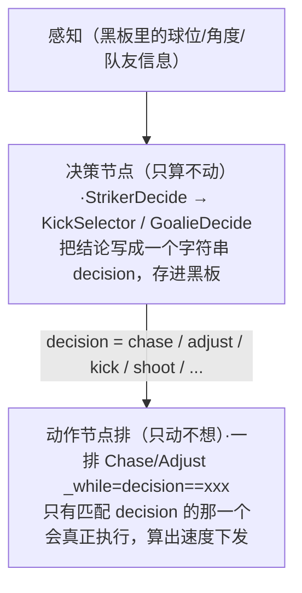
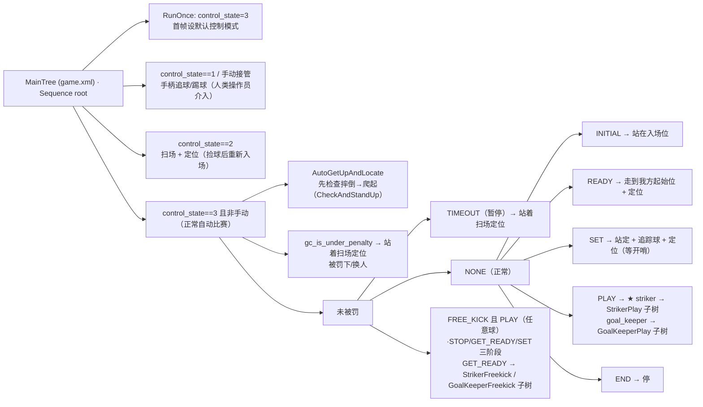

# 模块 07 · 行为树与决策（大脑的灵魂）

前面几个模块都在讲"感知"——[模块03](../03-视觉模块/index.md)看球、[模块05](../05-大脑数据与坐标系/index.md)维护世界状态、[模块06](../06-定位与球预测/index.md)定位与预测球。本模块讲"决策"——**机器人在每一个心跳（约 100Hz）里，根据感知到的一切，决定此刻该做什么、怎么做**。这是整个项目的核心，也是最难、最值得逐节点读透的部分。

决策用**行为树（Behavior Tree，简称 BT）** 实现，框架是开源的 [`BehaviorTree.CPP`](https://www.behaviortree.dev/)。逻辑骨架写在 XML 里（`src/brain/behavior_trees/`），具体动作用 C++ 节点实现（`src/brain/src/brain_tree.cpp` + `src/brain/include/brain_tree.h`）。

## 子篇导航

建议按顺序读，从"框架"到"主树"再到"具体决策/动作"层层深入：

| 子篇 | 讲什么 | 对应源码 |
|------|--------|----------|
| [7.1 行为树框架与黑板](./7.1-行为树框架与黑板.md) | BT 基本概念（三态、Sequence/ReactiveSequence/IfThenElse、`_while` 语法糖）、`BrainTree::init` 注册、`initEntry` 黑板每个变量含义、`getEntry/setEntry`、Sync vs Stateful 节点 | `brain_tree.h` `brain_tree.cpp:26/73/122` |
| [7.2 主树 game.xml 逐层分支](./7.2-主树game_xml.md) | `game.xml` 按 `control_state`/`gc_game_state`/`gc_game_sub_state` 层层分支、为何用 `ReactiveSequence`、各子树何时进入 | `behavior_trees/game.xml` |
| [7.3 前锋决策](./7.3-前锋决策.md) | `StrikerPlay` 子树、`CalcKickDir`、`StrikerDecide` 粗决策逐条、`KickSelector` 精决策 7 分支、两层决策串接设计 | `subtree_striker_play.xml` `brain_tree.cpp:769/814/994` |
| [7.4 守门员与任意球](./7.4-守门员与任意球.md) | `GoalieDecide`、`GoalKeeperPlay` 子树、`StrikerFreekick`/`GoalKeeperFreekick` 任意球子树、`handleSpecialStates` 开球计时、`isBallOut` 球出界 | `brain_tree.cpp:1046` `brain.cpp:542/1181` |
| [7.5 动作节点 · 追球/调整/踢球](./7.5-动作节点-追球调整踢球.md) | （核心动作）`Chase` 追预测位绕后、`Adjust` 切向+径向速度分解、`Kick` 蟹步两阶段+多维中止、`RLVisionKick` 视觉踢球 | `brain_tree.cpp:280/682/1110/1264` |
| [7.6 找球与移动节点](./7.6-找球与移动节点.md) | 头部节点、找球节点、场地移动节点（去接应/去封堵/回场内/导航）、杂项节点 | `brain_tree.cpp` 余下全部节点 |

## 本模块要点速览

### 行为树是什么？为什么用它？

行为树是一种**用树形结构组织"决策 + 动作"的方法**，比一坨嵌套 `if-else` 状态机更易读、易改、易复用。三个最核心的概念：

- **每个节点 tick 一次返回三种状态**：`SUCCESS`（成功）、`FAILURE`（失败）、`RUNNING`（进行中，下一帧继续）。
- **控制节点**决定子节点怎么跑（顺序、反应式、条件分支），**动作/条件节点**是叶子，干实事或判真假。
- **黑板（Blackboard）** 是节点间共享变量的"公告板"。大脑把感知结果（`ball_location_known`、`gc_game_state`、`decision`…）写进黑板，决策节点从黑板读。

> 💡 **为什么不用一堆 if-else？** 比赛逻辑天然复杂：5 种主状态 × 多种副状态 × 前锋/守门员两种角色 × 十几种动作。写成嵌套 if 会变成无人能维护的"意大利面"。行为树把它拆成可视化、可组合的小树，`game.xml` 一眼就能看出"比赛在 PLAY、我是前锋、就跑 `StrikerPlay` 子树"。XML 与 C++ 分离，还让策略调整（改阈值、换动作顺序）不必重新编译——改 XML 即可。

> 🏆 RoboCup 人形组（Humanoid League）比赛由**裁判机（GameController）**统一广播比赛状态（INITIAL/READY/SET/PLAY/...），见 [模块04](../04-裁判机与通信/index.md)。机器人必须**实时**响应这些状态切换——裁判一吹哨从 SET 进 PLAY，下一帧就得开踢。行为树的 `ReactiveSequence` 正是为这种"每帧重新评估条件"而生。

### 决策 - 动作分离：本项目最漂亮的设计

整个前锋/守门员逻辑遵循一个统一范式，把"决定做什么"和"具体怎么做"彻底解耦：

- **决策节点**（`StrikerDecide`/`KickSelector`/`GoalieDecide`）是 `SyncActionNode`，每帧瞬间算完，唯一的副作用是 `setOutput("decision_out", ...)` 把一个字符串写进黑板。
- **动作节点**（`Chase`/`Adjust`/`Kick`…）各自挂 `_while="decision=='xxx'"`，只有当前 `decision` 命中的那个会被 tick，其余被跳过。动作节点负责把决策翻译成 `(vx, vy, vθ)` 速度指令并调 `client->setVelocity()`（底层见 [模块08](../08-机器人控制与底层/index.md)）。

> 💡 这种分离的好处：① 决策逻辑集中在一两个 C++ 函数里，一眼看尽优先级；② 动作节点是可复用的"积木"，前锋和守门员共用 `Chase`/`Adjust`/`Kick`，只是 XML 里给的参数不同；③ 调试时只要看黑板里的 `decision` 字符串就知道大脑"想干啥"，再看机器人动作就知道动作节点"做得对不对"，问题定位极快。

前锋用了**两层决策串接**（粗 → 精）：`StrikerDecide`（老的粗逻辑：追/调/踢/找/助攻）先出一个决策，再喂给 `KickSelector`（Phase1 新增的精细射门选择：普通踢/射门/大力射/传中/视觉踢）。详见 [7.3](./7.3-前锋决策.md)。

### 一次心跳里行为树跑了什么

`BrainTree::tick()`（`brain_tree.cpp:122`）每个心跳调一次 `tree.tickOnce()`，从 `MainTree` 根节点往下走。整条主链路：

`gameControlCallback`（`brain.cpp:1414`）负责把裁判机的数字状态翻译成黑板字符串（`gc_game_state`、`gc_game_sub_state_type`、`gc_is_kickoff_side`…），主树再据此分支。详见 [7.2](./7.2-主树game_xml.md)。

### 谁去踢？协作与代价 `cost`（引用 [模块04](../04-裁判机与通信/index.md)）

多机器人时要避免大家一窝蜂抢球。每个机器人算自己够到球的总**代价 cost**（`updateCostToKick`，`brain.cpp:1069`），cost 越低越该去踢。cost 累加了：球多久没看到、球丢没丢、到球距离、球速项、路上有无障碍、转向对准角度、会不会撞队友、绕球调整角度、是否摔倒（+15）、定位是否失败（+100），最后做指数平滑防抖。

`handleCooperation`（`brain.cpp:577`，[模块04](../04-裁判机与通信/index.md) 已详讲）据此选出 lead（主攻）/assist（助攻），把 `is_lead`、`tmMyCostRank` 写进黑板。前锋决策里 `if (!tmImLead) → "assist"` 就是用它来"让位"。**本模块只引用这些信号，cost 计算细节见 [模块04](../04-裁判机与通信/index.md)。**

### 核心要点

- 行为树用 **XML 描述逻辑 + C++ 实现动作**，黑板做共享变量；每个节点 tick 返回 `SUCCESS/FAILURE/RUNNING`。
- 主树 `game.xml` 按裁判机 **state / sub_state** 和 **角色** 层层分支，全程 `ReactiveSequence` 保证每帧实时响应裁判机切换。
- 核心范式是**决策 - 动作分离**：决策节点把结论写成 `decision` 字符串，动作节点 `_while="decision=='xxx'"` 各取所需。
- 前锋决策两层串接：`StrikerDecide`（粗：找/助攻/追/踢/调）→ `KickSelector`（精：踢/射门/大力射/传中/视觉踢）。
- 守门员更保守：`GoalieDecide` 输出 retreat/chase/kick/adjust，主要在门前横移封堵。
- 三个核心动作：`Chase`（追预测位 pred100 + 绕后）、`Adjust`（绕球切向+径向调角，用 pred300）、`Kick`（蟹步两阶段 + 四维中止）。
- 多机靠 **cost** 排序选主攻，避免抢球（细节在 [模块04](../04-裁判机与通信/index.md)）。

## 读完本模块你应该能回答

- 裁判一吹哨，机器人是怎么"一帧之内"从站定切到追球的？
- 大脑决定"踢球"还是"绕球调整"的判据到底是什么？阈值在哪？
- `Chase` 为什么不直愣愣冲向球，而要"绕到球后方"？
- 多个机器人怎么决定谁去抢球？
