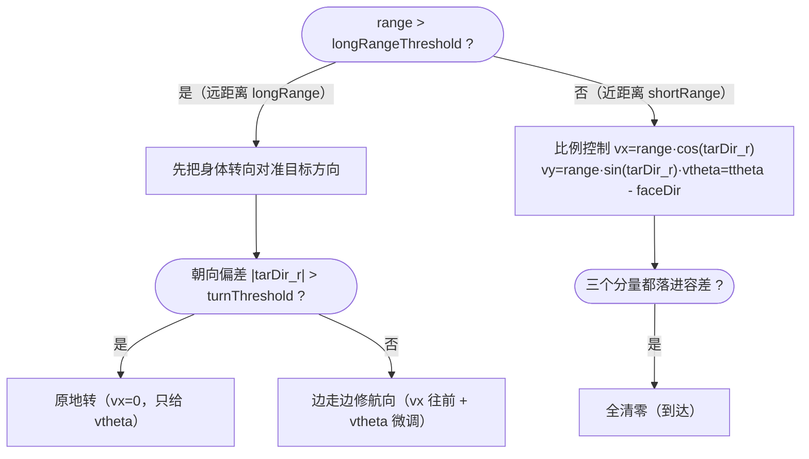

# 8.2 · 场地导航 moveToPoseOnField

很多决策不是"追球踢球"，而是"走到场地上某个点站好"——开球前回己方半场、任意球前去封堵、定位时去某个观测点。这类"导航到位姿"的活儿由 `RobotClient::moveToPoseOnField` 系列三个版本完成。行为树里的 `GoToReadyPosition` / `GoToFreekickPosition` / `MoveToPoseOnField` 等节点（[7.6](../07-行为树与决策/7.6-找球与移动节点.md)）调的就是它们。

源码：`robot_client.cpp:149`（v1）/ `250`（v2）/ `351`（v3）/ `475`（msecsToCollide）。

---

## 一、共同骨架：远转近移

三个版本签名相同 `(tx, ty, ttheta, longRangeThreshold, turnThreshold, vx/vy/vthetaLimit, x/y/thetaTolerance, avoidObstacle)`，核心策略也一致——**按到目标的距离分远近两段**：



> 💡 **为什么远要先转、近才平移？** 双足机器人"前进"远比"侧移"高效稳定。离目标还远时，与其侧着挪过去，不如先把身体转正、笔直走过去——又快又稳。等到了近处再用 vx/vy/vθ 三自由度比例控制做精细到位（这时距离短、误差小，侧移代价可接受）。`longRangeThreshold` 还带一点滞回（v2/v3 里 `mode=="longRange"` 时乘 0.9），避免在远近边界反复横跳。

到达判定也分版本：v1 直接比 `robotPoseToField` 与 `target_f` 的 x/y/θ 偏差是否都在容差内（`robot_client.cpp:171`），到了就 `setVelocity(0,0,0)`；v2/v3 在 shortRange 里算出 vx/vy/vθ 后若都小于容差就清零（`robot_client.cpp:327` / `432`）。

---

## 二、v1：临时目标避障 `target_temp_r`（`robot_client.cpp:149`）

v1 的避障思路是"**碰到障碍就临时换个目标绕一段，再回到原目标**"：

```cpp
static Pose2D target_temp_r;                         // 临时绕行目标（机器人系）
static rclcpp::Time timeEndTempTarget = now();       // 这个时间前都走临时目标
if (now() < timeEndTempTarget) {                     // 正在避障期内
    target_r = target_temp_r; vxLimit = vyLimit = 0.4;  // 走临时目标、限速
} else {
    target_r = field2robot(target_f);                // 否则走真目标
}
```

真正的避障决策在算完 vx/vy/vθ 后（`robot_client.cpp:200`）：

```cpp
if (avoidObstacle) {
    double etc = msecsToCollide(vx, vy, vtheta);     // 估计多久会撞
    double eta = norm(target_r.x, target_r.y)/max(1e-5,norm(vx,vy))*1000;  // 多久能到
    if (etc < min(eta, 3000.)) {                     // 撞得比到得快、且 3 秒内要撞
        vx = 随机微动; vy = 0; vtheta = 0;            // 原地踏步别全停
        // 从目标方向起，左右各扇形扫 9 个方向，找第一个 msecsToCollide>3000 的安全方向
        for (int i=0;i<9;i++){ theta1 = theta0 ± M_PI/9*i; if (msecsToCollide(...)>3000) break; }
        target_temp_r = {cos(theta1), sin(theta1)};   // 该方向 1m 处设临时目标
        timeEndTempTarget = now() + 3.5s;            // 接下来 3.5 秒走临时目标
    } else if (etc < min(eta, 6000.)) {
        vtheta += 0.2;                               // 中等危险→边走边偏转一点
    }
}
```

> 💡 撞得比到得早才需要避（`etc < eta`），否则障碍在目标之后、不挡路就不管。真要避时不全停（全停在比赛里很被动），而是**原地小幅踏步**，同时从目标方向开始向左右扇形搜索一个 3 秒内不会撞的方向，在那个方向 1m 处插一个临时目标走 3.5 秒，绕过去后自动回到真目标。

---

## 三、v2 / v3：状态化避障（`robot_client.cpp:250` / `351`）

v2、v3 把避障做得更细，引入了"后退/转身/侧移"等子状态，并用 `config` 里的 `safe_distance`、`avoid_secs` 参数控制。

**v2（`robot_client.cpp:250`）** 在 longRange 下区分"避障倒计时内/外"：
- 倒计时内：正前方障碍太近（`< SAFE_DIST/2`）就**后退 + 侧移**（`vx=-0.2, vy=avoidDir*0.2`）；稍近（`< SAFE_DIST`）就**原地转**（`vtheta=avoidDir*vtheta_limit`）；否则继续前进但目标方向有障碍时限速一半。
- 倒计时外：目标方向 `< SAFE_DIST*2` 限速、`< SAFE_DIST` 触发避障倒计时并停下重规划。
- `avoidDir` 由 `calcAvoidDir(tarDir_r, SAFE_DIST)`（[8.5](./8.5-避障与深度感知.md)）算出该往左还是往右绕。

**v3（`robot_client.cpp:351`）** 用 `should_avoid_in_move` 标志做"边走边侧避"，并对**任意球摆位**特殊处理——`isFreekickStartPlacing()` 时换用更大的 `freekick_start_placing_safe_distance` / `avoid_secs`（摆位阶段要离球更远，避免犯规）。它在 longRange/shortRange 都先扫一圈找 `mostViableDir`（第一个 `distToObstacle > SAFE_DIST` 的方向），障碍挡路时朝那个方向侧移 0.2~0.3 绕开。

> 💡 三个版本是迭代演进的产物（v1→v2→v3 避障越来越精细），共存于代码中由不同导航节点按需选用。它们都把"避哪个方向"委托给 [8.5](./8.5-避障与深度感知.md) 的 `distToObstacle` / `calcAvoidDir`，自己只负责"避障时该怎么走"的运动策略。

---

## 四、`msecsToCollide`：碰撞时间估计（`robot_client.cpp:475`）

v1 避障的核心判据，估计"按当前速度多久会撞上场上某个机器人"：

```cpp
double msecsToCollide(double vx, double vy, double vtheta, double maxTime) {
    auto robots = data->getRobots();
    if (robots.empty()) return maxTime;               // 场上无人→不会撞
    if (vx<1e-3 && vy<1e-3) return maxTime;           // 没在动→不会撞
    Line path = { x0, y0, x0 + vx*cos(theta)*maxTime/1000, y0 + vy*sin(theta)*maxTime/1000 }; // 预测路径
    const double SAFE_DIST = 0.6;
    for (每个 robot) {
        double distToPath = pointMinDistToLine(障碍点, path);
        if (distToPath < SAFE_DIST) {                 // 路径会擦过这个障碍
            double angle = angleBetweenLines(...);
            double l = 到障碍的距离;
            double d = l*cos(angle) - sqrt(SAFE_DIST² - l²·sin²(angle));  // 到"擦边圈"的距离
            minDist = min(minDist, d);
        }
    }
    return min(maxTime, minDist / norm(vx, vy) * 1000); // 距离 / 速度 = 时间
}
```

> 💡 把"会不会撞"几何化：以当前速度画一条预测路径线，对每个机器人算它到路径的垂距，小于 `SAFE_DIST=0.6m` 就认为会擦上；再用余弦定理算出"沿路径还要走多远才进入它的 0.6m 安全圈"，除以速度得到碰撞时间。注释里明说为简化**暂不考虑 vθ**，这是个偏保守的估计——宁可早避也不漏撞。障碍来自 `data->getRobots()`（队友+对手的位置），与 [8.5](./8.5-避障与深度感知.md) 的深度图障碍栅格是两套互补的障碍来源。

---

## 小结

- `moveToPoseOnField/2/3`（`robot_client.cpp:149/250/351`）统一**远转近移**：远了先转向对准再笔直走（双足前进最稳），近了用 vx/vy/vθ 比例控制到容差，`longRangeThreshold` 带滞回防横跳。
- v1 用"临时目标 `target_temp_r` 绕一段再回原目标"避障，靠 `msecsToCollide` 判危、扇形搜索安全方向。
- v2/v3 是更精细的状态化避障（后退/转身/侧移），v3 还对任意球摆位用更大的安全距离；都把"避哪边"委托给 `calcAvoidDir`（[8.5](./8.5-避障与深度感知.md)）。
- `msecsToCollide`（`robot_client.cpp:475`）几何估计沿当前速度多久撞到场上机器人，`SAFE_DIST=0.6m`、保守地忽略 vθ。
- 行为树的 `GoToReadyPosition`/`GoToFreekickPosition`/`MoveToPoseOnField` 节点（[7.6](../07-行为树与决策/7.6-找球与移动节点.md)）就是这些函数的调用方。

下一篇：机器人怎么知道自己在哪、有没有摔倒——本体状态回调。
