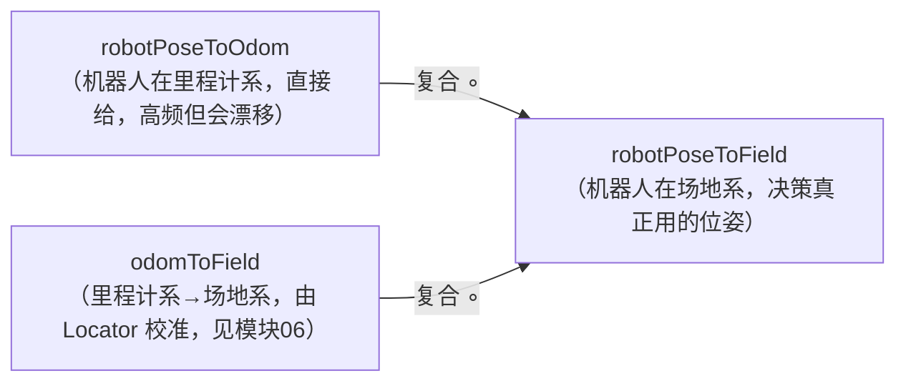

# 8.3 · 本体状态回调（里程计 / IMU / 摔倒）

前两篇是"大脑→本体"的指令方向。本篇是反方向：**本体→大脑**——机器人把里程计、IMU、头部位姿、摔倒状态这些自身状态高频回灌给大脑，大脑在回调里更新 `BrainData`，决策才知道"我现在在哪、头朝哪、有没有摔"。

四个回调在 `brain.cpp:248-251` 注册订阅，实现在 `brain.cpp:1637/1653/1680/1705`：

```cpp
// brain.cpp:248-251 订阅注册
odometerSubscription     = create_subscription<Odometer>("/odometer_state" + suffix, ..., odometerCallback);
lowStateSubscription     = create_subscription<LowState>("/low_state" + suffix, ..., lowStateCallback);
headPoseSubscription     = create_subscription<Pose>("/head_pose" + suffix, ..., headPoseCallback);
recoveryStateSubscription= create_subscription<RawBytesMsg>("fall_down_recovery_state" + suffix, ..., recoveryStateCallback);
```

---

## 一、odometerCallback：机器人在场地上的位置（`brain.cpp:1637`）

里程计是机器人位姿**最高频**的来源。回调做两件事：

```cpp
void Brain::odometerCallback(const Odometer &msg) {
    // 1) 里程计原始读数 × odom_factor 标度补偿，存进 robotPoseToOdom
    data->robotPoseToOdom.x = msg.x * config->get_robot_odom_factor();
    data->robotPoseToOdom.y = msg.y * config->get_robot_odom_factor();
    data->robotPoseToOdom.theta = msg.theta;

    // 2) 复合 odomToField，算出机器人在场地系的位姿 robotPoseToField
    transCoord(
        data->robotPoseToOdom.x, data->robotPoseToOdom.y, data->robotPoseToOdom.theta,
        data->odomToField.x,     data->odomToField.y,     data->odomToField.theta,
        data->robotPoseToField.x,data->robotPoseToField.y,data->robotPoseToField.theta);
}
```

这正是 [模块05](../05-大脑数据与坐标系/index.md) 讲的三套坐标系的核心一环：



> 💡 **为什么要乘 `odom_factor`？** 里程计靠累计步态推算位移，长期会有系统性标度误差（实际走 1m 它报 0.95m 之类），`robot_odom_factor` 做线性标度补偿。**为什么还要复合 `odomToField`？** 里程计只知道"相对开机点走了多远"，不知道自己在球场哪。`odomToField` 这个偏移由 [模块06](../06-定位与球预测/index.md) 的定位器根据看到的场地线/角点持续校准、慢速修正里程计漂移。里程计提供高频平滑的相对运动、定位提供低频绝对校正，两者复合得到又快又准的 `robotPoseToField`。

---

## 二、lowStateCallback：底层状态与头部角度（`brain.cpp:1653`）

```cpp
void Brain::lowStateCallback(const LowState &msg) {
    data->headYaw   = msg.motor_state_serial[0].q;   // 头部偏航关节角
    data->headPitch = msg.motor_state_serial[1].q;   // 头部俯仰关节角
}
```

`LowState` 是底层的"全身状态"消息（含各关节、IMU 等）。当前实现主要从中取出**头部两个关节的实测角度** `headYaw`/`headPitch`——注意这是**实测反馈**，与 [8.1](./8.1-RobotClient指令翻译.md) `moveHead` 下发的**目标**角度不同，中间有跟踪延迟。视觉把像素映射到三维时需要知道相机当前朝向，正依赖这两个实测角。

> 💡 `TrainingFrame` 里预留了 `imu_acc` 字段，但 `lowStateCallback` 当前没解析 IMU 加速度（`brain.cpp:522` 注释说明保持 0）。这是个留待扩展的位置——IMU 数据对摔倒检测、姿态估计很有用，后续可在这里补上。

---

## 三、headPoseCallback：相机到机器人的变换（`brain.cpp:1680`）

```cpp
void Brain::headPoseCallback(const geometry_msgs::msg::Pose& msg) {
    Eigen::Matrix4d headToBase = Eigen::Matrix4d::Identity();
    Eigen::Quaterniond q(msg.orientation.w, .x, .y, .z);
    headToBase.block<3,3>(0,0) = q.toRotationMatrix();          // 头相对身体的旋转
    headToBase.block<3,1>(0,3) = Eigen::Vector3d(msg.position.x, .y, .z); // 平移
    data->camToRobot = headToBase * config->camToHead;          // 串成 相机→机器人
}
```

把"头部相对身体的位姿" `headToBase` 乘上配置里固定的"相机相对头部" `camToHead`，得到完整的 **`camToRobot`** 变换矩阵。

> 💡 `camToRobot` 是视觉换算的命脉：[模块03](../03-视觉模块/index.md) 检测到球在像素坐标后，要靠它把相机系的三维点转到机器人系（再经 `robotPoseToField` 转到场地系）。头一直在动（追球、扫场），所以 `camToRobot` 必须每帧随头部位姿更新——这就是它放在回调里实时算的原因。[8.5](./8.5-避障与深度感知.md) 的深度图反投影同样用它（`point_robot = camToRobot * point_cam`）。

---

## 四、recoveryStateCallback：摔倒恢复状态机（`brain.cpp:1705`）

机器人会摔倒，必须能自动爬起。底层把摔倒恢复状态通过二进制消息 `RawBytesMsg` 透传上来，回调解析它：

```cpp
void Brain::recoveryStateCallback(const RawBytesMsg &msg) {
    RobotRecoveryStateData recoveryState;
    memcpy(&recoveryState, buffer.data(), buffer.size());        // 二进制结构体解析
    vector<RobotRecoveryState> map = { IS_READY, IS_FALLING, HAS_FALLEN, IS_GETTING_UP };
    data->recoveryState        = map[recoveryState.state];       // 0/1/2/3 → 枚举
    data->isRecoveryAvailable  = (bool)recoveryState.is_recovery_available;
    data->currentRobotModeIndex= recoveryState.current_planner_index;
}
```

状态机四态：

| `recoveryState` | 含义 |
|-----------------|------|
| `IS_READY` (0) | 站立正常 |
| `IS_FALLING` (1) | 正在倒下 |
| `HAS_FALLEN` (2) | 已经摔倒（趴/仰在地上）|
| `IS_GETTING_UP` (3) | 正在爬起 |

`isRecoveryAvailable` 表示"当前是否允许执行爬起动作"（比如某些状态下硬件不让起身）。

> 💡 这条链路串到行为树：主树最前面的 `AutoGetUpAndLocate` 子树里有 `CheckAndStandUp` 节点（[7.6](../07-行为树与决策/7.6-找球与移动节点.md)），它读 `recoveryState`——一旦 `HAS_FALLEN` 就调 `client->standUp()`（[8.1](./8.1-RobotClient指令翻译.md)）爬起，起来后还要重新定位（摔倒过程里程计/定位都乱了）。`recoveryState==HAS_FALLEN` 同时也是 [7.5](../07-行为树与决策/7.5-动作节点-追球调整踢球.md) `Kick` 节点四维中止之一（摔了就别踢空气）。摔倒检测优先级排在所有比赛逻辑之前——躺在地上谈什么策略都没意义。

---

## 小结

- 四个回调（`brain.cpp:1637/1653/1680/1705`，注册于 `248-251`）把本体状态高频回灌进 `BrainData`，是"本体→大脑"的反向链路。
- `odometerCallback`：里程计 ×`odom_factor` 标度补偿存 `robotPoseToOdom`，再复合 `odomToField` 得决策真正用的 `robotPoseToField`（坐标系细节见 [模块05](../05-大脑数据与坐标系/index.md)，校准见 [模块06](../06-定位与球预测/index.md)）。
- `lowStateCallback`：取头部两关节**实测**角 `headYaw/headPitch`（IMU 预留未解析）。
- `headPoseCallback`：`headToBase × camToHead = camToRobot`，每帧更新，是视觉/深度图三维换算的命脉（[模块03](../03-视觉模块/index.md)）。
- `recoveryStateCallback`：解析二进制摔倒状态机（READY/FALLING/FALLEN/GETTING_UP）+ `isRecoveryAvailable`，驱动行为树 `CheckAndStandUp` 摔倒爬起（[7.6](../07-行为树与决策/7.6-找球与移动节点.md)）。

下一篇：开启主动控头后，脖子怎么自己追球扫场。
