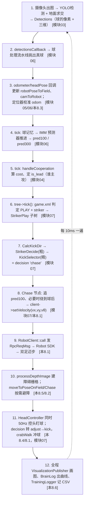

# 8.6 · 可视化与训练数据记录

大脑内部状态（机器人在哪、球在哪、决定干啥、有哪些障碍）都是看不见摸不着的变量。本篇讲两件让它"可见、可存"的事：`VisualizationPublisher` 把状态发成 RViz/Booster Studio 能显示的图形、`BrainLog` 把标量发成曲线、`TrainingLogger` 把每一帧记成 CSV 供离线学习。最后用"一次完整决策回路"收束整套文档。

---

## 一、VisualizationPublisher：把状态画出来

源码 `src/brain/src/visualization_publisher.cpp`、`include/visualization_publisher.h`。构造时建四个发布器（`visualization_publisher.cpp:11`），对应四种可视化数据：

| 话题 | 类型 | 内容 |
|------|------|------|
| `/booster_soccer/visualization_markers` | `MarkerArray` | 机器人/球/场地/队友/角点/决策文字等图元 |
| `/booster_soccer/visualization_point_cloud` | `PointCloud2` | 障碍深度点云 |
| `/booster_soccer/visualization_obstacle_grid` | `OccupancyGrid` | 障碍代价栅格图 |
| `/booster_soccer/player_decision` | `String` | 决策叙述文字（"striker-chase"）|

### 1.1 MarkerArray：各种图元

一组 `createXxxMarker` 工厂方法各造一个 `Marker`，由 `publishMarkers`（`visualization_publisher.cpp:132`）成批发出：

- `createRobotMarker`：本机位姿，**绿色箭头**（位置 + 朝向）。
- `createBallMarker`：球，**黄色球体**（直径 0.22m）。
- 场地类：`createFieldCenterLine`/`CenterCircle`/`Boundary`/`GoalArea`/`PenaltyArea`/`PenaltyPoint`——白线画出中线、中圈、边界、球门区、罚球区、罚球点。
- `createTeammateMarker` / `createTeammateBallMarker`：队友位姿和队友看到的球（多机协作可视化，[模块04](../04-裁判机与通信/index.md)）。
- `createObservedMarkPointMarkers`：观测到的场地角点，按类型用**红(X)/蓝(T)/橙(L)/紫(P)柱**（`createMarkPointMarker:80`，用于定位调试，[模块06](../06-定位与球预测/index.md)）；`createObservedFieldLineMarkers`：观测到的场地线段。
- `createGameControllerStateMarker`（:678）+ `createGameControllerInfoMarker`：比赛状态/比分/剩余时间文字。
- `createDecisionInfoMarker`（:728）：**决策信息文字面板**，显示 role、decision、球距、球 yaw、kickDir、是否 lead，并按决策类型上色（chase 蓝、adjust 黄、kick 绿、assist 青…）。

> 💡 这些 Marker 用固定 ID（`ROBOT_MARKER_ID=0`、`BALL_MARKER_ID=1`…）覆盖更新，动态图元（角点/线段）用 ID 区间并每帧"先删旧再加新"。固定 ID 让同一物体每帧刷新而非堆积，是 RViz Marker 的标准用法。

### 1.2 点云与栅格

- `publishPointCloud`（:552）：把 [8.5](./8.5-避障与深度感知.md) 反投影出的障碍三维点填进 `PointCloud2`（x/y/z 三字段）发出，能直观看到"相机看到的障碍点"。
- `publishObstacleGrid`（:596）：把障碍栅格填进 `OccupancyGrid`（带 `resolution`/`origin`），渲染成代价图——格子越占用越深，正是 `distToObstacle` 查询的那张图。

### 1.3 决策叙述

`publishPlayerDecision`（:137）把一句决策文字（如 `"striker-chase"`）发到 `/booster_soccer/player_decision`。最轻量却最常用——一眼就知道大脑此刻"想干啥"，配合 [模块07](../07-行为树与决策/index.md) 的决策-动作分离调试极快。

> 💡 仓库根目录的 `booster_soccer.layout` 可直接导入 **Booster Studio**，一键加载上面所有话题的布局，把机器人脑内的世界完整画在屏幕上。可视化是调机器人的第一生产力——比赛现场没法单步调试，全靠这些图形快速判断"大脑看错了还是动作做错了"。

---

## 二、BrainLog::log_scalar：标量曲线（`brain_log.cpp`）

`BrainLog`（`src/brain/src/brain_log.cpp`）除了 `debug/log/warn/error` 四个文本日志（包装 `RCLCPP_*`），还提供 **标量曲线**：

```cpp
void BrainLog::log_scalar(const string& entity_path, const string& label, double value) {
    auto publisher = get_or_create_publisher(entity_path);   // 按 entity_path 懒创建发布器
    diagnostic_msgs::msg::KeyValue msg;
    msg.key = label; msg.value = std::to_string(value);
    publisher->publish(msg);
}
```

`get_or_create_publisher`（`brain_log.cpp:53`）按 `entity_path` 维护一张发布器表，首次用到某条曲线时懒创建话题 `/booster_soccer/log/scalars/{entity_path}`。`log_scalar` 有 `double` 和 `int` 两个重载（:66/:77）。用它把 tick 耗时、检测延迟、球速、cost、碰撞时间等标量发成可订阅曲线，在 Booster Studio 里画成时序图，性能与行为一目了然。

---

## 三、TrainingLogger：每帧写一行 CSV

源码 `src/brain/src/training_logger.cpp`、`include/training_logger.h`、`include/training_frame.h`。`training_logger.enable` 开启时，每个心跳调 `logTrainingFrame`（`brain.cpp:454`）写一条 `TrainingFrame`。

### 3.1 生命周期

- `init`（`training_logger.cpp:11`）：建 `training_logs/` 目录，按 `robot{id}_{name}_{startUs}.csv` 命名开文件，调 `writeHeader`。
- `writeHeader`（:41）：写一行 40+ 列的表头（见下）。
- `log`（:63）：把一个 `TrainingFrame` 按列顺序写成一行，每 50 帧 `flush` 一次（防意外退出丢数据又不拖累吞吐）。
- `close`（:91）：flush + 关闭，析构里也兜底调用。

### 3.2 TrainingFrame：一帧的 40+ 列（`training_frame.h` + `logTrainingFrame`）

`logTrainingFrame`（`brain.cpp:454`）从 `BrainData`/`tree` 采集填充，列大致分组：

| 组 | 字段 | 来源 |
|----|------|------|
| 时间 | `timestamp_us` | 当前时钟 |
| 原始球 | `raw_ball_robot[2]`、`raw_ball_conf`、`bbox_xywh[4]` | `data->ball`（视觉，[模块03](../03-视觉模块/index.md)）|
| 滤波/预测球 | `filtered_ball_field`、`pred100_field`、`pred300_field`、`pred100_robot`、`pred300_valid`、`mode_prob[2]`、`ball_confidence`、`using_field_frame` | IMM 预测器（[模块06](../06-定位与球预测/index.md)）|
| 位姿/速度 | `robot_pose[3]`、`robot_vel[3]`（里程计差分）| `robotPoseToField`/`robotPoseToOdom`（[8.3](./8.3-状态回调odom_imu_fall.md)）|
| 头/IMU | `head_pose[2]`（yaw,pitch）、`imu_acc[3]`（预留 0）| `lowStateCallback`（[8.3](./8.3-状态回调odom_imu_fall.md)）|
| 决策 | `player_role`、`decision`（编码 1~9）、`is_lead`、`cost` | 行为树黑板 + 协作（[模块07](../07-行为树与决策/index.md)/[04](../04-裁判机与通信/index.md)）|
| 踢球结果 | `kick_result`、`abort_reason` | Kick 多维中止（[7.5](../07-行为树与决策/7.5-动作节点-追球调整踢球.md)）|
| 协作时延 | `tm_age_ms[4]` | 队友消息时延（[模块04](../04-裁判机与通信/index.md)）|
| 状态 | `fall_state`（recoveryState）、`game_state`（编码）| [8.3](./8.3-状态回调odom_imu_fall.md) / 裁判机 |

决策与比赛状态用小整数编码：`logTrainingFrame` 里 `encodeDecision`（find=1…assist=9）和 `encodeGameState`（INITIAL=1…END=5）把字符串映射成数字便于训练。

> 💡 **这是为离线监督/模仿学习准备的。** 每帧把"当时看到什么（球位/位姿/障碍）+ 当时做了什么决策（decision/is_lead）+ 结果如何（kick_result/abort_reason）"全记下来，事后就能训练一个学习型决策策略去模仿/超越手写规则。`decision`、`kick_result`、`abort_reason` 是关键监督信号。
>
> 💡 **为什么用 CSV 不用 ROS bag / mcap？**（`training_logger.h` 注释）为了**自包含、零额外构建依赖**——CSV 用标准库 `ofstream` 就能写，不引入 mcap/rosbag 的编译链。代价是字段需手工对齐表头，但 schema 稳定后随时可写个转换器导成 mcap。比赛时默认 `enable=false`，避免磁盘 I/O 影响实时性。

---

## 四、视觉侧远程可视化：标注检测帧发成 JPEG

前三节都是**大脑**把自己的内部状态画出来。这里补一路**视觉进程**自己发的可视化——把画了检测框的整帧图像发给远程观察端（如 Foxglove），因为比赛机器人上通常没接显示器，`cv::imshow` 那套本地弹窗根本看不到。

### 4.1 渲染 + 编码路径（`ProcessData`）

源码 `src/vision/src/vision_node.cpp` 的 `ProcessData`。检测跑完后，只要 `show_det_` 或 `pub_det_image_` 任一为真，就先渲染一张标注帧（`vision_node.cpp:495-498`）：

```cpp
// show / publish vision results
if (show_det_ || (pub_det_image_ && detection_img_pub_)) {
    cv::Mat color_rgb;
    cv::cvtColor(color, color_rgb, cv::COLOR_BGR2RGB);
    cv::Mat img_out = YoloV8Detector::DrawDetection(color_rgb, detections_for_display);
    ...
}
```

`DrawDetection` 把检测框和标签画到一张 **RGB** 图 `img_out` 上。接下来两条出口互不干扰：

- `show_det_` → 本地 `cv::imshow("Detection", img_out)` + `cv::waitKey(1)`（需接显示器，`vision_node.cpp:500-513`）。
- `pub_det_image_ && detection_img_pub_` → 编码成 JPEG 发出去（`vision_node.cpp:517-529`）：

```cpp
// img_out is RGB; imencode wants BGR.
if (pub_det_image_ && detection_img_pub_) {
    cv::Mat img_bgr;
    cv::cvtColor(img_out, img_bgr, cv::COLOR_RGB2BGR);          // RGB → BGR
    std::vector<uchar> buf;
    std::vector<int> params = {cv::IMWRITE_JPEG_QUALITY, 80};   // JPEG 质量 80
    if (cv::imencode(".jpg", img_bgr, buf, params)) {
        sensor_msgs::msg::CompressedImage cmsg;
        cmsg.header = detection_msg.header;                     // 复用当帧检测的 header
        cmsg.format = "jpeg";
        cmsg.data = std::move(buf);
        detection_img_pub_->publish(cmsg);
    }
}
```

几个关键点：

- **色序两次翻转**：原图 `color` 是 BGR，先转 RGB 给 `DrawDetection`（画框用 RGB）；发布前又转回 BGR，因为 `cv::imencode` 按 BGR 编码 JPEG，否则红蓝互换。
- **JPEG 质量 80**：在清晰度和带宽间取平衡，隔着 2.4GHz WiFi 传整帧图也不至于卡。
- **header 对齐**：`cmsg.header = detection_msg.header`，让这张图和同帧的结构化检测（`/booster_soccer/detection`）共享时间戳/坐标系，Foxglove 里可叠加对齐。
- **发布器条件存在**：`detection_img_pub_` 仅在 `pub_det_image=true` 时创建（`vision_node.cpp:304`），所以这里还额外判 `detection_img_pub_` 非空防御。

### 4.2 为什么要走 JPEG／CompressedImage

> 💡 **JPEG over WiFi + Foxglove 不吃 nv12。** 相机原始话题 `/boostercamera/head/rgb` 是 **nv12** 裸格式，Foxglove 无法直接渲染；就算能，裸帧走 WiFi 也太占带宽。所以这里选择：本地把标注帧压成 JPEG（`CompressedImage`，`format="jpeg"`），远程观察端（Foxglove 经 WebSocket bridge）拿到就能原生解码显示检测框。这条路由新增的 `pub_det_image` launch 开关（默认 `false`）控制，比赛时不发、零开销，调试时 `pub_det_image:=true` 打开。开关与话题定义分别见 [1.3](../01-启动与架构/1.3-launch文件逐行.md) 和 [2.1](../02-接口与消息/2.1-vision_interface.md)。

---

## 五、收束：一次完整决策回路

至此，八个模块讲完了从开机到踢球的每一环。用一次"前锋追球射门"把它们串起来：



每 10ms 这套"感知 → 预测 → 协作 → 决策 → 动作 → RobotClient → 双足"的回路跑一遍，机器人就这样自己踢完一场球。

---

## 全套文档完结

从 `./scripts/start.sh` 出发，我们走遍了八个模块：

- [模块01 · 启动与架构总览](../01-启动与架构/index.md)
- [模块02 · 接口与消息](../02-接口与消息/index.md)
- [模块03 · 视觉模块](../03-视觉模块/index.md)
- [模块04 · 裁判机与通信](../04-裁判机与通信/index.md)
- [模块05 · 大脑数据与坐标系](../05-大脑数据与坐标系/index.md)
- [模块06 · 定位与球预测](../06-定位与球预测/index.md)
- [模块07 · 行为树与决策](../07-行为树与决策/index.md)
- [模块08 · 机器人控制与底层](./index.md)（本模块）

希望这套文档帮你真正读懂这个项目的**每一行代码在做什么、为什么这么做**。

---

## 小结

- `VisualizationPublisher`（`visualization_publisher.cpp`）四路输出：`MarkerArray`（机器人/球/场地/队友/角点/决策文字）、`PointCloud2`（障碍点云）、`OccupancyGrid`（代价栅格）、`String`（决策叙述 `publishPlayerDecision:137`）；`booster_soccer.layout` 一键导入 Booster Studio。
- `BrainLog::log_scalar`（`brain_log.cpp:66/77`）按 `entity_path` 懒创建发布器，把标量发成可订阅曲线（tick 耗时/球速/cost…）。
- `TrainingLogger`（`training_logger.cpp`）`logTrainingFrame`（`brain.cpp:454`）每心跳写一行 40+ 列 `TrainingFrame` CSV：原始/滤波/预测球位、位姿速度、头角、角色、决策编码、is_lead、cost、kick_result/abort_reason、队友时延、摔倒/比赛状态。
- 用 CSV 而非 mcap 是为零依赖自包含，为离线模仿学习备料；比赛默认关闭不影响实时性。
- 视觉侧 `ProcessData`（`vision_node.cpp:495`）用 `DrawDetection` 画标注帧，`pub_det_image=true` 时 RGB→BGR + `imencode(".jpg", 质量80)` 编成 JPEG `CompressedImage` 发到 `/booster_soccer/detection_image`，供 Foxglove 远程看检测框（默认关、零开销；nv12 裸帧 Foxglove 不能渲染）。
- 一次完整决策回路串起全部八个模块：感知 → 预测 → 协作 → 决策 → 动作 → RobotClient → 双足，每 10ms 一遍。
