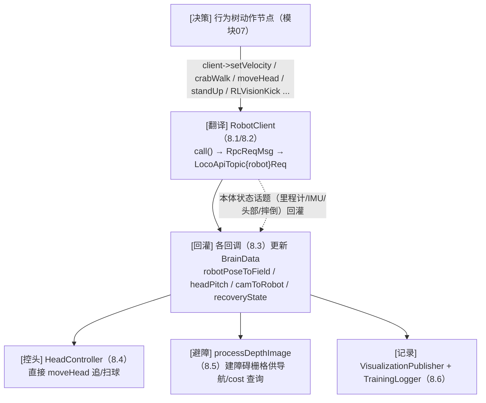

# 模块 08 · 机器人控制与底层（决策落地的最后一公里）

[模块07](../07-行为树与决策/index.md) 的动作节点最终都调用 `client->setVelocity(...)` 之类的接口。本模块就讲**这层接口往下到机器人本体的一切**：`RobotClient` 怎么把"走/踢/转头"翻译成 RPC 指令、`moveToPoseOnField` 怎么导航、本体状态（里程计/IMU/摔倒）怎么回灌进大脑、`HeadController` 怎么主动控头、避障怎么用深度图建栅格、以及把内部状态可视化与记成训练数据。

这是决策真正"动起来"的最后一公里，也是整套文档的收尾模块。

## 子篇导航

建议从"指令翻译"往下读，逐层贴近硬件，最后用 8.6 收束整套文档：

| 子篇 | 讲什么 | 对应源码 |
|------|--------|----------|
| [8.1 RobotClient 指令翻译官](./8.1-RobotClient指令翻译.md) | `call()` RPC 异步机制、指令表（setVelocity/crabWalk/moveHead/standUp/RLVisionKick/robocupWalk/enterDamping/waveHand）、`setVelocity` 三道安全处理、`crabWalk` 补偿 | `robot_client.cpp:16/77/124`、`robot_client.h` |
| [8.2 场地导航 moveToPoseOnField](./8.2-导航moveToPoseOnField.md) | 三个版本 `moveToPoseOnField/2/3` 的远近策略、避障临时目标 `target_temp_r`、`msecsToCollide` 碰撞时间 | `robot_client.cpp:149/250/351/475` |
| [8.3 本体状态回调](./8.3-状态回调odom_imu_fall.md) | `odometerCallback`（里程计→场地位姿）、`lowStateCallback`（IMU/头角）、`headPoseCallback`（camToRobot）、`recoveryStateCallback`（摔倒状态机） | `brain.cpp:1637/1653/1680/1705` |
| [8.4 头部主动控制 HeadController](./8.4-头部主动控制HeadController.md) | ~50Hz 主动控头、`enable` 接管、`selectMode` 三模式、`trackBall/searchDirected/searchSweep`、`sendHead` 钳制 | `head_controller.cpp:13/56/68/80/95/113` |
| [8.5 避障与深度感知](./8.5-避障与深度感知.md) | `processDepthImage` 深度图建栅格、`distToObstacle`、`findSafeDirections`、`calcAvoidDir`、哪些节点用避障、cost 惩罚项 | `brain.cpp:2417/2556/2581/2604` |
| [8.6 可视化与训练记录](./8.6-可视化与训练记录.md) | `VisualizationPublisher`（Marker/点云/栅格/决策串）、`BrainLog::log_scalar`、`TrainingLogger` 写 CSV、一次完整决策回路收束 | `visualization_publisher.cpp`、`brain_log.cpp`、`training_logger.cpp`、`brain.cpp:454` |

## 本模块要点速览

### 本模块在整条链路里的位置

> 💡 这一层的设计核心是**解耦**：决策代码只发"语义级"指令（"以 vx 前进"或"起身"），完全不碰双足平衡这种极难的实时控制——那是底层 Robot SDK 的事。指令异步发出、不阻塞，大脑发完就继续跑下一帧决策。回调方向相反：本体状态高频回灌，让大脑随时知道"我现在在哪、头朝哪、有没有摔"。

### 两个方向：下行指令 vs 上行状态

把本模块的内容按"数据流方向"分成两束，最便于建立全局观：

**下行（大脑 → 本体）：把决策翻译成动作**
- 速度指令：`setVelocity` / `crabWalk`（[8.1](./8.1-RobotClient指令翻译.md)）——所有走/冲球的最终出口，带最小速度兜底、限速、路径仿真。
- 导航指令：`moveToPoseOnField/2/3`（[8.2](./8.2-导航moveToPoseOnField.md)）——走到指定位姿，远转近移、避障绕行。
- 模式/动作指令：`standUp` / `RLVisionKick` / `robocupWalk` / `enterDamping` / `waveHand`（[8.1](./8.1-RobotClient指令翻译.md)）。
- 头部指令：`moveHead`，以及主动控头器 `HeadController`（[8.4](./8.4-头部主动控制HeadController.md)）。

**上行（本体 → 大脑）：把状态回灌给决策**
- `odometerCallback` → `robotPoseToField`（我在哪，[8.3](./8.3-状态回调odom_imu_fall.md)）。
- `lowStateCallback` → 头角/底层（[8.3](./8.3-状态回调odom_imu_fall.md)）。
- `headPoseCallback` → `camToRobot`（视觉换算的命脉，[8.3](./8.3-状态回调odom_imu_fall.md)）。
- `recoveryStateCallback` → `recoveryState`（摔没摔，驱动爬起，[8.3](./8.3-状态回调odom_imu_fall.md)）。
- 深度相机 → `processDepthImage` 障碍栅格（看见障碍，[8.5](./8.5-避障与深度感知.md)）。

可视化与训练记录（[8.6](./8.6-可视化与训练记录.md)）横跨两束，把内部状态既画出来又存下来。

### 核心要点

- `RobotClient::call()`（`robot_client.cpp:16`）把所有指令封成 `RpcReqMsg`（`api_id` 进 header、参数 JSON 进 body）发到 `LocoApiTopic{robot}Req`，**异步不等回执**（接口模式见 [模块02](../02-接口与消息/index.md)）。
- `setVelocity` 不是裸转发：**最小速度兜底 + 限速钳制 + 5 米路径仿真记录**，并记最后一条速度供 `isStandingStill` 判停稳。
- 导航 `moveToPoseOnField/2/3` 一律**远转近移**：远了先转向对准再走、近了比例控制到容差，避障时插临时目标绕行。行为树里 `GoToReadyPosition`/`MoveToPoseOnField` 等节点调的就是它（[7.6](../07-行为树与决策/7.6-找球与移动节点.md)）。
- 本体状态四个回调把里程计/IMU/头角/摔倒状态灌进 `BrainData`；`robotPoseToField` 由里程计经两套坐标系复合得到（[模块05](../05-大脑数据与坐标系/index.md)），`recoveryState` 驱动行为树的 `CheckAndStandUp` 爬起。
- `HeadController` 可选 ~50Hz **主动控头**，`enable` 开启时接管头部、BT 看球节点让位，三模式追/定向扫/三角扫找球。
- 避障用**深度图建障碍栅格**，`distToObstacle(angle)` 查某方向最近障碍，导航/追球/踢球按配置启用；cost 里含"路上有障碍"惩罚（[模块04](../04-裁判机与通信/index.md)）。🏆 撞对手会被判 `HL_PHYSICAL_CONTACT` 罚下。
- `VisualizationPublisher` 把内部状态发成 RViz/Booster Studio 能看的标记；`TrainingLogger` 每心跳写一行 `TrainingFrame` CSV，为离线模仿学习备料。

## 读完本模块你应该能回答

- 大脑说"以 vx=0.3 前进"，这条指令是怎么变成机器人迈步的？中间做了哪些安全处理？
- `moveToPoseOnField` 为什么远距离要先转身、近距离才平移？
- 机器人怎么知道自己在场地上的位置？摔倒了怎么自动爬起来？
- 开启主动控头后，脖子和身体谁动得快？为什么这样设计？
- 避障的"障碍地图"是怎么从一张深度图建出来的？
- 这套系统怎么把每一帧的"看到什么 + 做了什么决策 + 结果如何"全记下来给后续训练用？
