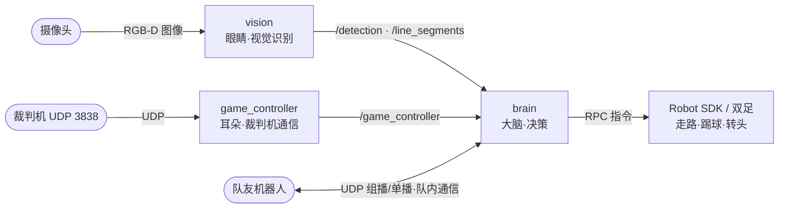

## 这是个什么项目？

一句话：**让一台人形机器人自己踢一场完整的 RoboCup 足球赛**。

机器人要能：用摄像头**看见**球、球门、对手、场地线 → **算出**它们在场地上的位置 → 知道**自己站在哪**（自定位）→ 听**裁判机**的开球/罚球/暂停指令 → 跟**队友**通信协作 → 然后**决策**是追球、调整、还是射门 → 最后**控制双足**走过去并踢球。

整个系统由三个独立运行的程序（ROS2 节点）组成，外加一堆消息接口包：

| 程序 | 角色 | 通俗比喻 |
|------|------|----------|
| **vision** | 视觉识别 | 机器人的**眼睛** |
| **brain** | 决策大脑 | 机器人的**大脑** |
| **game_controller** | 裁判机通信 | 机器人的**耳朵**（听裁判口令）|

它们之间通过 **ROS2 话题（topic）** 这种"发布-订阅"机制传递消息，互不阻塞、各跑各的。

## 系统全景图

## 怎么读这套文档

- 建议**按 01 → 08 顺序阅读**建立全局观，也可用左侧侧边栏按需跳读。
- 文中所有形如 `src/brain/src/brain.cpp:866` 的引用都是**真实文件:行号**，可在编辑器里点开定位。
- 涉及"为什么这么设计"的地方用 `💡` 标注，涉及"比赛规则约束"的地方用 `🏆` 标注。
- 关键术语第一次出现会加粗解释，后文复用。
- 每个模块是一个文件夹，内含**模块索引 + 细粒度子篇**，篇与篇之间用底部导航条互相跳转。

> 本套文档是仓库根目录官方 `README.md` 的**代码级深度补充**。
